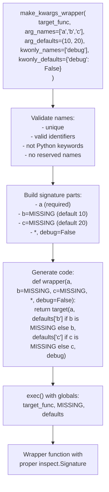

# Python kwargs Wrapper (Code-Generated)

**TL;DR**
- `tvm_ffi.utils.kwargs_wrapper` generates Python wrapper functions that add keyword-argument support to positional-only FFI functions, using `exec`-based code generation (the same pattern used by `dataclasses` and `pydantic`).
- Default values are injected via a `MISSING` sentinel and a runtime defaults dictionary, ensuring generated code never contains string representations of untrusted values.
- Combined with function metadata from the reflection system, this enables auto-generated ergonomic Python APIs with named parameters, defaults, and keyword-only arguments.

## Problem Statement

### Background

FFI-exported functions have a packed calling convention: `(const AnyView* args, int32_t num_args, Any* rv)`. The Python bindings expose these as positional-only callables. Users must remember argument order and cannot use keyword arguments, even when the function metadata includes parameter names and defaults.

### Solution

A code-generation utility that takes a target function, parameter names, and defaults, and produces a wrapper function with a proper Python signature. The wrapper delegates to the original positional function after resolving keyword arguments.

### Goals

- **Goal**: Add keyword-argument support to any positional-only FFI function.
- **Goal**: Minimize runtime overhead (generated code calls the target directly; no `*args/**kwargs` repacking).
- **Goal**: Prevent code injection by never embedding untrusted values in generated source.
- **Goal**: Support both positional defaults and keyword-only arguments with defaults.
- **Non-goal**: Runtime type checking of arguments (that remains the FFI layer's responsibility).

## Design

### Code Generation Strategy

### Safe Default Handling

Default values fall into two categories:

| Default Type | Handling | Rationale |
|---|---|---|
| `None` | Embedded directly as `=None` | Safe literal |
| `bool` | Embedded as `=True`/`=False` | Safe literal; uses `type(x) is bool` to avoid subclasses |
| All others | `=MISSING` sentinel + runtime dict | Avoids `repr()` injection; no untrusted strings in generated code |

### Key Classes, Fields and Interfaces

- **`make_kwargs_wrapper(target_func, arg_names, arg_defaults, kwonly_names, kwonly_defaults, prototype)`**: Main API. Returns a generated wrapper function.
- **`make_kwargs_wrapper_from_signature(target_func, signature, prototype)`**: Convenience API that extracts parameter info from an `inspect.Signature`.
- **`MISSING`**: Module-level sentinel object for distinguishing "not provided" from any valid default.
- **`_validate_argument_names(names, arg_type)`**: Validates names are valid identifiers, unique, and not Python keywords.
- **`_validate_wrapper_args(..., reserved_names)`**: Cross-validates positional vs. keyword-only argument overlap and reserved internal names.

### Contracts, Assumptions and Invariants

- **No untrusted code in exec**: The generated code string contains only validated identifier names, safe literals (`None`, `True`, `False`), and references to `MISSING` and `__i_target_func` globals. No user-provided strings (default values, function names) appear literally in the generated code.
- **Right-aligned defaults**: `arg_defaults` tuple is right-aligned to `arg_names` (matching Python `__defaults__` semantics). `(10, 20)` with names `['a', 'b', 'c', 'd']` means `c=10, d=20`.
- **Reserved name collision check**: Internal names (`__i_target_func`, `__i_MISSING`, `__i_arg_defaults`) are checked against user-provided argument names.
- **Python keyword rejection**: Argument names that are Python keywords (e.g., `class`, `return`) are rejected.

### Extension Points

- **Custom sentinel types**: Replace `MISSING` with a custom sentinel for domain-specific needs.
- **Metadata-driven generation**: Combine with `get_global_func_metadata()` to auto-generate kwargs wrappers for entire registries.

## Alternatives & Trade-offs

### Alternative A: Runtime `*args, **kwargs` wrapper

- Pros: No code generation. Simpler implementation.
- Cons: Measurable overhead from `**kwargs` dict creation and argument repacking on every call. For hot-path FFI functions, this cost is significant.

### Alternative B: Cython-level kwargs support

- Pros: Zero Python overhead.
- Cons: Requires modifying the Cython dispatch layer for every function. Not scalable for hundreds of registered functions with different signatures.

## Related Work

### Design Docs & ADRs

- [`.knowledge/designs/0014-python-bindings.md`](0014-python-bindings.md) -- Python FFI layer where wrappers are consumed
- [`.knowledge/designs/0023-type-schema-and-stubgen.md`](0023-type-schema-and-stubgen.md) -- Metadata providing parameter names for wrapper generation

### Evidence Matrix

- kwargs_wrapper introduction (360 lines + 321 line tests) -> `.knowledge/commits/2025-12-04-3115b237d43fa2c7a24157ec88e1a9f9ec403900.md` + `3115b23`
- Robustify with ignore_arg_names and keyword validation -> `.knowledge/commits/2025-12-04-6bc1a8ebb228bd0a6357e1e1da86a8febebf07ba.md` + `6bc1a8e`
