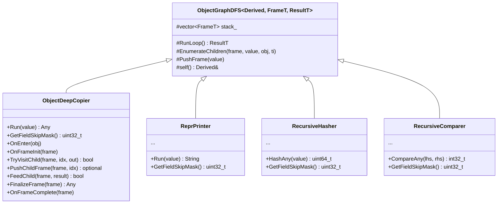
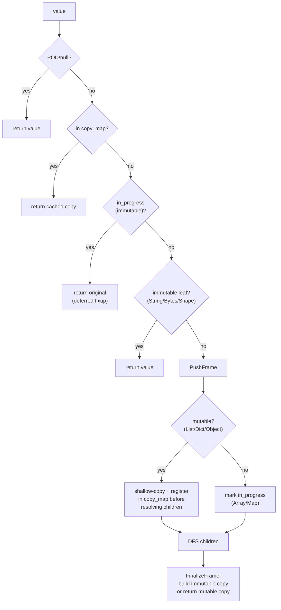
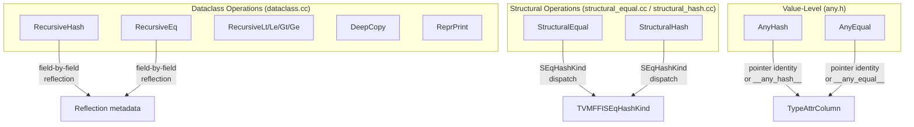

# Dataclass Operations: Unified Object-Graph Traversal

**TL;DR**
- `src/ffi/extra/dataclass.cc` consolidates four reflection-based object-graph operations -- deep copy, repr printing, recursive hash, and recursive compare -- into a single compilation unit backed by a shared `ObjectGraphDFS` CRTP engine. This replaces the former `deep_copy.cc` and `repr_print.cc`.
- The public C++ API (`include/tvm/ffi/extra/dataclass.h`) exposes `DeepCopy`, `ReprPrint`, `RecursiveHash`, `RecursiveEq`, and relational comparisons (`RecursiveLt/Le/Gt/Ge`). Each operation supports custom per-type hooks via `TypeAttrColumn` (`__ffi_repr__`, `__ffi_hash__`, `__ffi_eq__`, `__ffi_compare__`).
- Per-field opt-out is controlled by C ABI flag bits (`kTVMFFIFieldFlagBitMaskReprOff`, `kTVMFFIFieldFlagBitMaskCompareOff`, `kTVMFFIFieldFlagBitMaskHashOff`) registered through lowercase reflection traits (`repr(false)`, `compare(false)`, `hash(false)`).

## Problem Statement

### Background

Before commit `6b39efb`, deep copy (`deep_copy.cc`) and repr printing (`repr_print.cc`) were separate compilation units that each implemented their own recursive graph traversal with cycle/DAG detection. They shared no code despite having identical traversal patterns: enumerate children via reflection, push frames onto an explicit stack, detect cycles via pointer tracking, memoize completed results. Adding recursive hash and compare would have required duplicating this pattern two more times.

Additionally, the system lacked a generic mechanism for recursive structural hashing and comparison of dataclass objects. The existing `StructuralEqual`/`StructuralHash` (in `structural_equal.cc`/`structural_hash.cc`) serve compiler IR with specialized semantics (alpha-equivalence, DAG-node memoization, `TVMFFISEqHashKind` dispatch). There was no lightweight alternative for simple dataclass-level operations.

### Solution

A single CRTP-based iterative DFS engine (`ObjectGraphDFS`) that parameterizes the traversal over:
- **Frame type**: What data is stored per stack frame (e.g., `CopyFrame`, `ReprFrame`, `HashFrame`, `CompareFrame`).
- **Result type**: What type flows back up the stack (e.g., `Any`, `std::string`, `uint64_t`, `int32_t`).
- **Customization points**: CRTP methods (`OnEnter`, `OnFrameInit`, `TryVisitChild`, `PushChildFrame`, `FeedChild`, `FinalizeFrame`, `OnFrameComplete`, `OnTerminate`, `GetFieldSkipMask`) that the concrete operation class overrides.

### Goals

- **Goal**: Eliminate duplicated graph-traversal code across deep copy, repr, hash, and compare.
- **Goal**: Provide `RecursiveHash`/`RecursiveEq` as public APIs for dataclass-level structural operations.
- **Goal**: Per-field opt-out from hash/compare via reflection traits, orthogonal to the existing `SEqHashIgnore` flag.
- **Goal**: Custom per-type hooks for hash, equality, and comparison via `TypeAttrColumn`.
- **Non-goal**: Replace `StructuralEqual`/`StructuralHash`, which handle alpha-equivalence and IR-specific dispatch.

## Design

### ObjectGraphDFS CRTP Engine



The `RunLoop()` method drives an iterative DFS:

```
RunLoop():
  while stack is not empty:
    frame = stack.back()
    for each unvisited child in frame:
      if TryVisitChild(frame, idx, &result):
        FeedChild(frame, result)        // immediate result (leaf/memoized)
      else:
        opt = PushChildFrame(frame, idx)
        if opt has value:
          FeedChild(frame, *opt)        // eager result (e.g., map mismatch)
        else:
          break                         // child frame pushed, resume later
    if all children visited:
      result = FinalizeFrame(frame)
      OnFrameComplete(frame)
      stack.pop_back()
      if stack empty: return result
      FeedChild(stack.back(), result)   // propagate to parent
```

**Key invariant**: The stack depth is bounded by `kMaxTraversalStackDepth = 1 << 20`. Exceeding this throws `ValueError`. This prevents unbounded stack growth on deeply nested structures while being generous enough for practical object graphs.

### Container Dispatch

`EnumerateChildren` handles built-in containers and reflected objects uniformly:

| Container | FrameBase::Kind | Children | Ordering |
|---|---|---|---|
| `Array` | `kSequence` | Elements in order | Index-based |
| `List` | `kSequence` | Elements in order | Index-based |
| `Map` | `kMap` | Alternating key/value pairs | Iteration order |
| `Dict` | `kMap` | Alternating key/value pairs | Iteration order |
| Reflected object | `kObject` | Fields (skipping per `GetFieldSkipMask()`) | Registration order |

For reflected objects, each concrete operation class provides a `GetFieldSkipMask()` returning a bitmask of flags to skip:
- Deep copy: `0` (copy all fields)
- Repr: `kTVMFFIFieldFlagBitMaskReprOff`
- Hash: `kTVMFFIFieldFlagBitMaskHashOff | kTVMFFIFieldFlagBitMaskCompareOff`
- Compare: `kTVMFFIFieldFlagBitMaskCompareOff`

### Deep Copy (ObjectDeepCopier)

The deep copier handles four container categories differently:



- **Mutable containers** (List, Dict) and reflected objects are shallow-copied and registered in `copy_map_` before resolving children. This enables cyclic back-references: when a child refers back to a parent being copied, the copy is already in the map.
- **Immutable containers** (Array, Map) cannot be registered early (they must be built from resolved children). They are marked in `in_progress_` and if a child refers to them, the original is returned as a placeholder. A deferred fixup pass (`FixupDeferredReferences`) replaces stale placeholders after all copies are constructed.
- **Reflected objects** use the `__ffi_shallow_copy__` type attribute to create a shallow copy via the C++ copy constructor, then set fields to deep-copied values.

### Repr Printer (ReprPrinter)

The repr printer uses 3-state tracking per object pointer:

| State | Meaning | Behavior on re-encounter |
|---|---|---|
| `kNotVisited` | Never seen | Push frame |
| `kInProgress` | On the current DFS stack | Return `"..."` (cycle) |
| `kDone` | Fully printed | Return cached repr (DAG) |

Output format:
- **Array**: `(elem1, elem2)` with trailing comma for single-element `(elem,)`
- **List**: `[elem1, elem2]`
- **Map/Dict**: `{key1: val1, key2: val2}`
- **Reflected object**: `TypeKey(field1=val1, field2=val2)` (fields with `kTVMFFIFieldFlagBitMaskReprOff` excluded; duplicate field names from inheritance are deduplicated)
- **Primitives**: `None`, `True`/`False`, integers, floats, DLDataType, DLDevice
- **Strings**: Escaped with `EscapeString`
- **Tensor**: `dtype[shape]@device`
- **Shape**: `Shape(d1, d2, ...)`
- **Address**: Optionally appended (`@0x...`) when `TVM_FFI_REPR_WITH_ADDR=1`

Custom `__ffi_repr__` type attribute hooks are still supported. When detected, the hook receives `(obj, fn_repr)` where `fn_repr` is a callback for recursive repr of child values. The callback saves/restores the DFS stack to handle re-entrant calls.

### Recursive Hash (RecursiveHasher)

Computes a deterministic recursive hash using `StableHashCombine`:

- **POD types**: `StableHashCombine(type_index, value_bits)`. NaN canonicalized to `quiet_NaN()`. Positive and negative zero canonicalized to `+0.0`.
- **Strings/Bytes**: `StableHashCombine(canonical_type_index, StableHashBytes(data, len))`. Cross-variant: SmallStr and heap Str produce the same hash.
- **Sequences** (Array/List): `hash = StableHashCombine(type_key_hash, size)`, then `StableHashCombine(hash, StableHashCombine(child_hash, index))` per element. Index-sensitive.
- **Maps** (Map/Dict): `hash = StableHashCombine(type_key_hash, size)`, then entry hashes `StableHashCombine(key_hash, val_hash)` are sorted and folded. Order-independent.
- **Reflected objects**: `hash = type_key_hash`, then fold field hashes. Fields with `kTVMFFIFieldFlagBitMaskHashOff` or `kTVMFFIFieldFlagBitMaskCompareOff` are skipped.
- **Cycle handling**: Objects on the current DFS stack return `type_key_hash` as a sentinel.
- **DAG handling**: Completed hashes are memoized in `memo_`.
- **Custom hooks**: `__ffi_hash__` type attribute with signature `(obj: Object*, fn_hash: Function) -> int64_t`.

**Hash/Eq consistency enforcement**: If a reflected type (not a built-in container) registers `__ffi_eq__` or `__ffi_compare__` but not `__ffi_hash__`, `RecursiveHash` throws `ValueError`. This enforces the invariant `RecursiveEq(a, b) => RecursiveHash(a) == RecursiveHash(b)`.

### Recursive Compare (RecursiveComparer)

Three-way comparison returning `int32_t`: -1, 0, +1. Operates in two modes:
- **`eq_only=true`**: Only checks equality. Type mismatches return 1 (not equal) without throwing. Cycles are assumed equal. Used by `RecursiveEq`.
- **`eq_only=false`**: Full ordering. Type mismatches throw `TypeError`. NaN ordering throws `TypeError`. Map/Dict inequality during ordering throws `TypeError` (maps have no natural order). Used by `RecursiveLt/Le/Gt/Ge`.

Dispatch:
- **POD types**: Direct value comparison. NaN == NaN in eq_only mode.
- **Strings/Bytes**: Lexicographic via `memncmp`.
- **Sequences**: Lexicographic element-wise, then length comparison.
- **Maps**: Size must match; for each LHS key, look up in RHS and compare values. Missing keys are inequality (eq_only) or error (ordering).
- **Reflected objects**: Field-by-field, skipping `kTVMFFIFieldFlagBitMaskCompareOff` fields. Type mismatch is inequality (eq_only) or error (ordering).
- **Custom hooks**: `__ffi_eq__` with signature `(lhs, rhs, fn_eq) -> bool`. `__ffi_compare__` with signature `(lhs, rhs, fn_cmp) -> int32_t`. In eq_only mode, `__ffi_eq__` is preferred over `__ffi_compare__`.

Cycle detection uses a set of `(lhs_ptr, rhs_ptr)` pairs. `OnTerminate` propagates non-zero results and checks for map frames in the stack (cannot order through maps).

### Relationship to StructuralEqual/StructuralHash



| Aspect | RecursiveHash/Eq | StructuralEqual/Hash | AnyHash/Equal |
|---|---|---|---|
| Scope | Dataclass fields | IR nodes + custom kinds | Single values |
| Alpha-equiv | No | Yes (kFreeVar) | No |
| DAG memoization | No (cycle sentinel only) | Yes (kDAGNode) | N/A |
| Per-field skip | `CompareOff`, `HashOff` | `SEqHashIgnore`, `SEqHashDef` | N/A |
| Custom hooks | `__ffi_hash/eq/compare__` | `__s_equal/hash__` | `__any_hash/equal__` |
| Ordering | Yes (Lt/Le/Gt/Ge) | No (equality only) | No |
| Location | extra tier (dataclass.cc) | extra tier (structural_*.cc) | core (any.h) |

### Key Classes, Fields and Interfaces

- **`ObjectGraphDFS<Derived, FrameT, ResultT>`** (`dataclass.cc`, anonymous namespace): CRTP base class for iterative DFS. Owns `stack_`. Provides `RunLoop()`, `EnumerateChildren()`, `PushFrame()`. Customization points: `GetFieldSkipMask`, `OnEnter`, `OnFrameInit`, `TryVisitChild`, `PushChildFrame`, `FeedChild`, `FinalizeFrame`, `OnFrameComplete`, `OnTerminate`.
- **`FrameBase`** (`dataclass.cc`): Common frame base for single-value DFS. Fields: `kind` (`kSequence|kMap|kObject`), `type_index`, `obj`, `children` (vector of `Any`), `field_infos` (vector of `TVMFFIFieldInfo*`), `child_idx`, `container_size`.
- **`ObjectDeepCopier`** (`dataclass.cc`): Deep copy operation. Result type: `Any`. Uses `copy_map_` (object -> copy), `in_progress_` (immutable containers being built), deferred fixup.
- **`ReprPrinter`** (`dataclass.cc`): Repr printing operation. Result type: `std::string`. Uses `state_` (3-state tracking), `repr_cache_` (DAG).
- **`RecursiveHasher`** (`dataclass.cc`): Recursive hash operation. Result type: `uint64_t`. Uses `on_stack_` (cycle detection), `memo_` (DAG).
- **`RecursiveComparer`** (`dataclass.cc`): Three-way comparison operation. Result type: `int32_t`. Uses `on_stack_` (pair-based cycle detection), `eq_only_` mode flag.
- **`DeepCopy(const Any&) -> Any`** (`dataclass.h`): Public API. `TVM_FFI_EXTRA_CXX_API`.
- **`ReprPrint(const Any&) -> String`** (`dataclass.h`): Public API. `TVM_FFI_EXTRA_CXX_API`.
- **`RecursiveHash(const Any&) -> int64_t`** (`dataclass.h`): Public API. `TVM_FFI_EXTRA_CXX_API`. Returns `int64_t` for FFI compatibility (unsigned `uint64_t` internally).
- **`RecursiveEq(lhs, rhs) -> bool`** (`dataclass.h`): Public API. `TVM_FFI_EXTRA_CXX_API`.
- **`RecursiveLt/Le/Gt/Ge(lhs, rhs) -> bool`** (`dataclass.h`): Public API. `TVM_FFI_EXTRA_CXX_API`.
- **`kTVMFFIFieldFlagBitMaskCompareOff`** (`c_api.h`): Bit 7. Excludes field from recursive compare.
- **`kTVMFFIFieldFlagBitMaskHashOff`** (`c_api.h`): Bit 8. Excludes field from recursive hash.
- **`refl::compare(bool)`** (`registry.h`): InfoTrait setting `CompareOff` flag.
- **`refl::hash(bool)`** (`registry.h`): InfoTrait setting `HashOff` flag.
- **`refl::repr(bool)`** (`registry.h`): InfoTrait setting `ReprOff` flag. Renamed from `Repr` (uppercase) in commit `6b39efb`.
- **`type_attr::kHash`** (`registry.h`): `"__ffi_hash__"`. Custom per-type hash hook.
- **`type_attr::kEq`** (`registry.h`): `"__ffi_eq__"`. Custom per-type equality hook.
- **`type_attr::kCompare`** (`registry.h`): `"__ffi_compare__"`. Custom per-type three-way comparison hook.

### Contracts, Assumptions and Invariants

- **Hash/Eq consistency**: `RecursiveEq(a, b) => RecursiveHash(a) == RecursiveHash(b)`. Enforced by throwing `ValueError` when a type registers `__ffi_eq__` or `__ffi_compare__` without `__ffi_hash__`.
- **NaN canonicalization**: `RecursiveHash(NaN_a) == RecursiveHash(NaN_b)` for all NaN bit patterns. `RecursiveEq(NaN, NaN) == true`. Ordering NaN throws `TypeError`.
- **Positive/negative zero**: `RecursiveHash(+0.0) == RecursiveHash(-0.0)`. Both hash to positive zero bits.
- **Cross-variant string consistency**: SmallStr and heap Str produce identical hashes and compare equal.
- **Cycle safety**: All four operations handle arbitrary cyclic object graphs without infinite recursion. Deep copy uses deferred fixup. Repr returns `"..."`. Hash returns `type_key_hash` sentinel. Compare (eq_only) returns equal.
- **Stack depth bound**: `kMaxTraversalStackDepth = 1 << 20` (approximately 1 million frames). Exceeding throws `ValueError`.
- **Map ordering limitation**: `RecursiveLt/Le/Gt/Ge` throw `TypeError` when encountering unequal maps/dicts, since maps have no natural ordering.
- **Custom hook re-entrancy**: Custom hooks (`__ffi_repr__`, `__ffi_hash__`, `__ffi_eq__`, `__ffi_compare__`) receive a callback for recursive processing. The callback saves/restores the DFS stack to handle nested calls safely.

### Extension Points

- **New CRTP operations**: Inherit from `ObjectGraphDFS<NewOp, NewFrame, NewResult>` and implement the 8 customization points. The engine handles stack management, container dispatch, and frame lifecycle.
- **New container types**: Add cases to `EnumerateChildren` and per-operation dispatch methods.
- **New per-type hooks**: Register new `TypeAttrColumn` names (e.g., `__ffi_validate__`) and consume them in a new CRTP operation.
- **New per-field flags**: Bits 11-63 of `TVMFFIFieldFlagBitMask` are available for future annotations. New traits can consume them via `GetFieldSkipMask()`.

## Alternatives & Trade-offs

### Alternative: Keep separate .cc files with shared utility functions

- Pros: Simpler per-file, no CRTP complexity.
- Cons: Shared graph-walking logic (cycle detection, container dispatch, stack management) would still be duplicated or extracted into helper functions with complex callback signatures. The CRTP approach eliminates all duplication at zero runtime cost (compile-time dispatch).

### Alternative: Virtual base class instead of CRTP

- Pros: Simpler template-free code, easier debugging.
- Cons: Virtual dispatch overhead on every child visit (called millions of times for large graphs). CRTP inlines all customization points, making the hot path zero-cost.

### Alternative: Recursive implementation instead of iterative DFS

- Pros: Simpler code structure, natural call stack.
- Cons: C++ stack overflow on deep graphs. The 1M-frame iterative stack is much larger than typical system stack limits (1-8MB). Also, custom hook re-entrancy is harder to manage with true recursion.

## Related Work

### Design Docs & ADRs

- [`.knowledge/designs/0006-reflection.md`](0006-reflection.md) -- Reflection metadata consumed by all four operations
- [`.knowledge/designs/0009-structural-equal-hash.md`](0009-structural-equal-hash.md) -- Structural equal/hash (IR-focused, parallel but distinct system)
- [`.knowledge/designs/0011-extra-api-tier.md`](0011-extra-api-tier.md) -- Extra tier where dataclass.cc lives
- [`.knowledge/ADRs/0061-unified-repr-print.md`](../ADRs/0061-unified-repr-print.md) -- Decision for unified C++ repr (now consolidated into dataclass.cc)
- [`.knowledge/ADRs/0067-crtp-object-graph-dfs.md`](../ADRs/0067-crtp-object-graph-dfs.md) -- Decision to use CRTP-based iterative DFS engine
- [`.knowledge/ADRs/0060-custom-any-hash-equal.md`](../ADRs/0060-custom-any-hash-equal.md) -- Value-level AnyHash/AnyEqual (distinct from recursive hash)

### Evidence Matrix

- Consolidation of deep_copy.cc + repr_print.cc into dataclass.cc with ObjectGraphDFS CRTP engine -> `.knowledge/commits/2026-02-27-6b39efbf381e48a8a42ab3779bc2adf587458fb3.md` + `6b39efb`
- RecursiveHash, RecursiveEq, RecursiveLt/Le/Gt/Ge APIs -> `.knowledge/commits/2026-02-27-6b39efbf381e48a8a42ab3779bc2adf587458fb3.md` + `6b39efb`
- CompareOff/HashOff field flags and compare/hash InfoTraits -> `.knowledge/commits/2026-02-27-6b39efbf381e48a8a42ab3779bc2adf587458fb3.md` + `6b39efb`
- __ffi_hash__/__ffi_eq__/__ffi_compare__ type attribute columns -> `.knowledge/commits/2026-02-27-6b39efbf381e48a8a42ab3779bc2adf587458fb3.md` + `6b39efb`
- Repr renamed from uppercase to lowercase -> `.knowledge/commits/2026-02-27-6b39efbf381e48a8a42ab3779bc2adf587458fb3.md` + `6b39efb`
- Original deep copy implementation -> `.knowledge/commits/2026-02-13-c73d61a423edf69483676f727cf272feebbe4d49.md` + `c73d61a`
- Original repr_print.cc implementation -> `.knowledge/commits/2026-02-18-b648c5d6b7981350c165096efbb98d00787e2900.md` + `b648c5d`
- Python-exposed RecursiveEq/Lt/Le/Gt/Ge _ffi_api stubs + comprehensive comparison tests (1272 lines, 101 cases) -> `.knowledge/commits/2026-02-27-b87196f998868b2dfb76a7bf2be8795f75b099b8.md` + `b87196f`
- Python-exposed RecursiveHash _ffi_api stub + comprehensive hash tests (971 lines) -> `.knowledge/commits/2026-02-27-5796ff4b6b1a765a9181addaeb56ba9b253cfa8b.md` + `5796ff4`
- c_class structural dunders consuming RecursiveEq/Hash/Lt/Le/Gt/Ge from Python -> `.knowledge/commits/2026-02-28-e5f3af7bb83e6461c45d08117e4eaabe51add3b1.md` + `e5f3af7`
