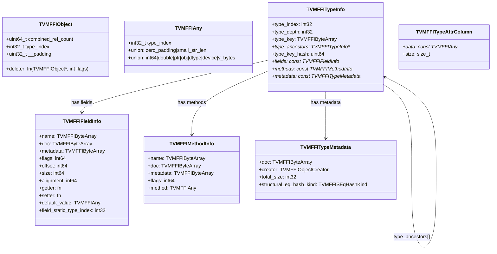

# C ABI Design

**TL;DR**:
- The C ABI defines the stable binary interface in `include/tvm/ffi/c_api.h`: a 24-byte `TVMFFIObject` header (with weak reference counting), a 16-byte `TVMFFIAny` tagged union, type-erased function calls via `TVMFFISafeCallType`, and TLS-based error propagation.
- Struct-type C API parameters (e.g., `DLDataType`) are passed by pointer, not by value, for WebAssembly/cross-platform ABI compatibility.
- Reflection structs (`TVMFFIFieldInfo`, `TVMFFIMethodInfo`, `TVMFFITypeMetadata`) carry rich metadata including docs, type schemas, bitmask flags, and structural eq/hash kind.

## Problem Statement
### Background
- All cross-language communication (C++ <-> Python <-> Rust) must go through a stable C ABI.

### Solution
- A 24-byte `TVMFFIObject` header (with `combined_ref_count` at offset 0 for torch `intrusive_ptr` ABI alignment) and a 16-byte `TVMFFIAny` tagged union.
- All functions use the `TVMFFISafeCallType` calling convention with TLS error propagation.

### Goals
- Binary compatibility across compilers and platforms (including WebAssembly/Emscripten).
- Non-goals: versioned ABI negotiation (breaking changes require full recompilation). However, a runtime version query API (`TVMFFIGetVersion`) was added in f0058a9 to enable version introspection without ABI negotiation.

## Design

### 24-Byte Layout: TVMFFIObject

```
Offset  Size   Field
0       8      uint64_t combined_ref_count    (strong in low 32 bits, weak in high 32 bits)
8       4      int32_t type_index
12      4      uint32_t __padding             (must be zeroed)
16      8      void (*deleter)(void*, int flags) | int64_t __ensure_align
                  (parameter widened from TVMFFIObject* to void* in 24125d0)
```

The `combined_ref_count` packs both reference counters into a single 64-bit field (since 43d13e86):
- Strong ref count: `combined_ref_count & 0xFFFFFFFF` (lower 32 bits)
- Weak ref count: `(combined_ref_count >> 32) & 0xFFFFFFFF` (upper 32 bits)

This enables a single-atomic fast path in `DecRef`: when `combined_ref_count == kCombinedRefCountBothOne` (both strong and weak are 1), one atomic decrement handles both counters. See `.knowledge/ADRs/018-combined-ref-count.md`.

The field layout was reordered in 13436f01 to place ref counters first (aligning with torch `intrusive_ptr` ABI), then again in 43d13e86 to merge into a single `combined_ref_count`.

The deleter receives a `TVMFFIObjectDeleterFlagBitMask` flags parameter for two-phase deletion:
- `kTVMFFIObjectDeleterFlagBitMaskStrong = 1` -- run destructor (when strong count reaches 0)
- `kTVMFFIObjectDeleterFlagBitMaskWeak = 2` -- free memory (when weak count reaches 0)
- `kTVMFFIObjectDeleterFlagBitMaskBoth = 3` -- common fast path (both counters reach 0 simultaneously)

### 16-Byte Layout: TVMFFIAny

```
Offset  Size   Field
0       4      int32_t type_index
4       4      union { uint32_t zero_padding; uint32_t small_str_len }
8       8      union { int64_t, double, void*, const char*, TVMFFIObject*, DLDataType, DLDevice, char v_bytes[8] }
               (Note: v_char32 member was removed in c100338)
```

Key invariants:
- `sizeof(TVMFFIObject) == 24`, `sizeof(TVMFFIAny) == 16`.
- **`zero_padding` must be 0 for non-small-string types**: Every `CopyToAnyView`/`MoveToAny` for non-small-string types must set `zero_padding = 0`. This enables `AnyEqual`'s fast-path 16-byte comparison and ensures `AnyHash` consistency.
- For small strings (`type_index = kTVMFFISmallStr` or `kTVMFFISmallBytes`): `small_str_len` holds the content length (0-7), and `v_bytes[0..small_str_len-1]` holds the content with null terminator at `v_bytes[small_str_len]`.

### Type Index Ranges

```
[kTVMFFIAny = -1]        -- Sentinel for reflection
[0, 64)                  -- POD/special types (None=0, Int=1, Bool=2, Float=3, OpaquePtr=4,
                            DataType=5, Device=6, DLTensorPtr=7, RawStr=8, ByteArrayPtr=9,
                            ObjectRValueRef=10, SmallStr=11, SmallBytes=12, ...)
[64, 75)                 -- Static objects (Object=64, String=65, Bytes=66, Error=67,
                            Function=68, Shape=69, Tensor=70, Array=71, Map=72,
                            Module=73, OpaquePyObject=74)
[75, 128)                -- Reserved for future static types
[128, +inf)              -- Dynamic types (allocated at runtime)
```

### TVMFFISafeCallType

```c
typedef int (*TVMFFISafeCallType)(void* handle, const TVMFFIAny* args,
                                   int32_t num_args, TVMFFIAny* result);
```

- **handle**: opaque pointer to external state (not necessarily `this`; may be nullptr)
- **Return**: 0 = success, -1 = error in TLS, -2 = frontend error

### TVMFFIFieldInfo

```c
typedef struct {
    TVMFFIByteArray name;
    TVMFFIByteArray doc;
    TVMFFIByteArray metadata;          // structured metadata JSON (renamed from type_schema in 935a5a07)
    int64_t flags;                     // kTVMFFIFieldFlagBitMask* bitmask
    int64_t offset;                    // byte offset from Object* to field
    int64_t size;
    int64_t alignment;
    TVMFFIFieldGetter getter;
    TVMFFIFieldSetter setter;
    TVMFFIAny default_value;
    int32_t field_static_type_index;
} TVMFFIFieldInfo;
```

### TVMFFIFieldFlagBitMask

```c
enum TVMFFIFieldFlagBitMask : int32_t {
    kTVMFFIFieldFlagBitMaskWritable       = 1 << 0,
    kTVMFFIFieldFlagBitMaskHasDefault     = 1 << 1,
    kTVMFFIFieldFlagBitMaskIsStaticMethod = 1 << 2,
    kTVMFFIFieldFlagBitMaskSEqHashIgnore  = 1 << 3,  // Skip during structural eq/hash
    kTVMFFIFieldFlagBitMaskSEqHashDef     = 1 << 4,  // Definition region for free-var mapping
};
```

### TVMFFIMethodInfo

```c
typedef struct {
    TVMFFIByteArray name;
    TVMFFIByteArray doc;
    TVMFFIByteArray metadata;          // structured metadata JSON (renamed from type_schema in 935a5a07)
    int64_t flags;
    TVMFFIAny method;    // Function stored as TVMFFIAny
} TVMFFIMethodInfo;
```

### TVMFFISEqHashKind

```c
enum TVMFFISEqHashKind : int32_t {
    kTVMFFISEqHashKindUnsupported  = 0,
    kTVMFFISEqHashKindTreeNode     = 1,
    kTVMFFISEqHashKindFreeVar      = 2,
    kTVMFFISEqHashKindDAGNode      = 3,
    kTVMFFISEqHashKindConstTreeNode = 4,
    kTVMFFISEqHashKindUniqueInstance = 5,
};
```

Per-type structural comparison semantic mode. Stored in `TVMFFITypeMetadata.structural_eq_hash_kind`. See `.knowledge/designs/0010-structural-equal-hash.md` for full semantics.

### TVMFFITypeMetadata

```c
typedef int (*TVMFFIObjectCreator)(TVMFFIObjectHandle* result);

typedef struct {
    TVMFFIByteArray doc;
    TVMFFIObjectCreator creator;
    int32_t total_size;
    TVMFFISEqHashKind structural_eq_hash_kind;
} TVMFFITypeMetadata;
```

Renamed from `TVMFFITypeExtraInfo` in commit 162d600. `total_size` narrowed from `int64_t` to `int32_t` in commit 9445fe7.

### TVMFFITypeAttrColumn

```c
typedef struct {
    const TVMFFIAny* data;  // column array indexed by type_index
    size_t size;
} TVMFFITypeAttrColumn;
```

Column-oriented per-type attribute storage. Queried via `TVMFFIGetTypeAttrColumn`. See `.knowledge/designs/reflection.md` for the TypeAttr system.

### TVMFFITypeInfo

```c
typedef struct TVMFFITypeInfo {
    int32_t type_index;
    int32_t type_depth;
    TVMFFIByteArray type_key;
    const struct TVMFFITypeInfo** type_ancestors;  // pointer-to-TypeInfo array
    uint64_t type_key_hash;
    int32_t num_fields;
    int32_t num_methods;
    const TVMFFIFieldInfo* fields;
    const TVMFFIMethodInfo* methods;
    const TVMFFITypeMetadata* metadata;
} TVMFFITypeInfo;
```

Note: `type_ancestors` stores `TVMFFITypeInfo**` (not `int32_t*`) for O(1) parent metadata access (changed in 837800e). The struct has a tag name (`TVMFFITypeInfo`) for the self-referential pointer. The `metadata` field was renamed from `extra_info` in commit 162d600.

### Struct Relationships



### Version API (since f0058a9)

```c
typedef struct {
    uint32_t major;
    uint32_t minor;
    uint32_t patch;
} TVMFFIVersion;

TVM_FFI_DLL void TVMFFIGetVersion(TVMFFIVersion* out_version);
```

Compile-time macros: `TVM_FFI_VERSION_MAJOR` (0), `TVM_FFI_VERSION_MINOR` (1), `TVM_FFI_VERSION_PATCH` (1, bumped from 0 in ac63fb9). `TVMFFIGetVersion` is documented as "always stable across all versions of the C ABI," serving as the bootstrap entry point for future ABI negotiation. The project uses an RFC-stage `0.X.Y` versioning scheme where X bumps indicate ABI-breaking changes.

### Preprocessor Macros

| Macro | Platform Mapping | Purpose |
|-------|-----------------|---------|
| `TVM_FFI_DLL` | MSVC: dllexport/dllimport; GCC/Clang: visibility("default") | Conditional import/export for shared library symbols |
| `TVM_FFI_DLL_EXPORT` | MSVC: dllexport (always); Emscripten: EMSCRIPTEN_KEEPALIVE; GCC/Clang: visibility("default") | Always-export for kernel library symbols (added in 192f196) |
| `TVM_FFI_WEAK` | MSVC: `__declspec(selectany)`; GCC/Clang: `__attribute__((weak))` | Header-defined overridable symbols (added in 8a00988) |
| `TVM_FFI_INLINE` | MSVC: `[[msvc::forceinline]] inline`; GCC/Clang: `[[gnu::always_inline]] inline` | Force-inline |
| `TVM_FFI_NO_INLINE` | MSVC: `[[msvc::noinline]]`; GCC/Clang: `[[gnu::noinline]]` | Prevent inlining |
| ~~`TVM_FFI_ATTRIBUTE_UNUSED`~~ | (removed in 7b813f8) | Was `[[maybe_unused]]`; now inlined directly in `TVM_FFI_STATIC_INIT_BLOCK` non-GCC fallback |
| `TVM_FFI_EXTRA_CXX_API` | defaults to `TVM_FFI_DLL` (in `extra/base.h`) | Marks non-core C++ APIs in `extra/` directory |

### C API Function Summary

| Function | Purpose |
|----------|---------|
| `TVMFFIObjectIncRef` | Increment strong reference count |
| `TVMFFIObjectDecRef` | Decrement strong reference count (was `TVMFFIObjectFree`) |
| `TVMFFIObjectCreateOpaque` | Create opaque object wrapping external handle (e.g., PyObject) |
| `TVMFFITypeKeyToIndex` | Map type key string to type index |
| `TVMFFITypeGetOrAllocIndex` | Register/allocate a type index (renamed from `TVMFFIGetOrAllocTypeIndex`) |
| `TVMFFIGetTypeInfo` | Query runtime type info |
| `TVMFFIFunctionCreate` | Create Function from C callback |
| `TVMFFIAnyViewToOwnedAny` | Convert non-owning view to owned Any |
| `TVMFFIFunctionCall` | Invoke function via safe_call |
| `TVMFFIFunctionSetGlobal` | Register a global function (param renamed: `override` -> `allow_override`) |
| `TVMFFIFunctionGetGlobal` | Retrieve a global function |
| `TVMFFIFunctionSetGlobalFromMethodInfo` | Register global function with metadata |
| `TVMFFIErrorSetRaised` | Store error in TLS |
| `TVMFFIErrorMoveFromRaised` | Retrieve and clear TLS error |
| `TVMFFIErrorCreate` | Allocate a new error object; returns `int` with out-param since 6f020c1 (was direct handle return) |
| `TVMFFIErrorSetRaisedFromCStr` | Set error from C string (renamed from `TVMFFIErrorSetRaisedByCStr`) |
| `TVMFFIErrorSetRaisedFromCStrParts` | Set error by concatenating array of C string parts (NULL parts skipped); for compiler-generated reusable error fragments (added in 550e92f) |
| `TVMFFITypeRegisterField` | Register reflection field (renamed from `TVMFFIRegisterTypeField`) |
| `TVMFFITypeRegisterMethod` | Register reflection method |
| `TVMFFITypeRegisterMetadata` | Register type creator/size/eq-hash metadata |
| `TVMFFITypeRegisterAttr` | Register per-type attribute value |
| `TVMFFIGetTypeAttrColumn` | Retrieve column-oriented type attribute array |
| `TVMFFITensor{From,To}DLPack{,Versioned}` | DLPack interop (renamed from `TVMFFINDArray*` in 3a551d8) |
| `TVMFFIDataType{From,To}String` | DType string conversion (`ToString` returns `TVMFFIAny*` for SSO) |
| `TVMFFIStringFromByteArray` | Create owned String (SSO-aware) from `TVMFFIByteArray*` (added in 043d9f6) |
| `TVMFFIBytesFromByteArray` | Create owned Bytes (SSO-aware) from `TVMFFIByteArray*` (added in 043d9f6) |
| `TVMFFIBacktrace` | Collect stack trace (renamed from `TVMFFITraceback` in 6f020c1); 4th param `cross_ffi_boundary` controls boundary filtering |
| `TVMFFIGetVersion` | Fill `TVMFFIVersion*` with runtime library version (major, minor, patch); always stable across all ABI versions (added in f0058a9) |
| `TVMFFIHandleInitOnce` | Thread-safe once-only handle initialization: `int TVMFFIHandleInitOnce(void** handle_addr, int (*init_func)(void** result))`. Uses acquire-load fast path + static mutex slow path. If `init_func` returns error or NULL, error is propagated. (added in 25c25aec) |
| `TVMFFIHandleDeinitOnce` | Thread-safe once-only handle deinitialization: `int TVMFFIHandleDeinitOnce(void** handle_addr, int (*deinit_func)(void* handle))`. Atomically exchanges handle to NULL and calls `deinit_func` on the old value. (added in 25c25aec) |
| `TVMFFITensorCreateUnsafeView` | Create a tensor view sharing source's data memory: `int TVMFFITensorCreateUnsafeView(TVMFFIObjectHandle source, const DLTensor* prototype, TVMFFIObjectHandle* out)`. Caller must ensure prototype's data points into source's memory. Shape/strides are copied. (added in 8888eb4b) |

### Core/Extra C API Split

The C API is split into two tiers:

- **Core** (`include/tvm/ffi/c_api.h`): Always compiled. Contains data structures, object management, function calling, DLPack, dtype, type reflection, and backend noexcept APIs. Section order: data structures -> Basic object API -> Function calling API -> DLPack -> dtype -> Type reflection -> Function registration -> Type registration -> Backend noexcept functions.
- **Extra** (`include/tvm/ffi/extra/c_env_api.h`): Compiled only with `TVM_FFI_USE_EXTRA_CXX_API=ON`. Contains environment-specific APIs (signal checking, Python interop), stream context management, and module-side (callee) APIs.

The split was formalized in commit 023ea44, which moved `TVMFFIEnvCheckSignals` and `TVMFFIEnvRegisterCAPI` from core to extra.

### Extra C Env API (`c_env_api.h`)

#### Stream Context APIs

| Function | Signature | Description |
|----------|-----------|-------------|
| `TVMFFIEnvSetStream` | `int TVMFFIEnvSetStream(int32_t device_type, int32_t device_id, TVMFFIStreamHandle stream, TVMFFIStreamHandle* opt_out_original_stream)` | Set thread-local current stream for a device; optionally returns previous stream (renamed from `TVMFFIEnvSetCurrentStream` back to `TVMFFIEnvSetStream` in f81ab9c) |
| `TVMFFIEnvGetStream` | `TVMFFIStreamHandle TVMFFIEnvGetStream(int32_t device_type, int32_t device_id)` | Get current stream for device; returns NULL if none set (renamed from `TVMFFIEnvGetCurrentStream` in f81ab9c) |

`TVMFFIStreamHandle` is `typedef void*`. The FFI layer does not allocate or deallocate streams; it only records weak references in a thread-local 2D table indexed by `(device_type, device_id)`.

Error handling differs between the two functions:
- `TVMFFIEnvSetStream` uses `TVM_FFI_SAFE_CALL_BEGIN/END` (returns int, error via TLS) because it returns status through a return code.
- `TVMFFIEnvGetStream` uses `TVM_FFI_LOG_EXCEPTION_CALL_BEGIN/END` (returns value directly, abort-on-error) because it returns a pointer value, making TLS error propagation infeasible.

#### Tensor Allocator APIs

| Function | Signature | Description |
|----------|-----------|-------------|
| `TVMFFIEnvSetTensorAllocator` | `int TVMFFIEnvSetTensorAllocator(DLPackTensorAllocator allocator, int write_to_global_context, DLPackTensorAllocator* opt_out_original_allocator)` | Set thread-local (and optionally global) tensor allocator |
| `TVMFFIEnvGetTensorAllocator` | `DLPackTensorAllocator TVMFFIEnvGetTensorAllocator()` | Get current allocator (TLS first, then global fallback) |

`DLPackTensorAllocator` is `typedef int (*)(DLTensor*, DLManagedTensorVersioned**, void*, void(*)(void*, const char*, const char*))`. Uses an error callback pattern rather than TLS for thread safety. See `.knowledge/designs/0018-dlpack-fast-path.md` for full design.

#### Host-Side Environment APIs

| Function | Signature | Description |
|----------|-----------|-------------|
| `TVMFFIEnvCheckSignals` | `int TVMFFIEnvCheckSignals()` | Check for signals in surrounding env (e.g., Python `PyErr_CheckSignals`). Acquires GIL. |
| `TVMFFIEnvRegisterCAPI` | `int TVMFFIEnvRegisterCAPI(const char* name, void* symbol)` | Register env-specific C API callbacks (e.g., `PyErr_CheckSignals`, `PyGILState_Ensure/Release`) |

`EnvCAPIRegistry` is an internal singleton managing Python env callbacks. It knows about three symbols: `PyErr_CheckSignals`, `PyGILState_Ensure`, `PyGILState_Release`.

#### Module-Side (Callee) Environment APIs

These use the `TVMFFIEnvMod*` prefix (the `Mod` infix distinguishes callee-side APIs from host-side ones, added in 023ea44):

| Function | Signature | Description |
|----------|-----------|-------------|
| `TVMFFIEnvModLookupFromImports` | `int TVMFFIEnvModLookupFromImports(TVMFFIObjectHandle library_ctx, const char* func_name, TVMFFIObjectHandle* out)` | Look up function from module's imports (callee helper for generated code) |
| `TVMFFIEnvModRegisterContextSymbol` | `int TVMFFIEnvModRegisterContextSymbol(const char* name, void* symbol)` | Register a symbol for lazy init when a library is loaded |
| `TVMFFIEnvModRegisterSystemLibSymbol` | `int TVMFFIEnvModRegisterSystemLibSymbol(const char* name, void* symbol)` | Register a symbol for system library loading |

See `.knowledge/designs/0013-module-system.md` for full module system design.

### Rust `#[repr(C)]` Mirrors (since 09477ce)

The Rust `tvm-ffi-sys` crate provides hand-written `#[repr(C)]` declarations for all C ABI structs (no `bindgen`). This gives explicit control over:
- **Atomic types**: `TVMFFIObject.combined_ref_count` is declared as `AtomicU64`, enabling native Rust atomic operations with correct memory ordering.
- **Union layout**: `TVMFFIAnyDataUnion` is a `#[repr(C)] union` with all variant fields.
- **Function pointer types**: `TVMFFISafeCallType` and `TVMFFIObjectDeleter` are declared as Rust `unsafe extern "C" fn(...)` types.

All extern "C" functions from `c_api.h` and `c_env_api.h` are declared in `unsafe extern "C"` blocks. See `.knowledge/ADRs/019-rust-hand-written-c-abi.md` for the decision rationale.

### Contracts, Assumptions and Invariants
- **Pointer-based struct passing**: Small structs (e.g., `DLDataType`) are passed by pointer in C API functions, not by value. This ensures consistent ABI behavior across native and WebAssembly targets (076ac23).
- **TLS error contract**: Callers must immediately retrieve errors after a -1 return via `TVMFFIErrorMoveFromRaised`. The single-error-per-thread model does not support nesting.
- **Enum constant prefix**: All `TVMFFIFieldFlagBitMask` constants use the `k` prefix (e.g., `kTVMFFIFieldFlagBitMaskWritable`).

### Extension Points
- `TVMFFITypeMetadata` carries per-type metadata (creator, total_size, doc, structural_eq_hash_kind). Additional per-type attributes use the `TypeAttr` column system (`TVMFFITypeAttrColumn`).
- `metadata` fields (JSON strings) on `TVMFFIFieldInfo` and `TVMFFIMethodInfo` enable future schema-driven codegen/validation (renamed from `type_schema` in 935a5a07).

### Usage Examples

#### Passing DLDataType through C API
**Context**: Using pointer-based struct passing for WebAssembly compatibility.
```c
DLDataType dtype = {kDLFloat, 32, 1};
TVMFFIAny out;
TVMFFIDataTypeToString(&dtype, &out);  // pointer, not value; returns TVMFFIAny* for SSO support
```

### Evidence Matrix
- DLDataType by pointer -> `2025-05-11-076ac23.md` + commit 076ac23
- `TVM_FFI_WEAK` macro -> `2025-05-24-8a00988.md` + commit 8a00988
- `TVM_FFI_DLL_EXPORT` + `TVM_FFI_DLL_EXPORT_TYPED_FUNC` -> `2025-05-29-192f196.md` + commit 192f196
- `TVMFFISafeCallType` `handle` param name -> `2025-06-05-11a4a02.md` + commit 11a4a02
- Reflection struct redesign -> `2025-06-15-1a85688.md` + `2025-06-16-a419ed1.md` + commits 1a85688, a419ed1
- `type_ancestors` -> `TVMFFITypeInfo**` -> `2025-06-19-837800e.md` + commit 837800e
- `ffi.*` type keys -> `2025-07-01-0966c36.md` + commit 0966c36
- C++ standard attributes -> `2025-07-05-fa5e2ac.md` + commit fa5e2ac
- `TVMFFISEqHashKind` + field flags -> `2025-07-19-9445fe7.md` + commit 9445fe7
- `TVMFFITypeMetadata` rename + TypeAttr -> `2025-07-22-162d600.md` + commit 162d600
- SSO: SmallStr/SmallBytes, zero_padding -> `2025-08-04-49e2ed4.md` + commit 49e2ed4
- Module env APIs (538bef4) + Mod infix rename (023ea44) -> `2025-08-17-538bef49.md` + `2025-08-20-023ea448.md`
- Thread-local stream context APIs -> `2025-08-19-0daaffed.md` + commit 0daaffed
- Core/extra C API split + c_api.h section reorg -> `2025-08-20-023ea448.md` + commit 023ea44
- TVMFFITraceback 4th param (cross_ffi_boundary) + TVM_FFI_TRACEBACK_HERE removal -> `2025-08-24-2d41a51.md` + commit 2d41a51
- Type index reorder + allow_override rename + GetFunctionMetadata -> `2025-08-30-777cf8d.md` + commit 777cf8d
- 24-byte TVMFFIObject + IncRef/DecRef + deleter flags -> `2025-09-01-ca9c3d1.md` + commit ca9c3d1
- kTVMFFIOpaquePyObject=74 + TVMFFIOpaqueObjectCell + TVMFFIObjectCreateOpaque -> `2025-09-05-91d69f0.md` + commit 91d69f0
- NDArray -> Tensor C API rename -> `2025-09-06-3a551d8.md` + commit 3a551d8
- FObjectDeleter void* parameter + SimpleObjAllocator to details namespace -> `2025-09-07-24125d0.md` + commit 24125d0
- TVMFFIEnvSetStream -> TVMFFIEnvSetCurrentStream -> TVMFFIEnvSetStream (reverted in f81ab9c) + `__tvm_ffi_env_stream__` protocol -> `2025-09-09-db98729.md` + commit db98729
- String/Bytes C API + DLPackTensorAllocator typedef -> `2025-09-13-043d9f64.md` + `2025-09-12-f81ab9c2.md` + commits 043d9f6, f81ab9c
- TVM_FFI_ATTRIBUTE_UNUSED removal -> `2025-09-13-7b813f8b.md` + commit 7b813f8
- `v_char32` removal from TVMFFIAny union + `DLPackTensorAllocator` moved inside `extern "C"` + C example -> `2025-09-14-c100338d.md` + commit c100338
- TVMFFIGetVersion + TVMFFIVersion + compile-time macros -> `2025-10-18-f0058a9f.md` + commit f0058a9
- Plus 2 supporting commits (a419ed1 enum k-prefix, a419ed1 error rename)
- TVMFFIHandleInitOnce/TVMFFIHandleDeinitOnce -> `2025-12-05-25c25aec22acadcf1aeb839297fe156bc0cf7183.md` + commit 25c25aec
- TVMFFITensorCreateUnsafeView -> `2025-12-12-8888eb4b254486fb1fb5baad7e9f24bc1cfac63a.md` + commit 8888eb4b
- Metadata string lifetime fix -> `2025-12-02-dcacb98d189241d52ef51c1d63fb0e9f6c98a4b0.md` + commit dcacb98d

## Related Work
### Design Docs & ADRs
- `.knowledge/ADRs/001-unified-any-and-object.md` -- Unified type index layout
- `.knowledge/ADRs/002-tls-error-propagation.md` -- TLS error propagation
- `.knowledge/ADRs/003-type-index-ranges.md` -- Type index partitioning
- `.knowledge/designs/object-system.md` -- Object/TypeInfo hierarchy
- `.knowledge/designs/reflection.md` -- TVMFFIFieldInfo/TVMFFIMethodInfo usage, TypeAttr system
- `.knowledge/designs/0010-structural-equal-hash.md` -- TVMFFISEqHashKind semantics
- `.knowledge/designs/0011-small-string-optimization.md` -- SSO, SmallStr/SmallBytes, zero_padding invariant
- `.knowledge/designs/0013-module-system.md` -- Module system (ModuleObj, Library, loader dispatch)
- `.knowledge/designs/error-handling.md` -- TVM_FFI_LOG_EXCEPTION_CALL pattern for direct-return C APIs
- `.knowledge/designs/0014-python-bindings.md` -- Cython binding layer that consumes the C API (base.pxi externs all C API functions)
- `.knowledge/designs/0016-weak-reference-counting.md` -- Weak RC design: WeakObjectPtr, two-phase deletion
- `.knowledge/ADRs/014-weak-ref-24byte-header.md` -- Decision: 24-byte header with split counters
- `.knowledge/ADRs/015-type-index-simplicity-ordering.md` -- Decision: type index reorder for simplicity grouping
