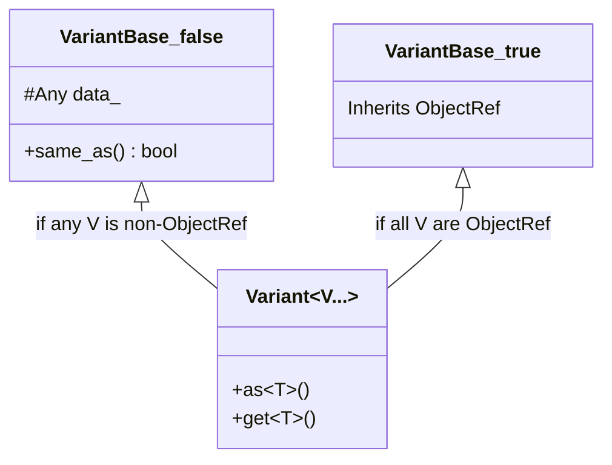

# Container Types Design

**TL;DR**:
- TVM FFI provides typed containers (`Array`, `Map`, `String`, `Bytes`, `Tuple`, `Variant`, `Optional`, `Shape`, `Tensor`). Most are Object subclasses; `String` and `Bytes` are value types with small-string optimization (not ObjectRef since commit 49e2ed4).
- Containers store `Any` elements internally with explicit `void* data_` pointer indirection and `data_deleter_` for cross-library safety.
- `Variant<V...>` uses a compile-time storage specialization: `ObjectRef`-backed (8 bytes) when all types are ObjectRef, `Any`-backed (16 bytes) otherwise.
- All container types require `tvm::ffi::` qualification. The `tvm::` namespace aliases were removed in commit e9d2946.

## Problem Statement
### Background
- The FFI needs typed collections that cross language boundaries, support ref-counting, and store both POD and object values.
- Container data must be safely deallocated even when allocated by a different shared library.

### Solution
- All containers inherit from `Object` and use `Any` as the internal element type.
- Explicit `void* data_` pointer + `void (*data_deleter_)(void*)` decouple element storage from the object header.
- Template wrappers (`Array<T>`, `Map<K,V>`, etc.) enforce type invariants via `TypeTraits<T>::CheckAnyStrict`.

### Goals
- Zero-boxing for POD elements (e.g., `Array<int>` stores `kTVMFFIInt` values inline in `Any`).
- Deterministic iteration order for `Map`.
- Non-goals: concurrent modification safety (debug mode only).

## Design

### Namespace Qualification

All container types require `tvm::ffi::` qualification (e.g., `tvm::ffi::Array<int>`, `tvm::ffi::Map<K,V>`, `tvm::ffi::String`). The `tvm::` namespace aliases were progressively removed: `tvm::Tuple` in ed56a5e, `tvm::Downcast` in 4be1af7, and all remaining aliases (`tvm::Array`, `tvm::Map`, `tvm::String`, `tvm::Bytes`, `tvm::Optional`, `tvm::Variant`, `tvm::GetRef`, `tvm::GetObjectPtr`, `tvm::make_object`) in e9d2946. No `using ffi::*` declarations remain in any FFI header.

### String / Bytes

`String` and `Bytes` are **value types** (not `ObjectRef` subclasses since commit 49e2ed4). They embed a `details::BytesBaseCell` that transparently manages dual storage:

- **Small strings (<=7 bytes)**: stored inline in `TVMFFIAny.v_bytes` with `type_index = kTVMFFISmallStr` / `kTVMFFISmallBytes`.
- **Large strings (>7 bytes)**: heap-allocated via `details::MakeInplaceBytes<Base>` or `details::BytesObjStdImpl<Base>`. The backing Obj classes (`details::StringObj`, `details::BytesObj`, `details::BytesObjBase`) are in the `details` namespace (moved from `tvm::ffi` in commit f9d2bff).

Key API:
- `String(std::nullptr_t) = delete` -- prevents null construction.
- `String::compare(const char*)` -- scans inline, avoids `strlen` (optimized in ba0ea87).
- `Bytes::memequal(const void* lhs, const void* rhs, size_t, size_t)` -- equality-only comparison, short-circuits on length mismatch (added in ba0ea87).
- `Bytes::memncmp(const char*, const char*, size_t, size_t)` -- three-way comparison for ordering.
- `Optional<String>` / `Optional<Bytes>` -- zero-overhead via `BytesBaseCell(std::nullopt)` sentinel.

See `.knowledge/designs/0011-small-string-optimization.md` for the full SSO design.

### Array<T>

#### ArrayObj Layout

```cpp
class ArrayObj : public Object, public InplaceArrayBase<ArrayObj, TVMFFIAny> {
    void* data_;                          // pointer to first element
    int64_t size_;
    int64_t capacity_;
    void (*data_deleter_)(void*) = nullptr;  // cross-library cleanup
};
```

Key design: `data_` points to `AddressOf(0)` for inplace storage but can be redirected to externally-allocated buffers in the future. The `InplaceArrayBase` template argument is `TVMFFIAny` (not `Any`) for layout correctness -- elements are accessed as `static_cast<Any*>(data_)`.

- `at(int64_t i)` returns `const Any&` (reference, not copy -- changed in 7e0a4b3)
- `operator[](int64_t i)` -- bounds checking, throws `IndexError`
- `begin()` / `end()` -- returns `static_cast<Any*>(data_)`
- `EmplaceInit(size_t idx, Args...)` -- placement-new at `MutableBegin() + idx`
- `emplace_back(Args...)` -- variadic emplace via CoW + `EmplaceInit`
- Destructor explicitly destroys each `Any` element and calls `data_deleter_` if non-null

#### IterAdapter

Random-access iterator adapter used by `Array::begin()`/`end()`. Includes `operator+=` / `operator-=` (added in 024e45c) to fully satisfy the RandomAccessIterator named requirement -- required by some STL implementations for `std::vector::insert`.

**Type alias correctness** (fixed in 14f3c82): `IterAdapter` and `ReverseIterAdapter` type aliases are now correct for LegacyInputIterator compliance:
- `using pointer = const typename Converter::ResultType*;` (was non-const)
- `using reference = const typename Converter::ResultType;` (was `ResultType&`)
- `reference operator*() const;` (return type now matches `reference` typedef)

The iterator returns converted values by value (not by reference), so `reference` must be `const T` (not `T&`). The old mismatch caused potential UB with `std::make_move_iterator`, which deduces its own `reference` from the wrapped iterator's `reference` typedef.

### Map<K, V>

#### MapObj Layout

```cpp
class MapObj : public Object {
    void* data_;
    int64_t size_;
    uint64_t slots_;               // MSB (bit 63) is layout tag: set=SmallMap, clear=DenseMap
    void (*data_deleter_)(void*) = nullptr;

    static constexpr uint64_t kSmallTagMask = static_cast<uint64_t>(1) << 63;
    bool IsSmallMap() const;       // returns (slots_ & kSmallTagMask) != 0
};
```

Uses `KVRawStorageType = struct { TVMFFIAny first; TVMFFIAny second; }` for inplace storage in `SmallMapObj` (prevents double destruction by separating raw storage from `Any` destructor management).

#### MSB-Tagged slots_ Encoding (since 03e8a6b)

`MapObj::slots_` encodes both the slot count and the layout discriminant in a single `uint64_t`. Bit 63 (`kSmallTagMask`) is set for SmallMap instances, clear for DenseMap. This replaces the previous heuristic of comparing `slots_` against `SmallMapObj::kMaxSize`.

Each subclass provides a `NumSlots()` accessor that masks off the tag:
- `SmallMapObj::NumSlots()` returns `slots_ & ~kSmallTagMask`
- `DenseMapObj::NumSlots()` returns `slots_` (MSB is always clear)

Construction uses private setters:
- `SmallMapObj::SetSlotsAndSmallLayoutTag(n)` -- `slots_ = (n & ~kSmallTagMask) | kSmallTagMask`
- `DenseMapObj::SetSlotsAndDenseLayoutTag(n)` -- asserts MSB clear, then `slots_ = n`

All dispatch sites use `IsSmallMap()` instead of raw `slots_` comparisons.

#### SmallMapObj (n <= 8)

Linear scan over a dense KV array. Explicit destructor manually destroys each `KVType` entry. `MapObj::CreateFromRange` uses `InsertMaybeReHash` for small maps with `cap >= 2` to handle duplicate keys correctly (fixed in 0342d85). The `cap < 2` case uses direct bulk copy since duplicates are impossible with 0 or 1 elements.

#### DenseMapObj (n > 8)

Open-addressing hash map with Fibonacci hashing.
- `NumSlots()` returns the actual slot count (MSB is always clear for dense maps)
- Hash probing uses `% NumSlots()` (modulo, not bitwise-and -- corrected in 7e0a4b3 for arbitrary slot counts)
- `BlockDeleter` static method as `data_deleter_` callback for safe cross-library deallocation
- `IsFull()` check: `size_ + 1 > NumSlots() * kMaxLoadFactor`

#### Dispatch Macros

`TVM_FFI_DISPATCH_MAP` / `TVM_FFI_DISPATCH_MAP_CONST` use `base->IsSmallMap()` for tag-based dispatch (previously used `slots_ <= kMaxSize` heuristic; renamed from `TVM_DISPATCH_MAP` in 7e0a4b3).

### Tuple<T...>

Fixed-size heterogeneous tuple backed by `ArrayObj::Empty(sizeof...(Types))`. Supports `get<I>()` for typed access.

Variadic constructor has a SFINAE guard (added in 024e45c): disabled when `sizeof...(Types) == 1` and `UTypes` is `Tuple<Types>` itself, preventing the forwarding reference from shadowing move/copy constructors for single-element tuples.

**C++17 Structured Binding Support** (since 5569e44):
- `std::tuple_size<tvm::ffi::Tuple<Types...>>` specialization: inherits `std::integral_constant<size_t, sizeof...(Types)>`
- `std::tuple_element<I, tvm::ffi::Tuple<Types...>>` specialization: `using type = std::tuple_element_t<I, std::tuple<Types...>>`
- ADL-friendly free-function `tvm::ffi::get<I>(const Tuple<Types...>&)` and `tvm::ffi::get<I>(Tuple<Types...>&&)` overloads
- Rvalue-qualified `get<I>() &&` member: when `this->unique()` is true, moves the I-th element via `AnyUnsafe::MoveFromAnyAfterCheck`; falls back to copy when shared
- CTAD deduction guide: `Tuple(UTypes&&...) -> Tuple<decay_t<UTypes>...>`

```cpp
// Structured binding (lvalue copy):
auto t = Tuple{1, 2.0f, String{"hello"}};  // CTAD
auto [a, b, c] = t;
// a == 1, b == 2.0f, c == "hello"; t still valid

// Move semantics for uniquely-owned tuples:
auto t2 = Tuple{Array<int>{0}};
auto [arr] = std::move(t2);
// arr.use_count() == 1 (moved, not copied)
```

### Variant<V...>

Compile-time dual-storage strategy based on `all_object_ref_v<V...>`:



- **All ObjectRef**: `VariantBase<true>` inherits from `ObjectRef`. `sizeof == 8`. The variant participates in the ObjectRef type hierarchy directly.
- **Mixed POD+Object**: `VariantBase<false>` stores `Any data_`. `sizeof == 16`.

Compile-time trait: `all_object_ref_v<T...> = (std::is_base_of_v<ObjectRef, T> && ...)` (added in 296e2f7).

### Tensor / TensorView / Shape / Optional

- **Tensor**: `TensorObj : Object` with `DLTensor` following header (renamed from `NDArrayObj`/`NDArray` in 3a551d8). Type index `kTVMFFITensor = 70` (value unchanged, key changed from `"ffi.NDArray"` to `"ffi.Tensor"`). Strides are always populated (never nullptr) since ca95b41, **except for zero-dimensional (scalar) tensors** where `strides == nullptr` is a valid DLPack state (relaxed in 4fefeb0); the canonical check is `strides != nullptr || ndim == 0`. Contiguity must be checked via `IsContiguous()` rather than `strides == nullptr`. Protected fields `shape_data_` and `strides_data_` (both `Optional<Shape>`, `strides_data_` renamed from `stride_data_` in 6fa40b5) own the backing memory for the shape and strides pointers respectively. Public accessors: `Tensor::shape()`, `Tensor::strides()` (added in 6fa40b5), `Tensor::IsContiguous()`, `Tensor::IsAligned(size_t)` (added in 1b824e8).

- **TensorView** (added in 1ec6236, method-based API since 0dcd4d2): A lightweight non-owning view over a `DLTensor`, the recommended parameter type for FFI-exported kernel functions. Key properties:
  - `TensorView(const Tensor&)`, `TensorView(const DLTensor*)` -- constructors from owned Tensor or raw DLTensor pointer
  - `TensorView(Tensor&&) = delete` -- prevents binding to rvalue owning tensors
  - `data_ptr()`, `ndim()`, `dtype()`, `device()`, `size(int64_t idx)`, `stride(int64_t idx)`, `byte_offset()`, `numel()` -- named method accessors (replaces `operator->()` removed in 0dcd4d2). `size`/`stride` accept negative indices (since 573d76f): when `idx < 0`, computes `ptr->ndim + idx`.
  - `dim()`, `sizes()`, `is_contiguous()` -- PyTorch aten-style aliases for `ndim()`, `shape()`, `IsContiguous()` respectively (added in 573d76f)
  - `shape()`, `strides()`, `IsContiguous()` -- compound accessors
  - `TypeTraits<TensorView>` sets `storage_enabled = false` (view-only, cannot be stored in `Any`), `field_static_type_index = kTVMFFIDLTensorPtr`
  - `TryCastFromAnyView` accepts both `kTVMFFIDLTensorPtr` (raw DLTensor pointers) and `kTVMFFITensor` (owned Tensor objects), enabling maximum flexibility for callers
  - No `MoveToAny`/`MoveFromAny` (deliberately non-owning)
  - Supersedes `ffi::Tensor` as the recommended kernel function parameter type

- **Tensor** method-based API (since 0dcd4d2): `operator->()` removed in favor of named methods: `data_ptr()`, `ndim()`, `dtype()`, `device()`, `size(int64_t idx)`, `stride(int64_t idx)`, `byte_offset()`, `numel()`, `GetDLTensorPtr()`. Protected `get()` replaces the implicit `operator->()` chain. Uses explicit constructors instead of `TVM_FFI_DEFINE_OBJECT_REF_METHODS_NULLABLE` macro. PyTorch aten-style aliases: `dim()`, `sizes()`, `is_contiguous()` (added in 573d76f). Negative indexing for `size`/`stride` (since 573d76f).

- **Tensor strided view** (since 8888eb4b): `Tensor::as_strided(ShapeView shape, ShapeView strides, std::optional<int64_t> element_offset)` creates a zero-copy strided view of an existing tensor via `TVMFFITensorCreateUnsafeView`. The view shares the source tensor's data memory. `element_offset` is in dtype elements (not bytes); it adjusts `byte_offset`. On devices with direct addressing (CPU, CUDA), the byte offset is folded into the data pointer (`data += byte_offset`, `byte_offset = 0`). The companion `Tensor::FromNDAllocStrided(alloc, shape, strides, dtype, device)` creates a new tensor with explicit strides via a prototype-based `TensorObjFromNDAlloc` constructor that copies shape and strides into the inplace allocation.

- **Shape**: `ShapeObj : Object, TVMFFIShapeCell`. Immutable. Type index `kTVMFFIShape = 69`. `Shape::StridesFromShape(const int64_t* data, int64_t ndim)` (public static factory, added in 472e10c) computes row-major strides as a new Shape object, wrapping the internal `details::MakeStridesFromShape`.
- **Optional<T>**: For ObjectRef types, uses nullptr for nullopt (zero overhead). For POD, wraps `std::optional<T>`. Uses `ObjectUnsafe::ObjectRefFromObjectPtr<T>` internally (since 472e10c) instead of direct `T(ObjectPtr<Object>)` construction.

### Key Classes, Fields and Interfaces

| Symbol | Key Members | Description |
|--------|-------------|-------------|
| `ArrayObj` | `void* data_`, `size_`, `capacity_`, `data_deleter_` | Dynamic array with inplace storage |
| `Array<T>` | `push_back`, `Set`, `emplace_back`, `begin`/`end` | Typed wrapper with CoW |
| `MapObj` | `void* data_`, `size_`, `uint64_t slots_` (MSB-tagged), `data_deleter_`, `kSmallTagMask`, `IsSmallMap()` | Base for SmallMapObj/DenseMapObj; MSB of `slots_` discriminates layout |
| `Map<K,V>` | `Set`, `Get`, `count`, `find`, `erase` | Typed wrapper, insertion-order preserving |
| `Variant<V...>` | `as<T>()`, `get<T>()` | Dual-storage tagged union |
| `VariantBase<true>` | inherits `ObjectRef` | 8-byte specialization for all-ObjectRef variants |
| `VariantBase<false>` | `Any data_` | 16-byte default for mixed variants |
| `all_object_ref_v<T...>` | `constexpr bool` | Compile-time predicate for variant specialization |

### Contracts, Assumptions and Invariants
- **Type element invariant**: `Array<T>` enforces `TypeTraits<T>::CheckAnyStrict(elem)` for all elements.
- **Cross-library deallocation**: `data_deleter_` ensures data allocated in one shared library is freed by that library's allocator.
- **Insertion order**: `Map` iteration order matches insertion order (deterministic across platforms).
- **Variant storage**: `sizeof(Variant<V...>) == 8` when `all_object_ref_v<V...>` is true, `16` otherwise.
- **Tuple single-element guard**: Variadic constructor is SFINAE-disabled for single-element self-type to prevent shadowing move constructor.

### Extension Points
- `data_` pointer indirection enables future external/reallocated data buffers without changing the object header.
- `KVRawStorageType` pattern can be reused for any inplace container that needs explicit destruction control.

### Usage Examples

#### Variant storage specialization
**Context**: Using a variant of ObjectRef types gets 8-byte storage.
```cpp
// All-ObjectRef variant: 8 bytes, participates in ObjectRef hierarchy
Variant<TInt, Array<TInt>> v = TInt(1);
static_assert(std::is_base_of_v<ObjectRef, decltype(v)>);
assert(sizeof(v) == sizeof(ObjectRef));  // 8 bytes

// Mixed variant: 16 bytes, backed by Any
Variant<String, int> v2 = 42;
assert(sizeof(v2) == sizeof(Any));  // 16 bytes
```

### Python Container Wrappers (since 2d41a51)

The Python `container.py` module provides `Array` and `Map` wrappers with `collections.abc` compliance:

**`Array(Object, Sequence[T])`** (generic since df58a05): Registered as `"ffi.Array"`. Constructor takes any `Iterable[T]` (widened from `Sequence` in 54f527f) and calls `_ffi_api.Array(*input_list)`. Implements `__getitem__` (with `SupportsIndex` protocol via `operator.index()` and slice support via `getitem_helper` using `slice.indices()`), `__len__` (via `_ffi_api.ArraySize`), explicit `__iter__`, and `__add__`/`__radd__` for concatenation (since 54f527f). Slicing returns `list[T]`, not `Array[T]` (restored original behavior in 90dba57 after a brief regression in df58a05).

**`Map(Object, Mapping[K, V])`** (generic since df58a05): Registered as `"ffi.Map"`. Constructor flattens dict to alternating key-value list and calls `_ffi_api.Map(*list_kvs)`. Implements `__getitem__` (via `_ffi_api.MapGetItem`), `__contains__` (via `_ffi_api.MapCount`), `__len__` (via `_ffi_api.MapSize`). `Map.get` is overloaded with `_DefaultT` TypeVar for precise default-value typing; uses `try/except KeyError` instead of double lookup. Both `SmallMapObj` and `DenseMapObj` now consistently throw `KeyError` for missing keys (corrected for `DenseMapObj` in c88110e).

**Lazy iteration via `MapForwardIterFunctor`**: Custom `KeysView[K]`, `ValuesView[V]`, `ItemsView[K, V]` classes (generic since df58a05) inherit from `collections.abc` generic bases and use a stateful C++ iterator functor (`_ffi_api.MapForwardIterFunctor(map)`) for lazy traversal. The functor protocol: `functor(0)` returns key, `functor(1)` returns value, `functor(2)` advances and returns whether more items exist. `ItemsView.__contains__` performs O(1) key lookup (added in df58a05). View iteration uses bounded `for _ in range(size)` instead of `while True`.

**`Shape(tuple, PyNativeObject)`** (in `ndarray.py`): Registered as `"ffi.Shape"`. A `tuple` subclass that carries a `__tvm_ffi_object__` handle. Constructor validates all elements are `Integral`, creates the tuple, then calls the FFI Shape constructor. `__from_tvm_ffi_object__` reconstructs from C++ object via `_shape_obj_get_py_tuple`.

**Automatic conversion**: `list`/`tuple` -> `Array`, `dict` -> `Map`, `str` -> `String`, `bytes` -> `Bytes`. Since commit 043d9f6, nested container conversion is handled by Cython-level setters (`TVMFFIPyArgSetterTuple_`, `TVMFFIPyArgSetterTupleLike_`, `TVMFFIPyArgSetterMap_`) via `TVMFFIPyConstructorCall`, replacing the old `_FUNC_CONVERT_TO_OBJECT` Python callback. The `convert()` function in `convert.py` remains available for explicit Python-level conversion.

See `.knowledge/designs/0014-python-bindings.md` for full details.

### Evolution Timeline
| Version | Commit | Change | Motivation |
|---------|--------|--------|------------|
| v1 | 7d34eb8 | Initial containers with `InplaceArrayBase<ArrayObj, Any>` | Establish container system |
| v2 | 16e9f0a | Namespace aliases (`tvm::Array`, etc.) | Convenience for downstream |
| v3 | 296e2f7 | Variant ObjectRef specialization (`VariantBase<true>`) | Halve memory for all-ObjectRef variants |
| v4 | 024e45c | Tuple SFINAE guard; IterAdapter `+=`/`-=` | Fix single-element tuple bug; complete iterator contract |
| v5 | 7e0a4b3 | `data_`/`data_deleter_` indirection; modulo probing; `KVRawStorageType` | ABI stabilization; cross-library safety |
| v6 | ba0ea87 | `Bytes::memequal`; aligned `StableHashBytes`; `String::compare(const char*)` rewrite | String equality/hash performance |
| v7 | f9d2bff | `BytesObj`/`StringObj`/`BytesObjBase` moved to `details` namespace | Decouple public API from internal representation |
| v8 | 0342d85 | SmallMapObj duplicate key fix in `CreateFromRange` | Correctness: dedup keys for small maps |
| v9 | 49e2ed4 | SSO: `String`/`Bytes` as value types; `BytesBaseCell`; `kTVMFFISmallStr`/`kTVMFFISmallBytes` | Zero-allocation for short strings |
| v10 | ed56a5e | Remove `using ffi::Tuple;` from `namespace tvm` | Phase out `tvm::Tuple` alias; use `tvm::ffi::Tuple` |
| v11 | 4be1af7 | Remove `Downcast` from FFI; add `using ffi::GetObjectPtr;`; `GetRef` changed from `TVM_FFI_INLINE` to `inline` | FFI minimality: `Downcast` was redundant with `Any::cast<T>()` |
| v12 | 03e8a6b | MSB tag in `MapObj::slots_` for SmallMap/DenseMap discrimination; `IsSmallMap()`, per-subclass `NumSlots()`, `SetSlotsAnd{Small,Dense}LayoutTag()` | Decouple dispatch from slot count value; structural tag replaces heuristic |
| v13 | 3a551d8 | Rename `NDArrayObj`/`NDArray` to `TensorObj`/`Tensor`; type key `"ffi.NDArray"` to `"ffi.Tensor"` | Align with torch.Tensor naming |
| v14 | 6fa40b5 | Add `Tensor::strides()` accessor; rename `stride_data_` to `strides_data_` | Complete Tensor ref API |
| v15 | e9d2946 | Remove all `using ffi::*` aliases from `namespace tvm` | Mandatory `tvm::ffi::` qualification |
| v16 | 472e10c | `UnsafeInit` constructors on Array, Map, Tuple, Variant; `Optional` uses `ObjectUnsafe::ObjectRefFromObjectPtr` | ObjectRef null safety |
| v17 | df58a05 | `Array[T]`, `Map[K,V]` generic parameterization; `SupportsIndex`; explicit `__iter__`; overloaded `Map.get` | Static type inference for element types |
| v18 | 54f527f | `Array.__add__`/`__radd__`; `Iterable[T]` constructor | Pythonic array concatenation |
| v19 | 90dba57 | `Array.__getitem__(slice)` returns `list[T]` (reverts v17 regression) | Restore original TVM behavior |
| v20 | c88110e | `DenseMapObj::At` throws `KeyError` (was `IndexError`) | Consistent exception across map layouts |
| v21 | 1ec6236 | Add `TensorView` non-owning view class; recommended kernel param type | Non-owning view over DLTensor for FFI functions |
| v22 | 4fefeb0 | Relax strides invariant for zero-dim tensors (`strides == nullptr` OK when `ndim == 0`) | DLPack spec compliance for scalar tensors |
| v23 | 0dcd4d2 | Replace `operator->()` with method-based API on Tensor/TensorView; `GetDLTensorPtr()`; explicit `get()` | Prevent raw pointer access; uniform API surface |
| v24 | 8377011 | Expose `Tensor.strides` property in Python with NULL-strides fallback | Complete Python tensor API |
| v25 | 6e9100c | Add `class Tensor;` forward declaration for MSVC | Compiler compatibility fix |
| v26 | 573d76f | Add `dim()`, `sizes()`, `is_contiguous()` aten-style aliases + negative indexing for `size(int64_t)`/`stride(int64_t)` on Tensor and TensorView | PyTorch API compatibility |
| v27 | 14f3c82 | Fix `IterAdapter`/`ReverseIterAdapter` `pointer`/`reference` typedefs and `operator*` return type for LegacyInputIterator compliance | Prevent UB with `std::make_move_iterator` |
| v28 | 5569e44 | Add `std::tuple_size`/`std::tuple_element` specializations, ADL `get()`, rvalue `get() &&`, CTAD for `Tuple<T...>` | C++17 structured binding support |
| v29 | 8888eb4b | Add `Tensor::as_strided(shape, strides, element_offset)` and `Tensor::FromNDAllocStrided`; `TVMFFITensorCreateUnsafeView` C API | Zero-copy strided tensor views |
| v30 | 438f6439 | Fix `Map.get()` Python performance by avoiding unnecessary map value copy | Map lookup optimization |

## Alternatives & Trade-offs
### Keep inplace array addressing without data_ pointer
- Pros: Simpler implementation; no extra pointer member
- Cons: Cannot support external/reallocated buffers; no cross-library deallocation safety
### Use std::variant for Variant instead of ObjectRef/Any backing
- Pros: Standard C++ type; compiler-managed discriminant
- Cons: Fixed size based on largest alternative; cannot participate in ObjectRef hierarchy; not ABI-stable

## Related Work
### Design Docs & ADRs
- `.knowledge/ADRs/004-insertion-order-map.md` -- Map iteration order decision
- `.knowledge/ADRs/006-variant-objectref-specialization.md` -- Variant storage optimization
- `.knowledge/ADRs/007-container-data-indirection.md` -- data_/data_deleter_ pattern
- `.knowledge/ADRs/010-msb-tagged-map-dispatch.md` -- MSB tag in slots_ for SmallMap/DenseMap dispatch
- `.knowledge/designs/any-system.md` -- Any as element storage
- `.knowledge/designs/0011-small-string-optimization.md` -- SSO design for String/Bytes

### Evidence Matrix
- Namespace aliases -> `2025-05-08-16e9f0a.md` + commit 16e9f0a
- Variant specialization -> `2025-05-10-296e2f7.md` + commit 296e2f7
- Tuple SFINAE guard -> `2025-05-29-024e45c.md` + commit 024e45c
- Container ABI stabilization -> `2025-06-18-7e0a4b3.md` + commit 7e0a4b3
- `Bytes::memequal` + aligned hash -> `2025-07-30-ba0ea87.md` + commit ba0ea87
- String/Bytes SSO -> `2025-08-04-49e2ed4.md` + commit 49e2ed4
- SmallMap dup key fix -> `2025-07-31-0342d85.md` + commit 0342d85
- Tuple alias removal -> `2025-08-06-ed56a5e.md` + commit ed56a5e
- Downcast removal, GetObjectPtr addition -> `2025-08-08-4be1af7.md` + commit 4be1af7
- Map MSB tag -> `2025-08-09-03e8a6b.md` + commit 03e8a6b
- NDArray -> Tensor rename -> `2025-09-06-3a551d8.md` + commit 3a551d8
- Tensor::strides() -> `2025-09-06-6fa40b5.md` + commit 6fa40b5
- Namespace alias removal -> `2025-09-08-e9d2946.md` + commit e9d2946
- UnsafeInit on containers -> `2025-09-08-472e10c.md` + commit 472e10c
- TensorView introduction -> `2025-10-01-1ec623678adea0ddba482d8d56d4ab2be440e694.md` + commit 1ec6236
- Zero-dim strides fix -> `2025-10-01-4fefeb0f5913fc41cf860f517b9320f1bf1d0e98.md` + commit 4fefeb0
- Tensor aten-style aliases + negative indexing -> `2025-10-17-573d76f2.md` + commit 573d76f
- IterAdapter LegacyInputIterator fix -> `2025-11-04-14f3c82e.md` + commit 14f3c82
- Tuple structured bindings + ADL get + CTAD -> `2025-11-05-5569e449.md` + commit 5569e44
- Strided tensor view -> `2025-12-12-8888eb4b254486fb1fb5baad7e9f24bc1cfac63a.md` + commit 8888eb4b + `Tensor::as_strided`, `TVMFFITensorCreateUnsafeView`
- Map.get performance fix -> `2025-12-12-438f6439148b059d424ce2cc2a348736923f6948.md` + commit 438f6439
- Plus 2 supporting commits (eda2b71 clang20 nullptr_t fix, f9d2bff details namespace)
