# Object System Design

**TL;DR**:
- Every heap-allocated value inherits from `Object` with a 24-byte `TVMFFIObject` header (expanded from 16 bytes in ca9c3d1 to add weak reference counting). References are managed via `ObjectPtr<T>` (strong) and `WeakObjectPtr<T>` (weak).
- The dual-class pattern (`FooObj` data + `Foo` ref wrapper) is mandatory, with macros for declaring static metadata.
- Type keys use the `ffi.*` namespace (e.g., `"ffi.String"`); ancestor tables store `TVMFFITypeInfo**` for O(1) parent metadata access.

## Problem Statement
### Background
- The FFI needs a uniform type hierarchy for all heap objects, supporting ref-counting, runtime type checking, and cross-language interop.

### Solution
- Intrusive reference counting via `TVMFFIObject` header (combined_ref_count packing strong+weak, type_index, deleter with flags).
- `ObjectPtr<T>` for ownership; `ObjectRef` as the public wrapper base class.
- Static metadata fields on each class (`_type_key`, `_type_index`, `_type_final`, `_type_mutable`, etc.).

### Goals
- O(1) `IsInstance<T>()` for final types and child-slot ranges.
- Non-virtual destructors (explicit destructor call via deleter function pointer with `TVMFFIObjectDeleterFlagBitMask` flags).
- Non-goals: multiple inheritance of Object classes (single-inheritance hierarchy only).

## Design

### Core Classes

#### Object

```cpp
class Object {
protected:
    TVMFFIObject header_;  // {combined_ref_count, type_index, __padding, deleter}
public:
    template<typename T> bool IsInstance() const;
    int32_t type_index() const;
    std::string GetTypeKey() const;
    int32_t use_count() const;
    bool unique() const;
private:
    void IncRef();   // atomic increment (RELAXED)
    void DecRef();   // atomic decrement (RELEASE) + ACQUIRE fence on deletion path
};
```

Subclasses declare static metadata fields:
- `_type_key` -- unique string identifier using `ffi.*` namespace (e.g., `"ffi.String"`, `"ffi.Object"`)
- `_type_index` -- compile-time index (or `kTVMFFIDynObject` for dynamic)
- `_type_final` -- true if no subclasses in the type system
- `_type_child_slots` -- reserved contiguous index range for children
- `_type_child_slots_can_overflow` -- allow dynamic children beyond slots
- `_type_depth` -- depth in inheritance tree
- `_type_mutable` -- whether non-const pointer extraction is allowed from `Any`/`AnyView` (default: `false`, added in 1a85688)

Optional metadata fields (for structural comparison):
- `_type_s_eq_hash_kind` -- `TVMFFISEqHashKind` enum value (default: `kTVMFFISEqHashKindUnsupported`). Declares how the type participates in structural equality/hash. Stored in `TVMFFITypeMetadata` (added in 9445fe7).

Removed fields:
- `_type_has_method_visit_attrs` -- removed in da47623 (legacy `VisitAttrs` pattern phased out)
- `_type_has_method_sequal_reduce` -- removed in e52aed5 (replaced by `_type_s_eq_hash_kind` + TypeAttr `__s_equal__`)
- `_type_has_method_shash_reduce` -- removed in e52aed5 (replaced by `_type_s_eq_hash_kind` + TypeAttr `__s_hash__`)

#### StaticTypeKey Constants

Centralized type key strings (all use `ffi.*` prefix, formalized in 0966c36):
- `kTVMFFIObject = "ffi.Object"`, `kTVMFFIFunction = "ffi.Function"`
- `kTVMFFIArray = "ffi.Array"`, `kTVMFFIMap = "ffi.Map"`
- `kTVMFFIStr = "ffi.String"`, `kTVMFFIBytes = "ffi.Bytes"`
- `kTVMFFIShape = "ffi.Shape"`, `kTVMFFITensor = "ffi.Tensor"` (renamed from `kTVMFFINDArray = "ffi.NDArray"` in 3a551d8)
- `kTVMFFIModule = "ffi.Module"`, `kTVMFFISmallStr = "ffi.SmallStr"`, `kTVMFFISmallBytes = "ffi.SmallBytes"`

#### ObjectPtr<T>

Intrusive smart pointer. Internal `data_` field is `Object*`. Copy increments ref count; move transfers ownership (no atomics); destructor calls `DecRef()`.

#### ObjectRef

Public wrapper around `ObjectPtr<Object>`. Provides `as<ObjectType>()` for downcast, `defined()` for null check, `same_as()` for identity comparison.

### Dual-Class Pattern

```
FooObj : Object          -- "Data class" holds fields
  Declares: _type_key, _type_index, _type_final, etc.
  Macro: TVM_FFI_DECLARE_FINAL_OBJECT_INFO(FooObj, Object)

Foo : ObjectRef          -- "Ref class" provides API
  Macro: TVM_FFI_DEFINE_OBJECT_REF_METHODS(Foo, ObjectRef, FooObj)
  Defines: operator->() returns FooObj*, ContainerType = FooObj
```

Macro variants (renamed in a08fa6e to absorb `_type_key` as first parameter and use verb-last naming):
- `TVM_FFI_DECLARE_OBJECT_INFO(TypeKey, TypeName, Parent)` -- inheritable (dynamic type index). Absorbs `_type_key` definition.
- `TVM_FFI_DECLARE_OBJECT_INFO_FINAL(TypeKey, TypeName, Parent)` -- leaf type (`_type_final=true`, `_type_child_slots=0`)
- `TVM_FFI_DECLARE_OBJECT_INFO_STATIC(TypeKey, TypeName, Parent)` -- compile-time fixed index
- `TVM_FFI_DEFINE_OBJECT_REF_METHODS_NULLABLE(T, P, O)` -- ref can hold nullptr; auto-derives `__PtrType` from `O::_type_mutable`
- `TVM_FFI_DEFINE_OBJECT_REF_METHODS_NOTNULLABLE(T, P, O)` -- ref cannot hold nullptr; same `__PtrType` derivation

### Macro Expansions

`TVM_FFI_DECLARE_OBJECT_INFO_FINAL("my.FooObj", FooObj, Object)` expands to (pseudocode):
```cpp
// Static metadata (type key is now macro parameter, not user-declared)
static constexpr const char* _type_key = "my.FooObj";
static constexpr bool _type_final = true;
static constexpr int32_t _type_child_slots = 0;
static constexpr int32_t _type_depth = ParentObj::_type_depth + 1;

// Runtime type index (lazy allocation)
static int32_t _GetOrAllocRuntimeTypeIndex() {
    static int32_t idx = TVMFFITypeGetOrAllocIndex(
        _type_key, _type_index, parent_index, _type_child_slots, _type_child_slots_can_overflow);
    return idx;
}
static int32_t RuntimeTypeIndex() { return _GetOrAllocRuntimeTypeIndex(); }
```

### Type Index Hierarchy

The type index system supports fast `IsInstance<T>()` checks:

1. **Compile-time final check**: If `T::_type_final`, just compare `type_index == T::RuntimeTypeIndex()`
2. **Child-slot range check**: If `T::_type_child_slots > 0`, check if index is in `[T::RuntimeTypeIndex(), T::RuntimeTypeIndex() + _type_child_slots + 1)`
3. **Ancestor table lookup**: `TVMFFIGetTypeInfo(index)->type_ancestors[T::_type_depth]->type_index == T::RuntimeTypeIndex()` (dereferences a `TVMFFITypeInfo*` pointer, changed in 837800e from raw `int32_t`)

```mermaid
graph TD
    A["Object (idx=64, ffi.Object)"] --> B["details::StringObj (idx=65, ffi.String, final)"]
    A --> C["details::BytesObj (idx=66, ffi.Bytes, final)"]
    A --> D["ErrorObj (idx=67, ffi.Error, final)"]
    A --> E["FunctionObj (idx=68, ffi.Function, final)"]
    A --> F["ShapeObj (idx=69, ffi.Shape, final)"]
    A --> G["TensorObj (idx=70, ffi.Tensor, final)"]
    A --> H["ArrayObj (idx=71, ffi.Array, final)"]
    A --> I["MapObj (idx=72, ffi.Map, final)"]
    A --> J["ModuleObj (idx=73, ffi.Module)"]
    A --> J2["OpaquePyObject (idx=74)"]
    A --> K["Dynamic types (128+)"]
```



### Type Registration (Runtime)

`TVMFFITypeGetOrAllocIndex` (renamed from `TVMFFIGetOrAllocTypeIndex` in 1a85688):
1. **Static types**: Placed at the pre-assigned index
2. **Dynamic types**: Try parent's child slots, then overflow range (starts at 128)
3. Ancestor chain built as `TVMFFITypeInfo**` -- each entry points to a parent's `TypeInfo` struct directly (changed in 837800e)

### Key Classes, Fields and Interfaces

| Symbol | Signature / Description |
|--------|------------------------|
| `Object::IsInstance<T>()` | `template<T> bool IsInstance() const` -- three-tier type check |
| `Object::_type_mutable` | `static constexpr bool` -- gates non-const pointer extraction |
| `ObjectPtr<T>` | Intrusive smart pointer with `get()`, `reset()`, `use_count()`, `unique()` |
| `ObjectRef` | `as<T>()`, `defined()`, `same_as()` |
| `make_object<T>(args...)` | `template<T, Args...> ObjectPtr<T>` -- primary allocation function |
| `StaticTypeKey::kTVMFFI*` | `constexpr const char*` -- centralized type key constants |

### Contracts, Assumptions and Invariants
- **24-byte header**: `sizeof(TVMFFIObject) == 24`. All objects start with this header (expanded from 16 bytes in ca9c3d1 to add weak reference counting).
- **combined_ref_count == kCombinedRefCountBothOne at creation**: `make_object` sets `combined_ref_count` to `kCombinedRefCountBothOne` (strong=1, weak=1). The strong reference implicitly holds one weak reference. See `.knowledge/ADRs/018-combined-ref-count.md`.
- **Non-virtual destructor**: The deleter calls `T::~T()` explicitly (not virtual dispatch). The deleter receives a `TVMFFIObjectDeleterFlagBitMask` flags parameter for two-phase deletion (destroy vs. free memory).
- **Weak reference support**: `WeakObjectPtr<T>` provides non-owning references that keep memory alive after destruction. See `.knowledge/designs/0016-weak-reference-counting.md`.
- **ffi.* type key namespace**: All built-in object types use `"ffi."` prefix. No object should sit in a root namespace.
- **_type_mutable default false**: Non-const pointer extraction via `TypeTraits<TObject*>` requires explicit opt-in.
- **Ancestor table stores TypeInfo pointers**: `type_ancestors` is `const TVMFFITypeInfo**`, enabling O(1) access to parent metadata without `TVMFFIGetTypeInfo` lookup.

### Extension Points
- New object types: define `FooObj` + `Foo`, use declaration macros, register reflection via `ObjectDef<FooObj>`.
- `_type_child_slots`: reserve contiguous index ranges for fast `IsInstance` on base classes with known child count.

### Usage Examples

#### Defining a new object type
**Context**: Creating a new ref-counted type in the FFI type hierarchy.
```cpp
class MyNodeObj : public Object {
 public:
  int64_t value;
  static constexpr bool _type_mutable = true;
  // UnsafeInit constructor for reflection-based creation (since 472e10c)
  explicit MyNodeObj(UnsafeInit) {}
  MyNodeObj(int64_t v) : value(v) {}
  // _type_key is now absorbed into the macro (since a08fa6e)
  TVM_FFI_DECLARE_OBJECT_INFO_FINAL("my.Node", MyNodeObj, Object);
};

class MyNode : public ObjectRef {
 public:
  // Ref macro auto-derives non-const MyNodeObj* from _type_mutable=true
  TVM_FFI_DEFINE_OBJECT_REF_METHODS_NULLABLE(MyNode, ObjectRef, MyNodeObj);
};

// Create and use
auto node = make_object<MyNodeObj>(42);
MyNode ref(node);  // typed ObjectPtr<MyNodeObj> constructor
assert(ref->value == 42);
```

### Python Binding: Cython Object System (since 2d41a51)

The Cython layer in `object.pxi` provides the Python-side object system:

**`Object` cdef class**: Holds a raw `void* chandle` (`TVMFFIObjectHandle`). `__cinit__` initializes to NULL; `__dealloc__` calls `TVMFFIObjectDecRef` (DecRef). All FFI objects inherit from this base.

**Object Type Registry**: `OBJECT_TYPE` (list: type_index -> Python class) and `OBJECT_INDEX` (dict: class -> type_index) map between type indices and Python classes. `_register_object_by_index` populates both. `make_ret_object` dispatches return values through this table.

**`register_object(type_key)` decorator** (in `registry.py`): Resolves type key to type index via `TVMFFITypeKeyToIndex`, calls `_add_class_attrs_by_reflection(type_index, cls)` to auto-populate the class with C++ reflection metadata (properties for fields, methods for methods), then registers the class in `OBJECT_TYPE`.

**Reflection-based class decoration**: `_add_class_attrs_by_reflection` reads `TVMFFITypeInfo` for a type. For each field, creates `FieldGetter`/`FieldSetter` Cython objects (which call C-level `TVMFFIFieldGetter`/`TVMFFIFieldSetter` at the field's byte offset) and wraps them in Python properties. For each method, extracts the `Function` from `TVMFFIMethodInfo.method` and sets it as a class method. Already-defined Python attributes are skipped.

**`PyNativeObject` pattern**: For types that must subclass a Python builtin (e.g., `Shape(tuple)`), `PyNativeObject` provides `__tvm_ffi_object__` attribute storage and `__init_tvm_ffi_object_by_constructor__`. The protocol requires implementing `__from_tvm_ffi_object__(cls, obj)` classmethod, which `make_ret_object` calls when returning such types.

See `.knowledge/designs/0014-python-bindings.md` for full details.

### Rust Binding (since 09477ce)

The Rust crate `tvm-ffi` provides a complete mirror of the C++ object system:

**`ObjectCore` trait** (Rust equivalent of C++ Object metadata statics):
```rust
pub unsafe trait ObjectCore: Sized + 'static {
    const TYPE_KEY: &'static str;
    fn type_index() -> i32;
    unsafe fn object_header_mut(this: &mut Self) -> &mut TVMFFIObject;
}
```

**`ObjectRefCore` trait** (Rust equivalent of C++ ObjectRef pattern):
```rust
pub unsafe trait ObjectRefCore: Sized + Clone {
    type ContainerType: ObjectCore;
    fn data(this: &Self) -> &ObjectArc<Self::ContainerType>;
    fn into_data(this: Self) -> ObjectArc<Self::ContainerType>;
    fn from_data(data: ObjectArc<Self::ContainerType>) -> Self;
}
```

**`ObjectArc<T>`** (Rust equivalent of C++ `ObjectPtr<T>`): Intrusive refcounted smart pointer. Implements `Deref`, `DerefMut`, `Clone` (IncRef), `Drop` (DecRef), `Send + Sync`. Allocation via `ObjectArc::new(data)` initializes `combined_ref_count = COMBINED_REF_COUNT_BOTH_ONE` and sets a Rust-native deleter that handles two-phase deletion (strong: `drop_in_place`, weak: `dealloc`).

**Native ref-counting**: IncRef/DecRef are implemented in Rust using the same atomic protocol as C++ (Relaxed for increment, Relaxed decrement + Acquire fence for deletion), avoiding function call overhead through the dylib. The two-phase deletion protocol matches C++ exactly, including the `COMBINED_REF_COUNT_BOTH_ONE` fast path.

**Derive macros**: `#[derive(Object)]` generates `ObjectCore` impl (requires `#[type_key = "..."]`, optional `#[type_index(...)]`). `#[derive(ObjectRef)]` generates `ObjectRefCore` + `AnyCompatible` + `TryFrom` impls.

Example:
```rust
#[repr(C)]
#[derive(Object)]
#[type_key = "ffi.Function"]
#[type_index(TVMFFITypeIndex::kTVMFFIFunction)]
pub struct FunctionObj {
    object: Object,
    cell: TVMFFIFunctionCell,
}

#[derive(Clone, ObjectRef)]
pub struct Function {
    data: ObjectArc<FunctionObj>,
}
```

See `.knowledge/designs/rust-bindings.md` for the full Rust binding architecture.

### Evolution Timeline
| Version | Commit | Change | Motivation |
|---------|--------|--------|------------|
| v1 | 7d34eb8 | Initial object system with `object.*` type keys, `int32_t*` ancestor table | Establish type hierarchy |
| v2 | 1a85688 | Add `_type_mutable` flag; rename `TVMFFIGetOrAllocTypeIndex` to `TVMFFITypeGetOrAllocIndex` | Mutable field support; API naming |
| v3 | 837800e | `type_ancestors` from `int32_t*` to `TVMFFITypeInfo**`; `ForEachFieldInfo` | O(1) parent metadata access |
| v4 | 0966c36 | Rename type keys `object.*` to `ffi.*`; add `StaticTypeKey` constants | Formalized namespace convention |
| v5 | da47623 | Remove `_type_has_method_visit_attrs` | Complete migration to new reflection |
| v6 | d5209f0 | Optimize DecRef: split release/acquire atomics | Performance on weakly-ordered architectures |
| v7 | 9445fe7 | Add `_type_s_eq_hash_kind` static field on Object subclasses | Structural equal/hash opt-in via enum |
| v8 | e52aed5 | Remove `_type_has_method_sequal_reduce` / `_type_has_method_shash_reduce` | Complete migration to reflection-based eq/hash |
| v9 | f9d2bff | Move `StringObj`/`BytesObj`/`BytesObjBase` to `details` namespace | Prepare for SSO |
| v10 | 49e2ed4 | `String`/`Bytes` no longer ObjectRef; add `kTVMFFISmallStr`/`kTVMFFISmallBytes` type keys | Small string optimization |
| v11 | 777cf8d | Reorder type indices: Shape=69, NDArray=70, Array=71, Map=72; add `kTVMFFIOpaquePyObject=74` (91d69f0) | C ABI simplicity grouping; opaque Python object support |
| v12 | ca9c3d1 | 24-byte header with weak RC: `weak_ref_count` (u32) + `strong_ref_count` (u64); `WeakObjectPtr<T>`; `TVMFFIObjectFree` -> `TVMFFIObjectDecRef`; deleter gains flags param | Weak reference support |
| v13 | 3a551d8 | Rename `NDArrayObj`/`NDArray` to `TensorObj`/`Tensor`; type key `"ffi.NDArray"` to `"ffi.Tensor"` | Align with torch.Tensor naming |
| v14 | 472e10c | `UnsafeInit` tag type; `ObjectUnsafe::ObjectRefFromObjectPtr<T>`; typed `ObjectPtr<ContainerType>` in macros; `ObjectCreatorUnsafeInit<T>` for reflection | Explicit unsafe/null initialization; compile-time type safety for ref constructors |
| v15 | a08fa6e | Rename declaration macros (`DECLARE_FINAL_OBJECT_INFO` -> `DECLARE_OBJECT_INFO_FINAL`, etc.); absorb `_type_key` as macro parameter; unify 4 ref macros into 2 with `std::conditional_t`-based `__PtrType` | Reduce per-class boilerplate; derive mutability from `_type_mutable` |
| v16 | 98cb8af | Rename `type_acenstors` -> `type_ancestors` (typo fix); auto-create fallback Python classes for unregistered C++ types | Correctness + Python usability |
| v17 | 13436f0 | Reorder TVMFFIObject fields: ref counters first (torch ABI alignment) | ABI compatibility with `c10::intrusive_ptr` |
| v18 | 43d13e8 | Pack strong+weak into `uint64_t combined_ref_count`; single-atomic DecRef fast path | Performance: fewer atomics in common case |

## Alternatives & Trade-offs
### Virtual destructors instead of function-pointer deleter
- Pros: Standard C++ pattern; simpler implementation
- Cons: Adds vtable pointer to every object (8 bytes overhead); header-only objects pay vtable cost
### Use type_index as direct array offset for all types
- Pros: O(1) IsInstance without range checks or ancestor tables
- Cons: Requires reserving array slots for all possible dynamic types; unbounded memory for type tables

## Related Work
### Design Docs & ADRs
- `.knowledge/designs/memory.md` -- `make_object`, `SimpleObjAllocator`, ref-counting atomics
- `.knowledge/designs/c-abi.md` -- `TVMFFIObject`, `TVMFFITypeInfo` struct definitions
- `.knowledge/ADRs/003-type-index-ranges.md` -- Type index partitioning
- `.knowledge/designs/0010-structural-equal-hash.md` -- `_type_s_eq_hash_kind` semantics
- `.knowledge/designs/0011-small-string-optimization.md` -- String/Bytes as value types, SmallStr/SmallBytes
- `.knowledge/designs/0013-module-system.md` -- ModuleObj as first-class FFI object
- `.knowledge/designs/0016-weak-reference-counting.md` -- Weak RC: WeakObjectPtr, two-phase deletion, 24-byte header
- `.knowledge/ADRs/014-weak-ref-24byte-header.md` -- Decision: split counter design for 24-byte header
- `.knowledge/ADRs/015-type-index-simplicity-ordering.md` -- Decision: type index reorder for C ABI simplicity

### Evidence Matrix
- `_type_mutable` -> `2025-06-15-1a85688.md` + commit 1a85688
- `type_ancestors` -> `TVMFFITypeInfo**` -> `2025-06-19-837800e.md` + commit 837800e
- `ffi.*` type keys -> `2025-07-01-0966c36.md` + commit 0966c36
- `_type_has_method_visit_attrs` removal -> `2025-07-03-da47623.md` + commit da47623
- DecRef optimization -> `2025-06-18-d5209f0.md` + commit d5209f0
- `_type_s_eq_hash_kind` + structural eq/hash -> `2025-07-19-9445fe7.md` + commit 9445fe7
- Legacy eq/hash flags removal -> `2025-07-29-e52aed5.md` + commit e52aed5
- StringObj/BytesObj -> details -> `2025-08-01-f9d2bff.md` + commit f9d2bff
- `kTVMFFIModule` type key + ModuleObj -> `2025-08-17-538bef49.md` + commit 538bef4
- Type index reorder (Shape=69, NDArray=70, Array=71, Map=72) -> `2025-08-30-777cf8d.md` + commit 777cf8d
- 24-byte header + WeakObjectPtr + TVMFFIObjectDecRef -> `2025-09-01-ca9c3d1.md` + commit ca9c3d1
- kTVMFFIOpaquePyObject=74 -> `2025-09-05-91d69f0.md` + commit 91d69f0
- NDArray -> Tensor rename -> `2025-09-06-3a551d8.md` + commit 3a551d8
- UnsafeInit + ObjectRef null safety -> `2025-09-08-472e10c.md` + commit 472e10c
- Object declaration macro rename -> `2025-09-09-a08fa6e.md` + commit a08fa6e
- Plus 3 supporting commits (16e9f0a namespace aliases, e909486 mutable guard, 49e2ed4 SSO)
