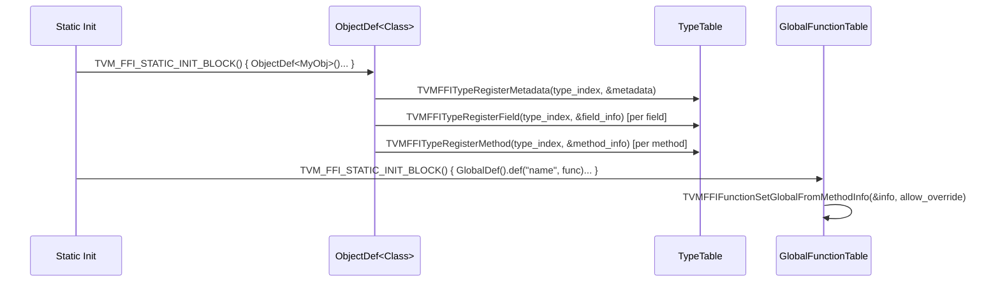

# Reflection System Design

**TL;DR**:
- The reflection system enables runtime introspection and mutation of object fields, method dispatch, and object creation from any language binding.
- Registration uses `ObjectDef<Class>` (for types) and `GlobalDef` (for global functions) inside `TVM_FFI_STATIC_INIT_BLOCK`.
- Runtime access uses `FieldGetter`/`FieldSetter`, `GetMethod`, and `ForEachFieldInfo` from the `accessor.h` header.

## Problem Statement
### Background
- Language bindings (Python, Rust) need to access C++ object fields and call methods without compile-time knowledge of the class layout.
- The C ABI provides `TVMFFIFieldInfo` and `TVMFFIMethodInfo` descriptors per type; the reflection system populates and queries these.

### Solution
- **Registration-time**: `ObjectDef<Class>` builder registers fields (`def_ro`/`def_rw`), methods (`def`/`def_static`), and type metadata (creator, total_size, doc) at static init.
- **Runtime-access**: `FieldGetter`/`FieldSetter` read/write fields by name; `GetMethod` retrieves methods as `Function` objects; `ForEachFieldInfo` iterates inherited fields.
- Both paths are separated into `registry.h` (registration) and `accessor.h` (runtime access) headers.

### Goals
- Nanobind/pybind-style fluent API for registration.
- Full inheritance support: fields from base classes can be registered and iterated.
- Reflection-based object creation via `ffi.MakeObjectFromPackedArgs`.
- Non-goals: virtual dispatch through reflection (methods are resolved statically at registration time).

## Design

### Registration Flow



### ObjectDef<Class> Builder

```cpp
template <typename Class>
class ObjectDef : public ReflectionDefBase {
    // Constructor: deduces type_index and type_key from Class metadata.
    // Accepts variadic ExtraArgs forwarded to RegisterMetadata.
    // Auto-registers TVMFFITypeMetadata{creator, total_size, doc, structural_eq_hash_kind}.
    // Creator is ObjectCreatorDefault<Class> if Class is default-constructible.
    template <typename... ExtraArgs>
    ObjectDef(ExtraArgs&&... extra);

    // Read-only field (Class or any BaseClass that Class inherits from)
    template <typename T, typename BaseClass, typename... Extra>
    ObjectDef& def_ro(const char* name, T BaseClass::*field_ptr, Extra&&... extra);

    // Read-write field (requires Class::_type_mutable == true, enforced via static_assert)
    template <typename T, typename BaseClass, typename... Extra>
    ObjectDef& def_rw(const char* name, T BaseClass::*field_ptr, Extra&&... extra);

    // Instance method (first arg = self pointer or ObjectRef value)
    template <typename Func, typename... Extra>
    ObjectDef& def(const char* name, Func&& func, Extra&&... extra);

    // Static method
    template <typename Func, typename... Extra>
    ObjectDef& def_static(const char* name, Func&& func, Extra&&... extra);
};
```

Each `def_ro`/`def_rw` call:
1. Computes `offset` from the member pointer via `GetFieldByteOffsetToObject`
2. Determines `field_static_type_index` from `TypeTraits<T>::field_static_type_index`
3. Sets `getter` to `ReflectionDefBase::FieldGetter<T>` (reads field, converts to `TVMFFIAny`)
4. Sets `setter` to `ReflectionDefBase::FieldSetter<T>` (casts `TVMFFIAny` to `T`, writes)
5. Applies `Extra` args: `const char*` sets `doc`; `DefaultValue(v)` sets `default_value` + flags
6. Calls `TVMFFITypeRegisterField(type_index, &info)`

Base-class field registration: `def_ro`/`def_rw` accept member pointers to any `BaseClass` that `Class` inherits from, with a `static_assert(std::is_base_of_v<BaseClass, Class>)` guard. This enables registering inherited fields directly without redeclaration.

### GlobalDef Builder

```cpp
class GlobalDef : public ReflectionDefBase {
    // Typed function: auto-unpack arguments via Function::FromTyped
    template <typename Func, typename... Extra>
    GlobalDef& def(const char* name, Func&& func, Extra&&... extra);

    // Packed function: void(PackedArgs, Any*)
    template <typename Func, typename... Extra>
    GlobalDef& def_packed(const char* name, Func func, Extra&&... extra);

    // Method pointer: prepends self as first arg
    // ObjectRef-derived: pass by value; Object-derived: pass by const pointer
    template <typename Func, typename... Extra>
    GlobalDef& def_method(const char* name, Func&& func, Extra&&... extra);
};
```

Each method builds a `TVMFFIMethodInfo` and calls `TVMFFIFunctionSetGlobalFromMethodInfo(&info, allow_override=0)`.

### TVM_FFI_STATIC_INIT_BLOCK

Function-style static initialization macro (refactored in 7b813f8 from a lambda-body macro):

```cpp
// GCC/Clang: uses __attribute__((constructor))
#define TVM_FFI_STATIC_INIT_BLOCK() \
  __attribute__((constructor)) \
  static void TVM_FFI_STR_CONCAT(__TVMFFIStaticInitFunc, __COUNTER__)()

// MSVC/other: static function + static variable that calls it
#define TVM_FFI_STATIC_INIT_BLOCK() \
  /* generates: static void FnName(); [[maybe_unused]] static int RegVar = ...; static void FnName() */
```

Usage reads like a function definition:
```cpp
TVM_FFI_STATIC_INIT_BLOCK() {
  // code runs at static init time
}
```

Replaces both the old `TVM_FFI_REFLECTION_DEF` and `TVM_FFI_REGISTER_GLOBAL` macros. Uses `__COUNTER__` for unique naming. On GCC/Clang, constructor functions run before `main()` with well-defined ordering within a translation unit.

### TVMFFIFieldInfo (C ABI)

```c
typedef struct {
    TVMFFIByteArray name;
    TVMFFIByteArray doc;
    TVMFFIByteArray type_schema;          // JSON type schema
    int64_t flags;                         // TVMFFIFieldFlagBitMask bitmask
    int64_t offset;                        // byte offset from Object* to field
    int64_t size;                          // sizeof(field_type)
    int64_t alignment;                     // alignof(field_type)
    TVMFFIFieldGetter getter;              // fn(void* addr, TVMFFIAny* result) -> int
    TVMFFIFieldSetter setter;              // fn(void* addr, const TVMFFIAny* value) -> int
    TVMFFIAny default_value;               // default if kTVMFFIFieldFlagBitMaskHasDefault
    int32_t field_static_type_index;
} TVMFFIFieldInfo;
```

### TVMFFIFieldFlagBitMask

```c
enum TVMFFIFieldFlagBitMask : int32_t {
    kTVMFFIFieldFlagBitMaskWritable       = 1 << 0,
    kTVMFFIFieldFlagBitMaskHasDefault     = 1 << 1,
    kTVMFFIFieldFlagBitMaskIsStaticMethod = 1 << 2,
    kTVMFFIFieldFlagBitMaskSEqHashIgnore  = 1 << 3,  // Skip field during structural eq/hash
    kTVMFFIFieldFlagBitMaskSEqHashDef     = 1 << 4,  // Field enters a definition region for free-var mapping
};
```

### TVMFFIMethodInfo (C ABI)

```c
typedef struct {
    TVMFFIByteArray name;
    TVMFFIByteArray doc;
    TVMFFIByteArray type_schema;          // JSON type schema
    int64_t flags;                         // TVMFFIFieldFlagBitMask bitmask
    TVMFFIAny method;                      // Function object stored as TVMFFIAny
} TVMFFIMethodInfo;
```

### TVMFFITypeMetadata (C ABI)

```c
typedef int (*TVMFFIObjectCreator)(TVMFFIObjectHandle* result);

typedef struct {
    TVMFFIByteArray doc;
    TVMFFIObjectCreator creator;          // creates empty instance for packed-args construction
    int32_t total_size;                    // sizeof(Class) for reflection
    TVMFFISEqHashKind structural_eq_hash_kind;  // structural comparison semantic mode
} TVMFFITypeMetadata;
```

Registered per type via `TVMFFITypeRegisterMetadata` (renamed from `TVMFFITypeRegisterExtraInfo` in 162d600). `ObjectDef` auto-sets `creator = ObjectCreatorDefault<Class>` for default-constructible types. The `structural_eq_hash_kind` field is read from `Class::_type_s_eq_hash_kind` (added in 9445fe7).

### TypeAttr System

Column-oriented per-type attribute store, introduced in 162d600. Registered via `TypeAttrDef<Class>`, queried via `TypeAttrColumn`.

```cpp
template <typename Class>
class TypeAttrDef : public ReflectionDefBase {
    template <typename Func>
    TypeAttrDef& def(const char* name, Func&& func);   // register function-valued attr
    template <typename T>
    TypeAttrDef& attr(const char* name, T value);       // register constant-valued attr
};

class TypeAttrColumn {
    explicit TypeAttrColumn(std::string_view attr_name);
    AnyView operator[](int32_t type_index) const;       // O(1) lookup, null if unset
};

void EnsureTypeAttrColumn(std::string_view name);       // pre-create column
```

**C API functions:**
- `TVMFFITypeRegisterAttr(int32_t type_index, const TVMFFIByteArray* attr_name, const TVMFFIAny* attr_value) -> int`
- `TVMFFIGetTypeAttrColumn(const TVMFFIByteArray* attr_name) -> const TVMFFITypeAttrColumn*` (NULL if not registered)

**Python wrappers:**
- `_lookup_type_attr(type_index: int, attr_key: str) -> Any` -- Cython function (since 4edf4f3) that queries a TypeAttr column via `TVMFFIGetTypeAttrColumn` and indexes by `type_index`. Returns `None` if the attribute is unset. Anticipates future use cases like `__repr__` and `__metadata__` type attributes.

**C ABI struct:**
```c
typedef struct {
    const TVMFFIAny* data;  // column array indexed by type_index
    size_t size;
} TVMFFITypeAttrColumn;
```

Storage: `TypeTable` stores a `Map<String, int64_t>` (name-to-column-index) + `vector<unique_ptr<TypeAttrColumnData>>`.

### AttachFieldFlag Trait

```cpp
class AttachFieldFlag : public FieldInfoTrait {
    explicit AttachFieldFlag(int64_t flag_mask);
    void Apply(TVMFFIFieldInfo* info) const;  // info->flags |= flag_mask_
    static AttachFieldFlag SEqHashDef();       // returns AttachFieldFlag(1 << 4)
    static AttachFieldFlag SEqHashIgnore();    // returns AttachFieldFlag(1 << 3)
};
```

Generalizes the `FieldInfoTrait` protocol beyond `DefaultValue` by OR-ing arbitrary bitmask flags onto `TVMFFIFieldInfo::flags`. Used by the structural equal/hash system (see `.knowledge/designs/0010-structural-equal-hash.md`).

### InfoTrait Protocol (renamed from FieldInfoTrait in 28fe3cc)

Extra args to `def_ro`/`def_rw`/`def`/`def_method` that match `InfoTrait` are applied via `Apply(info)`:

```cpp
struct InfoTrait {};

class DefaultValue : public InfoTrait {
    explicit DefaultValue(Any value);
    void Apply(FieldInfoBuilder* info) const;  // sets default_value + kHasDefault flag
};

class Metadata : public InfoTrait {
    explicit Metadata(std::initializer_list<std::pair<String, Any>> entries);
    void Apply(FieldInfoBuilder* info) const;   // appends key-value pairs to builder metadata
    void Apply(MethodInfoBuilder* info) const;  // same for methods
    static std::string ToJSON(_MetadataType& metadata);  // serialize to JSON object
};
```

`const char*` extra args set `info->doc` (handled via `if constexpr` in `ApplyFieldInfoTrait`/`ApplyMethodInfoTrait`).

### Metadata and TypeSchema (added in 28fe3cc)

Every field, method, and global function registration now automatically includes a `type_schema` key in its metadata JSON. The `type_schema` value is a nested JSON object describing the type, e.g. `{"type":"int"}` or `{"type":"ffi.Function","args":[{"type":"int"},{"type":"int"}]}`.

Key components:
- `TypeTraits<T>::TypeSchema()` -- compile-time method returning JSON schema string for each type
- `FunctionInfo<F>::TypeSchema()` -- wraps function signatures as `{"type":"ffi.Function","args":[ret, arg0, ...]}`
- `FieldInfoBuilder` / `MethodInfoBuilder` -- intermediate builders that accumulate metadata before serialization to JSON
- `Metadata{{"key", value}, ...}` -- user-supplied metadata that merges alongside `type_schema`
- `ffi.GetGlobalFuncMetadata(name)` -- C++ global function for runtime metadata retrieval

Python-side (in `type_info.pxi`):
- `TypeSchema` dataclass with `origin: str` and `args: tuple[TypeSchema, ...]`, methods `from_json_str()`, `from_json_obj()`, `repr(ty_map=None)`
- `TypeField.metadata` and `TypeMethod.metadata` dicts containing parsed JSON metadata
- `get_global_func_metadata(name)` Python function for retrieving global function metadata
- `_TYPE_SCHEMA_ORIGIN_CONVERTER` mapping table for C++ to Python type name normalization (e.g., `"ffi.Array" -> "list"`, `"DataType" -> "dtype"`)

`TypeSchema.__post_init__` normalizes bare `list` to `list(Any)` and bare `dict` to `dict(Any, Any)` (since dd4fb0a). `TypeSchema.repr(ty_map)` accepts an optional callable for pluggable type-name rendering (since dd4fb0a).

### reflection::init<Args...> (registry.h, since fc2630f)

A struct template (nanobind/pybind-style) for registering constructors via `ObjectDef::def`:

```cpp
namespace tvm::ffi::reflection {
template <typename... Args>
struct init {
    constexpr init() noexcept = default;
 private:
    template <typename Class>
    static inline ObjectRef execute(Args&&... args) {
        return ObjectRef(make_object<Class>(std::forward<Args>(args)...));
    }
    template <typename C> friend class ObjectDef;  // only ObjectDef can call execute
};
}
```

`ObjectDef<Class>::def(init<Args...>, Extra&&...)` registers a static method named `__ffi_init__` (via the private constant `kInitMethodName`) that constructs an instance of `Class` with the given argument types. The object type `Class` is automatically deduced from the enclosing `ObjectDef<Class>`, eliminating the redundant type parameter.

Convention: register via `def(init<...>())` (replaces the old `def_static("__ffi_init__", init<ObjType, ...>)` pattern):

```cpp
refl::ObjectDef<MyObj>()
    .def(refl::init<int64_t, int32_t>())
    .def_rw("x", &MyObj::x)
    .def_rw("y", &MyObj::y);
```

On the Python side, `__ffi_init__` is renamed to `__c_ffi_init__` as a class attribute (by both `register_object` and `c_class`), and the base `Object.__ffi_init__` instance method dispatches through `type(self).__c_ffi_init__`. See `.knowledge/designs/0019-c-class-decorator.md` for the full calling convention.

### Runtime Type Introspection

**`TypeTable::GetRegisteredTypeKeys() const -> Array<String>`** (since 8fcd924):
Returns all registered type keys from the global type table. Exposed as:
- C++ global function: `ffi.GetRegisteredTypeKeys() -> Array<String>`
- Python wrapper: `tvm_ffi.registry.get_registered_type_keys() -> list[str]`

Useful for stub generation and tooling that needs to enumerate all registered C++ types at runtime.

### Runtime Access Utilities (accessor.h)

```cpp
namespace reflection {
    // Field lookup
    const TVMFFIFieldInfo* GetFieldInfo(std::string_view type_key, const char* field_name);

    // Field access wrappers
    class FieldGetter {
        explicit FieldGetter(const TVMFFIFieldInfo* info);
        explicit FieldGetter(std::string_view type_key, const char* field_name);
        Any operator()(const Object* obj_ptr) const;
    };

    class FieldSetter {
        explicit FieldSetter(const TVMFFIFieldInfo* info);
        explicit FieldSetter(std::string_view type_key, const char* field_name);
        void operator()(const Object* obj_ptr, AnyView value) const;
    };

    // Method lookup
    const TVMFFIMethodInfo* GetMethodInfo(std::string_view type_key, const char* method_name);
    Function GetMethod(std::string_view type_key, const char* method_name);

    // Field iteration (parent-to-child order, skipping root Object)
    template <typename Callback>
    void ForEachFieldInfo(const TypeInfo* type_info, Callback callback);
    // callback: void(const TVMFFIFieldInfo*) -- enforced by static_assert

    template <typename Callback>
    bool ForEachFieldInfoWithEarlyStop(const TypeInfo* type_info, Callback callback);
    // callback: bool(const TVMFFIFieldInfo*) -- returns true to stop early
}
```

### MakeObjectFromPackedArgs

Global function `"ffi.MakeObjectFromPackedArgs"`:

```
(type_key_or_index: String|int32_t, field1_name: String, field1_value: Any, ...) -> ObjectRef
```

1. Resolve type index (from string key or int32_t directly)
2. Call the type's registered `creator` to make an empty instance
3. Walk ancestor chain parent-to-child via `ForEachFieldInfo`
4. For each field, find matching name in the packed args and set via `FieldSetter`
5. Fields with defaults can be omitted; unknown field names cause an error

### ObjectCreator (creator.h, since 7cb9273)

A utility class that creates objects from a type key and a `Map<String, Any>` of field values, using reflection metadata:

```cpp
class ObjectCreator {
 public:
  explicit ObjectCreator(std::string_view type_key);
  explicit ObjectCreator(const TVMFFITypeInfo* type_info);
  Any operator()(const Map<String, Any>& fields) const;
};
```

Workflow: validates type has metadata + non-null creator, calls `creator` to make empty instance, iterates fields via `ForEachFieldInfo` (sets from map, falls back to defaults, throws for missing required fields), then validates no extra fields were passed.

Used internally by the JSON graph deserializer (`ObjectGraphDeserializer`) for generic object reconstruction.

### Key Classes, Fields and Interfaces

| Symbol | Kind | Description |
|--------|------|-------------|
| `ObjectDef<Class>` | class template | Type registration builder with `def_ro`/`def_rw`/`def`/`def_static` |
| `GlobalDef` | class | Global function registration builder with `def`/`def_packed`/`def_method` |
| `ReflectionDefBase` | class | Shared base providing `FieldGetter<T>`, `FieldSetter<T>`, `ObjectCreatorDefault<T>`, `GetMethod` |
| `ObjectCreator` | class | Creates objects from type key + field map via reflection metadata (since 7cb9273) |
| `FieldGetter` (accessor) | class | Runtime field reader; computes field address from object pointer + offset |
| `FieldSetter` (accessor) | class | Runtime field writer |
| `ForEachFieldInfo` | function template | Iterates all fields including inherited, parent-to-child order |
| `ForEachFieldInfoWithEarlyStop` | function template | Same iteration with bool callback for early termination |
| `DefaultValue` | class | `FieldInfoTrait` that sets a default value on `TVMFFIFieldInfo` |
| `AttachFieldFlag` | class | `FieldInfoTrait` that OR-s bitmask flags onto `TVMFFIFieldInfo::flags` |
| `TypeAttrDef<Class>` | class template | Per-type attribute registration builder (`def`/`attr`) |
| `TypeAttrColumn` | class | Runtime O(1) per-type-index attribute lookup |
| `EnsureTypeAttrColumn` | function | Pre-create a column before types register values |
| `reflection::init<Args...>` | struct template | Tag type for `ObjectDef::def(init<Args...>())`; object type deduced from `ObjectDef<Class>` context (since fc2630f, replaces `init<T, Args...>` function) |
| `TVM_FFI_STATIC_INIT_BLOCK` | macro | Universal static initialization block |
| `TypeTable::GetRegisteredTypeKeys` | method | Returns all registered type keys as `Array<String>` (since 8fcd924) |
| `_lookup_type_attr` | Python function | Cython wrapper for TypeAttr column lookup by type_index (since 4edf4f3) |
| `get_registered_type_keys` | Python function | Returns all registered type keys via `ffi.GetRegisteredTypeKeys` (since 8fcd924) |

### Contracts, Assumptions and Invariants
- **Mutable field guard**: `def_rw` requires `Class::_type_mutable == true` at compile time via `static_assert`. Immutable classes can only use `def_ro`.
- **Duplicate metadata guard**: `RegisterTypeMetadata` may only be called once per type index. Second call throws `RuntimeError` with diagnostic hints.
- **Object base metadata**: `Object` itself registers a stub `TVMFFITypeMetadata` (creator=nullptr) at TypeTable construction, ensuring the duplicate guard covers all subclasses.
- **ForEachFieldInfo callback contract**: `ForEachFieldInfo` enforces `void` return via `static_assert`; use `ForEachFieldInfoWithEarlyStop` for `bool`-returning callbacks.
- **Ancestor-chain field iteration**: Fields are visited parent-to-child (ancestors[1..depth-1] then self), enabling proper initialization order in `MakeObjectFromPackedArgs`.

### Extension Points
- New `FieldInfoTrait` subclasses can add arbitrary metadata to `TVMFFIFieldInfo` (e.g., `AttachFieldFlag` for bitmask flags, validators, serialization hints).
- The `type_schema` JSON field on `TVMFFIFieldInfo` and `TVMFFIMethodInfo` provides a future extension point for schema-driven codegen or validation.
- `TVMFFIObjectCreator` is a general callback; custom creators can be registered for types that need non-default construction.
- `TypeAttrDef<Class>` enables arbitrary per-type key-value attributes beyond the structured `TVMFFITypeMetadata`. Known TypeAttr columns:
  - `__s_equal__` / `__s_hash__`: Custom structural equal/hash callbacks (see `.knowledge/designs/0010-structural-equal-hash.md`).
  - `__data_to_json__` / `__data_from_json__`: Custom JSON serialization/deserialization callbacks (see `.knowledge/designs/0012-json-serialization.md`, since 8eaefe0).

### Usage Examples

#### Defining a reflectable object with fields, defaults, and methods
**Context**: Registering a C++ object class so Python can construct and manipulate it.
```cpp
class MyObj : public Object {
 public:
  int64_t x;
  String name;
  int64_t Add(int64_t other) const { return x + other; }

  static constexpr bool _type_mutable = true;
  static constexpr const char* _type_key = "my.MyObj";
  TVM_FFI_DECLARE_FINAL_OBJECT_INFO(MyObj, Object);
};

TVM_FFI_STATIC_INIT_BLOCK() {
  namespace refl = tvm::ffi::reflection;
  refl::ObjectDef<MyObj>()
      .def_rw("x", &MyObj::x, refl::DefaultValue(0))
      .def_rw("name", &MyObj::name, refl::DefaultValue("default"))
      .def("add", &MyObj::Add, "add method");
}
```

#### Registering global functions with GlobalDef
**Context**: Replacing `TVM_FFI_REGISTER_GLOBAL` for metadata-rich function registration.
```cpp
TVM_FFI_STATIC_INIT_BLOCK() {
  namespace refl = tvm::ffi::reflection;
  refl::GlobalDef()
      .def("my.Add", [](int a, int b) -> int { return a + b; })
      .def_packed("my.ArrayCreate",
                  [](ffi::PackedArgs args, Any* ret) {
                    *ret = Array<Any>(args.data(), args.data() + args.size());
                  })
      .def_method("my.IntGetValue", &TIntObj::GetValue);
}
```

#### Creating an object from Python via packed args
**Context**: Cross-layer object creation using the reflection factory.
```cpp
// C++ side (equivalent to Python: obj = MyObj(x=42, name="hello"))
Function create = Function::GetGlobalRequired("ffi.MakeObjectFromPackedArgs");
ObjectRef obj = create("my.MyObj", "x", 42, "name", "hello");
```

### Evolution Timeline
| Version | Commit | Change | Motivation |
|---------|--------|--------|------------|
| v1 | 7d34eb8 | Initial `ReflectionDef` with `def_readonly`/`def_readwrite`; `TVMFFIFieldInfo` with `readonly`/`byte_offset` | Basic field introspection |
| v2 | 1a85688 | Rewrite: `def_ro`/`def_rw`/`def`/`def_static`; `TVMFFIFieldFlagBitMask`; method reflection; `_type_mutable` flag; `reflection` namespace | Nanobind-style API, method support |
| v3 | a419ed1 | `ObjectDef<Class>` replaces `ReflectionDef`; `TVM_FFI_STATIC_INIT_BLOCK`; `TVMFFITypeExtraInfo` with creator; `type_schema` fields | Type-safe builder, object creation, metadata enrichment |
| v4 | e909486 | `ReflectionDefBase` base class; `MakeObjectFromPackedArgs`; `def_rw` mutable guard | Cross-language object factory |
| v5 | 837800e | `type_ancestors` -> `TVMFFITypeInfo**`; `ForEachFieldInfo` | O(1) ancestor lookup, field iteration |
| v6 | 69f2484 | `ForEachFieldInfoWithEarlyStop`; static_assert on `ForEachFieldInfo` | Search-oriented field visitor |
| v7 | b333288 | `GlobalDef` for global function registration | Reflection-aligned function registration |
| v8 | e95b43b | Split `reflection.h` into `registry.h` + `accessor.h` | Reduce compilation dependencies |
| v9 | 26b68b0 | Remove `TVM_FFI_REGISTER_GLOBAL` and `Function::Registry` | Complete migration to `GlobalDef` |
| v10 | 9445fe7 | `TVMFFISEqHashKind`; `AttachFieldFlag` (SEqHashDef/Ignore); `_type_s_eq_hash_kind` on Object | Structural equal/hash via reflection |
| v11 | 162d600 | Rename `TVMFFITypeExtraInfo` to `TVMFFITypeMetadata`; add TypeAttr system (`TypeAttrDef`, `TypeAttrColumn`, `EnsureTypeAttrColumn`) | Column-oriented per-type attributes |
| v12 | 2ec11f5 | Custom `__s_equal__`/`__s_hash__` via TypeAttr; `TVM_FFI_USE_EXTRA_CXX_API` build flag | Custom structural equal/hash callbacks |
| v13 | 59a837e | Presence-based custom dispatch; remove `kTVMFFISEqHashKindCustomTreeNode`; `__s_hash__` accumulator signature | Simplify dispatch, harden errors |
| v14 | 3fc0391 | Move `StructuralEqual`/`StructuralHash` to `tvm::ffi` namespace in `extra/` directory; `AccessKind` renames | API isolation |
| v15 | 7cb9273 | `ObjectCreator` class for creating objects from type key + field map; simplify `ReflectionDefBase::GetMethod` (remove `Class` template param) | Generic object factory; fix Cython method export |
| v16 | f4ede98 | Move `AccessStep`/`AccessPath` reflection registration + `MakeObjectFromPackedArgs` to `reflection_extra.cc` under `TVM_FFI_USE_EXTRA_CXX_API` | Clarify core vs extra boundary |
| v17 | c01dadf | `reflection::init<T, Args...>` helper; `__ffi_init__` replaces `__create__` as canonical constructor method name | Eliminate constructor registration boilerplate |
| v18 | 28fe3cc | `TypeSchema<T>` JSON schema generation; `Metadata` class for key-value metadata; `FieldInfoBuilder`/`MethodInfoBuilder`; rename `FieldInfoTrait` to `InfoTrait` | Compile-time type schema and user-supplied metadata |
| v19 | 368af82 | Fix `FunctionInfo<R (Class::*)(Args...)>` to include `Class*` as first parameter in schema | Correct member function schema arity |
| v20 | dd4fb0a | `TypeSchema.repr(ty_map)` for pluggable rendering; bare container normalization | Flexible type-name rendering for stubs |
| v21 | fc2630f | `init<Args...>` struct replaces `init<T, Args...>` function; `ObjectDef::def(init<...>())` overload; `kInitMethodName` constant | nanobind-style constructor registration; deduce type from ObjectDef context |
| v22 | 7b57a46 | SFINAE-based `FunctionInfo` specializations for `ObjectRef` member function pointers (by-value vs by-pointer) | Fix compilation of `def_method` for ObjectRef member functions |
| v23 | 9ac3121 | Remove auto-registration from `TVM_FFI_DECLARE_OBJECT_INFO_STATIC`; centralize depth-1 type reservation in `TypeTable`; add `StaticTypeKey::kTVMFFIError` | Explicit registration contract; reduce binary overhead |
| v24 | 4edf4f3 | `_lookup_type_attr` Cython function for querying per-type attributes from Python via `TVMFFIGetTypeAttrColumn` | Enable Python-side type attribute introspection |
| v25 | 8fcd924 | `TypeTable::GetRegisteredTypeKeys()`, `ffi.GetRegisteredTypeKeys` global function, `get_registered_type_keys()` Python wrapper | Runtime type key enumeration for stub generation |

## Alternatives & Trade-offs
### Keep separate macro per registration kind (TVM_FFI_REFLECTION_DEF, TVM_FFI_REGISTER_GLOBAL)
- Pros: Familiar pattern; less indirection
- Cons: Two registration patterns to learn; no metadata (doc, type_schema) support; type-unsafe (explicit type_index passing)
### Virtual-dispatch-based reflection (e.g., `VisitAttrs` pattern)
- Pros: No C ABI struct overhead; works without registration
- Cons: Requires virtual methods on every reflectable class; cannot be accessed from other languages without C++ vtable knowledge; `VisitAttrs` was explicitly removed (da47623)

## Related Work
### Design Docs & ADRs
- `.knowledge/designs/object-system.md` -- `_type_mutable`, type registration, dual-class pattern
- `.knowledge/designs/c-abi.md` -- `TVMFFIFieldInfo`, `TVMFFIMethodInfo`, `TVMFFITypeInfo` struct definitions
- `.knowledge/designs/function-system.md` -- `GlobalDef` as replacement for `TVM_FFI_REGISTER_GLOBAL`
- `.knowledge/ADRs/008-globaldef-replaces-register-global.md` -- Decision to migrate to `GlobalDef`
- `.knowledge/ADRs/009-reflection-structural-eq-hash.md` -- Decision to use reflection-based structural eq/hash
- `.knowledge/designs/0010-structural-equal-hash.md` -- Structural equal/hash system built on reflection
- `.knowledge/designs/0012-json-serialization.md` -- JSON & object graph serialization using reflection for field walking and TypeAttr for custom hooks
- `.knowledge/designs/0014-python-bindings.md` -- Python `_add_class_attrs_by_reflection` consumes TVMFFIFieldInfo/TVMFFIMethodInfo to auto-populate Python classes

### Evidence Matrix
- `ObjectDef<Class>` -> `2025-06-16-a419ed1.md` + commit a419ed1
- `GlobalDef` -> `2025-07-03-b333288.md` + commit b333288
- `TVM_FFI_REGISTER_GLOBAL` removal -> `2025-07-15-26b68b0.md` + commit 26b68b0
- `ForEachFieldInfo` -> `2025-06-19-837800e.md` + commit 837800e
- `ForEachFieldInfoWithEarlyStop` -> `2025-06-25-69f2484.md` + commit 69f2484
- `MakeObjectFromPackedArgs` -> `2025-06-17-e909486.md` + commit e909486
- Registry/accessor header split -> `2025-07-14-e95b43b.md` + commit e95b43b
- TypeAttr system + TypeMetadata rename -> `2025-07-22-162d600.md` + commit 162d600
- AttachFieldFlag + structural eq/hash -> `2025-07-19-9445fe7.md` + commit 9445fe7
- ObjectCreator -> `2025-08-05-7cb9273.md` + commit 7cb9273
- Reflection extra consolidation -> `2025-08-06-f4ede98.md` + commit f4ede98
- TypeSchema/Metadata system -> `2025-10-03-28fe3cc7fc23b725ddefbb3ca1e1899a7dfd530c.md` + commit 28fe3cc
- FunctionInfo member-pointer schema fix -> `2025-10-07-368af824845424ea439b9f3d68bf4a710afb38b1.md` + commit 368af82
- TypeSchema.repr(ty_map) -> `2025-10-08-dd4fb0ae92ab69b1cc0280e812a18a58273d4ae6.md` + commit dd4fb0a
- `_lookup_type_attr` Cython function -> `2025-11-08-4edf4f30.md` + commit 4edf4f3
- `get_registered_type_keys()` -> `2025-11-09-8fcd9245.md` + commit 8fcd924
- Plus 6 supporting commits (1a85688, f7311e4, a5a08b2, da47623, 2ec11f5, 59a837e)
