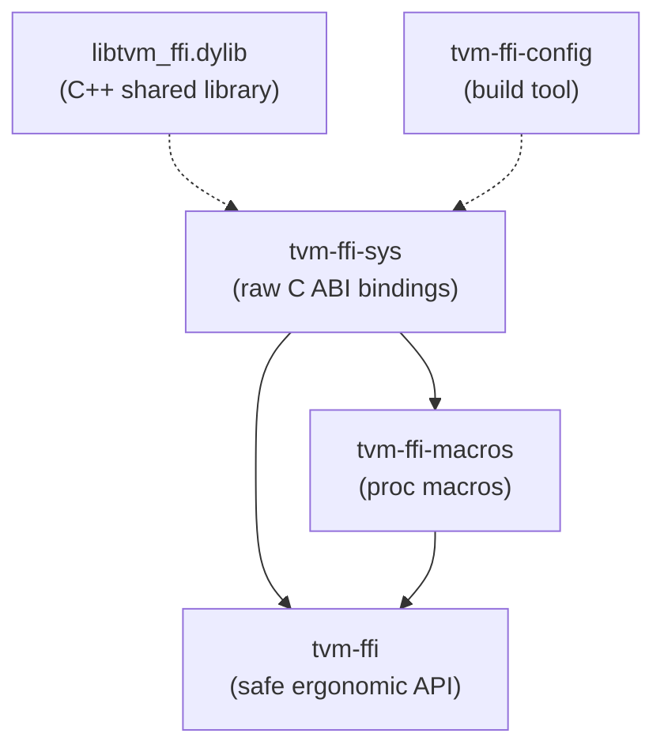

# Rust Bindings Design

**TL;DR**:
- The Rust bindings are organized as a three-crate Cargo workspace (`rust/`): `tvm-ffi-sys` (raw C ABI), `tvm-ffi-macros` (proc macros), and `tvm-ffi` (safe ergonomic API).
- All C ABI struct layouts are hand-written `#[repr(C)]` declarations (no `bindgen`), giving explicit control over atomic semantics and memory ordering.
- The `tvm-ffi` crate mirrors the C++/Python concept surface: `Any`/`AnyView`, `ObjectArc<T>`, `Function`, `String`, `Bytes`, `Shape`, `Tensor`, `Error`, `Module`, with derive macros for the dual-class Object/ObjectRef pattern.

## Problem Statement
### Background
- The TVM FFI provides a stable C ABI consumed by C++ and Python. Rust, as a systems language with strong safety guarantees, is a natural third binding target.
- Rust's ownership model and `unsafe` annotations can provide stronger compile-time guarantees than C++ while still interoperating at the C ABI level.

### Solution
- A layered crate architecture: `tvm-ffi-sys` handles raw FFI, `tvm-ffi-macros` provides proc-macro code generation, and `tvm-ffi` provides the safe, idiomatic API.
- All C ABI structs are manually declared in Rust with `#[repr(C)]` to ensure exact layout match and explicit control over atomics (particularly `AtomicU64` for `combined_ref_count`).
- Proc macros (`#[derive(Object)]`, `#[derive(ObjectRef)]`) generate the boilerplate for the dual-class pattern.

### Goals
- Provide safe, ergonomic Rust bindings to the TVM FFI ABI.
- Enable Rust code to define and call FFI functions, create and manage ref-counted objects, and interoperate with C++/Python through the shared ABI.
- Non-goals: reimplementing the FFI runtime in Rust (Rust links against `libtvm_ffi` at runtime).

## Design

### Crate Dependency Graph



### Crate: `tvm-ffi-sys`

Raw C ABI bindings. Contains:
- `#[repr(C)]` struct mirrors of all C ABI types: `TVMFFIObject`, `TVMFFIAny`, `TVMFFIAnyDataUnion`, `TVMFFIByteArray`, `TVMFFIFunctionCell`, `TVMFFIErrorCell`, `TVMFFIShapeCell`, `TVMFFIFieldInfo`, `TVMFFIMethodInfo`, `TVMFFITypeMetadata`, `TVMFFITypeAttrColumn`, `TVMFFITypeInfo`
- `TVMFFITypeIndex` as `#[repr(i32)]` enum with all ABI type indices
- `TVMFFIObjectDeleterFlagBitMask` enum for two-phase deletion flags
- Constants: `COMBINED_REF_COUNT_MASK_U32`, `COMBINED_REF_COUNT_STRONG_ONE`, `COMBINED_REF_COUNT_WEAK_ONE`, `COMBINED_REF_COUNT_BOTH_ONE`
- `extern "C"` function declarations for all C ABI functions
- DLPack types: `DLDevice`, `DLDataType`, `DLTensor`, `DLDeviceType`, `DLDataTypeCode`

Build system (`build.rs`):
- Runs `tvm-ffi-config --libdir` to discover the `libtvm_ffi` shared library location
- Adds native link search path and links `tvm_ffi` dylib
- Sets `LD_LIBRARY_PATH`/`DYLD_LIBRARY_PATH`/`PATH` for `cargo test`/`cargo run`
- **Rustdoc-safe graceful degradation** (since 729f971): When `RUSTDOC` or `CARGO_CFG_DOC` environment variables are set, `build.rs` returns early without emitting link directives, enabling `cargo doc` to succeed without `libtvm_ffi` installed

Documentation build pipeline (since 729f971, fix in 9a6ec6e):
- `_build_rust_docs()` in `docs/conf.py` runs `cargo doc --no-deps --workspace` with `RUSTDOCFLAGS=--cfg docsrs` during Sphinx config init (gated by `BUILD_RUST_DOCS=1` env var)
- `_copy_rust_docs_to_output()` (Sphinx `build-finished` event handler) copies `rust/target/doc/` to `{app.outdir}/reference/rust/generated/`
- A Rust usage guide at `docs/guides/rust_guide.md` and API reference landing page at `docs/reference/rust/index.rst` link to the generated cargo docs

### Crate: `tvm-ffi-macros`

Proc macros for the dual-class pattern:

**`#[derive(Object)]`** expands to `unsafe impl ObjectCore for T`:
```rust
// Input:
#[repr(C)]
#[derive(Object)]
#[type_key = "ffi.Function"]
#[type_index(TVMFFITypeIndex::kTVMFFIFunction)]
pub struct FunctionObj {
    object: Object,
    cell: TVMFFIFunctionCell,
}

// Expands to (pseudocode):
unsafe impl ObjectCore for FunctionObj {
    const TYPE_KEY: &'static str = "ffi.Function";
    fn type_index() -> i32 { TVMFFITypeIndex::kTVMFFIFunction as i32 }
    unsafe fn object_header_mut(this: &mut Self) -> &mut TVMFFIObject {
        Object::object_header_mut(&mut this.object)
    }
}
```

When `#[type_index(...)]` is omitted, the macro generates a `LazyLock`-based dynamic lookup via `TVMFFITypeKeyToIndex`, matching the C++ dynamic type index allocation pattern.

**`#[derive(ObjectRef)]`** expands to `unsafe impl ObjectRefCore for T` + `unsafe impl AnyCompatible for T` + `impl_try_from_any!` + `impl_arg_into_ref!` + `impl_into_arg_holder_default!`:
```rust
// Input:
#[derive(Clone, ObjectRef)]
pub struct Function {
    data: ObjectArc<FunctionObj>,
}

// Expands to (pseudocode):
unsafe impl ObjectRefCore for Function {
    type ContainerType = FunctionObj;
    fn data(this: &Self) -> &ObjectArc<FunctionObj> { &this.data }
    fn into_data(this: Self) -> ObjectArc<FunctionObj> { this.data }
    fn from_data(data: ObjectArc<FunctionObj>) -> Self { Self { data } }
}
unsafe impl AnyCompatible for Function { /* full impl with IncRef/DecRef */ }
impl TryFrom<AnyView<'_>> for Function { /* via TryFromTemp */ }
impl TryFrom<Any> for Function { /* via TryFromTemp with move semantics */ }
// + IntoArgHolder, ArgIntoRef
```

### Crate: `tvm-ffi` (Safe Ergonomic API)

#### Cross-Language Concept Mapping

| C++ Concept | Rust Equivalent | Notes |
|-------------|----------------|-------|
| `TypeTraits<T>` | `AnyCompatible` trait | unsafe trait with 7 required methods |
| `Object` | `Object` struct + `ObjectCore` trait | `ObjectCore` is unsafe, requires `TYPE_KEY`, `type_index()`, `object_header_mut()` |
| `ObjectRef` | Ref wrapper + `ObjectRefCore` trait | `ObjectRefCore` provides `data()`, `into_data()`, `from_data()` |
| `ObjectPtr<T>` | `ObjectArc<T>` | Intrusive refcounted pointer; native Rust IncRef/DecRef via atomics |
| `Any` | `Any` | Owning, 16-byte `TVMFFIAny`; Clone does IncRef, Drop does DecRef |
| `AnyView` | `AnyView<'a>` | Non-owning with lifetime annotation; Copy + Clone |
| `Function::FromTyped(f)` | `Function::from_typed(f)` | Uses `AsPackedCallable` trait |
| `Function::FromPacked(f)` | `Function::from_packed(f)` | Wraps `Fn(&[AnyView]) -> Result<Any>` |
| `Function::FromExternC(h,c,d)` | `Function::from_extern_c(h,c,d)` | Wraps C-style callback via `TVMFFIFunctionCreate` |
| `TypedFunction<R(Args...)>` | `into_typed_fn!(f, Fn(T0,...) -> Result<R>)` | Macro-based, 0-8 args |
| `TVM_FFI_DLL_EXPORT_TYPED_FUNC` | `tvm_ffi_dll_export_typed_func!` | Generates `__tvm_ffi_<name>` extern "C" symbol |
| `TVM_FFI_DECLARE_OBJECT_INFO*` | `#[derive(Object)]` | Proc macro generates `ObjectCore` impl |
| `TVM_FFI_DEFINE_OBJECT_REF_METHODS*` | `#[derive(ObjectRef)]` | Proc macro generates `ObjectRefCore` + `AnyCompatible` |
| `make_object<T>(args...)` | `ObjectArc::new(data)` | Allocates, writes header, sets deleter |
| `String` (SSO) | `tvm_ffi::String` | SSO-aware via `TVMFFIStringFromByteArray` |
| `Bytes` (SSO) | `tvm_ffi::Bytes` | SSO-aware via `TVMFFIBytesFromByteArray` |
| `Error` | `tvm_ffi::Error` | TLS-based error propagation via `TVMFFIErrorSetRaised`/`TVMFFIErrorMoveFromRaised` |

#### Native Rust Ref-Counting

The Rust bindings implement IncRef/DecRef natively rather than calling through the C API, using the same atomic protocol as C++:

```rust
// IncRef: Relaxed atomic increment
pub unsafe fn inc_ref(handle: *mut TVMFFIObject) {
    (*handle).combined_ref_count.fetch_add(1, Ordering::Relaxed);
}

// DecRef: Relaxed decrement + Acquire fence on deletion path
pub unsafe fn dec_ref(handle: *mut TVMFFIObject) {
    let old = (*handle).combined_ref_count
        .fetch_sub(COMBINED_REF_COUNT_STRONG_ONE, Ordering::Relaxed);
    if old == COMBINED_REF_COUNT_BOTH_ONE {
        // Fast path: both strong and weak are 1
        fence(Ordering::Acquire);
        deleter(ptr, kTVMFFIObjectDeleterFlagBitMaskBoth);
    } else if (old & COMBINED_REF_COUNT_MASK_U32) == COMBINED_REF_COUNT_STRONG_ONE {
        // Slow path: weak references still exist
        fence(Ordering::Acquire);
        deleter(ptr, kTVMFFIObjectDeleterFlagBitMaskStrong);
        // Then decrement weak count
        let old_weak = (*handle).combined_ref_count
            .fetch_sub(COMBINED_REF_COUNT_WEAK_ONE, Ordering::Release);
        if old_weak == COMBINED_REF_COUNT_WEAK_ONE {
            fence(Ordering::Acquire);
            deleter(ptr, kTVMFFIObjectDeleterFlagBitMaskWeak);
        }
    }
}
```

This mirrors the C++ `Object::DecRef()` logic exactly, including the two-phase deletion protocol and combined ref count packing.

#### ObjectArc Allocation

`ObjectArc::new(data)` allocates memory with `std::alloc::alloc`, writes the data via `std::ptr::write`, then overwrites the object header with a fresh `TVMFFIObject` containing `combined_ref_count = COMBINED_REF_COUNT_BOTH_ONE` and a Rust-native deleter function.

The deleter (`object_deleter_for_new::<T>`) handles two-phase deletion:
- Strong flag: calls `std::ptr::drop_in_place(obj)` (destructor without freeing)
- Weak flag: calls `std::alloc::dealloc` (frees memory)
- Both flag: fast path combining both

For objects with trailing extra items (e.g., string content), `ObjectArc::new_with_extra_items` allocates `sizeof::<T>() + count * sizeof::<ExtraItem>()` and uses a specialized deleter that stores the extra item count in the freed memory between the strong and weak deletion phases.

#### Function System

Three construction paths:
- `Function::from_typed(f)`: wraps a typed `Fn(T0, ...) -> Result<Out>` via `AsPackedCallable` trait. Internally converts to a packed closure and delegates to `from_packed`.
- `Function::from_packed(f)`: wraps a `Fn(&[AnyView]) -> Result<Any>` by creating a `CallbackFunctionObjImpl<F>` which stores the closure alongside a `FunctionObj` in the same allocation, setting `safe_call` to a generated callback and `cxx_call = nullptr`.
- `Function::from_extern_c(handle, safe_call, deleter)`: wraps a C-style callback via `TVMFFIFunctionCreate`.

The `AsPackedCallable` trait is implemented for `Fn(T0, ..., TN) -> Result<Out>` for 0-8 arguments using a macro. It validates argument count, extracts each argument via `ArgTryFromAnyView::try_from_any_view`, calls the function, and wraps the return value in `Any`.

### Key Classes, Fields and Interfaces

| Symbol | Signature / Description |
|--------|------------------------|
| `AnyCompatible` | `unsafe trait` with `copy_to_any_view`, `move_to_any`, `check_any_strict`, `copy_from_any_view_after_check`, `move_from_any_after_check`, `try_cast_from_any_view`, `type_str` |
| `ObjectCore` | `unsafe trait` with `TYPE_KEY: &'static str`, `fn type_index() -> i32`, `unsafe fn object_header_mut(&mut Self) -> &mut TVMFFIObject` |
| `ObjectCoreWithExtraItems` | `unsafe trait: ObjectCore` with `type ExtraItem`, `fn extra_items_count(&Self) -> usize`, `unsafe fn extra_items(&Self) -> &[ExtraItem]`, `unsafe fn extra_items_mut(&mut Self) -> &mut [ExtraItem]` |
| `ObjectRefCore` | `unsafe trait: Sized + Clone` with `type ContainerType: ObjectCore`, `fn data(&Self) -> &ObjectArc<ContainerType>`, `fn into_data(Self) -> ObjectArc<ContainerType>`, `fn from_data(ObjectArc<ContainerType>) -> Self` |
| `ObjectArc<T>::new(data: T)` | Allocates, writes header with `combined_ref_count = BOTH_ONE`, sets Rust-native deleter |
| `ObjectArc<T>::from_raw(ptr)` | Takes ownership of existing raw pointer (no IncRef) |
| `ObjectArc<T>::into_raw(Self) -> *const T` | Leaks ownership (no DecRef), returns raw pointer |
| `AsPackedCallable<I, O>` | `trait` with `fn call_packed(&self, &[AnyView]) -> Result<Any>`. Implemented for `Fn(T0,...,TN) -> Result<Out>` (0-8 args) |
| `TupleAsPackedArgs` | `trait` with `const LEN: usize`, `fn fill_any_view(&self, &mut [AnyView])`. Implemented for tuples of 0-8 elements |
| `IntoArgHolder` | `trait` with `type Target`, `fn into_arg_holder(self) -> Target`. Converts `&str` -> `String`, `&[u8]` -> `Bytes`, identity for PODs |
| `Function::from_typed(f)` | `fn from_typed<F: AsPackedCallable<I, O>>(f: F) -> Self` |
| `Function::from_packed(f)` | `fn from_packed<F: Fn(&[AnyView]) -> Result<Any>>(f: F) -> Self` |
| `Function::call_packed(&self, &[AnyView])` | `fn call_packed(&self, packed_args: &[AnyView]) -> Result<Any>` |
| `Function::call_tuple(&self, tuple)` | `fn call_tuple<T: TupleAsPackedArgs>(&self, args: T) -> Result<Any>` -- small-vector optimization for stack alloc |
| `Function::call_tuple_with_len::<LEN>(&self, tuple)` | `fn call_tuple_with_len<const LEN: usize, T: TupleAsPackedArgs>(&self, args: T) -> Result<Any>` -- const-generic stack alloc |
| `Function::get_global(name)` | `fn get_global(name: &str) -> Result<Function>` |
| `Function::register_global(name, func)` | `fn register_global(name: &str, func: Function) -> Result<()>` |
| `into_typed_fn!(f, Fn(T0,...) -> Result<R>)` | Macro converting `Function` to typed closure (0-8 args) |
| `tvm_ffi_dll_export_typed_func!(name, func)` | Macro generating `pub unsafe extern "C" fn __tvm_ffi_<name>(...)` |
| `check_safe_call!(expr)` | Macro wrapping FFI return code check; returns `Result<(), Error>` |
| `bail!(kind, fmt, args...)` | Macro creating Error with file/line context and returning `Err` |
| `ensure!(cond, kind, fmt, args...)` | Macro: conditional `bail!` |
| `TryFromTemp<T>` | Helper struct to work around Rust orphan rule for `TryFrom<AnyView/Any>` |

### Contracts, Assumptions and Invariants
- **Binary layout match**: All `#[repr(C)]` structs in `tvm-ffi-sys` must exactly match the C ABI layout. `sizeof(TVMFFIObject) == 24`, `sizeof(TVMFFIAny) == 16`.
- **Atomic ordering match**: IncRef uses `Relaxed`, DecRef uses `Relaxed` decrement + `Acquire` fence before deletion, matching C++ exactly.
- **ObjectArc header override**: `ObjectArc::new` writes the data first, then overwrites the object header. The first field of any `ObjectCore` type must lead to a `TVMFFIObject` at offset 0 (transitive through the `object_header_mut` chain).
- **CallbackFunctionObjImpl layout**: The `#[repr(C)]` layout places `FunctionObj` first so the pointer cast from `*CallbackFunctionObjImpl<F>` to `*FunctionObj` is valid. The `safe_call` callback receives `handle` as a pointer to the entire `CallbackFunctionObjImpl<F>`, not just `FunctionObj`.
- **No cross-crate re-export of proc macros**: `tvm-ffi` re-exports `tvm_ffi_sys` and the derive macros but downstream crates use `tvm_ffi::derive::{Object, ObjectRef}`.
- **Runtime library dependency**: The Rust crate requires `libtvm_ffi` to be installed and discoverable via `tvm-ffi-config --libdir`.
- **Two-phase deletion for extra items**: The deleter for objects with extra items stores the extra item count in the freed object memory after dropping (during the Strong phase), then reads it back during the Weak (free) phase. This requires `sizeof::<T>() % sizeof::<u64>() == 0`.

### Extension Points
- New object types: define `FooObj` with `#[derive(Object)]` + `Foo` with `#[derive(ObjectRef)]`. The proc macros generate all boilerplate.
- New `AnyCompatible` types: implement the unsafe trait manually (PODs) or rely on `#[derive(ObjectRef)]` for object types.
- Custom allocators: implement the `NDAllocator` trait for tensor memory allocation.
- DLL exports: use `tvm_ffi_dll_export_typed_func!` to export Rust functions as `__tvm_ffi_*` C symbols.

### Usage Examples

#### Defining and calling a typed function
**Context**: Creating a typed Rust function and calling it through the FFI.
```rust
use tvm_ffi::*;

let add = Function::from_typed(|x: i32, y: i32| -> Result<i32> { Ok(x + y) });
let typed_add = into_typed_fn!(add, Fn(i32, i32) -> Result<i32>);
assert_eq!(typed_add(1, 2).unwrap(), 3);
```

#### Exporting a Rust function as a C-ABI symbol
**Context**: Making a Rust function callable from C++/Python via shared library loading.
```rust
use tvm_ffi::*;

fn my_add(x: i32, y: i32) -> Result<i32> { Ok(x + y) }
tvm_ffi_dll_export_typed_func!(my_add, my_add);
// Generates: pub unsafe extern "C" fn __tvm_ffi_my_add(
//     _handle: *mut c_void, args: *const TVMFFIAny, num_args: i32, result: *mut TVMFFIAny
// ) -> i32

let f = Function::from_extern_c(std::ptr::null_mut(), __tvm_ffi_my_add, None);
let typed = into_typed_fn!(f, Fn(i32, i32) -> Result<i32>);
assert_eq!(typed(3, 4).unwrap(), 7);
```

#### Defining a custom object type
**Context**: Creating a new ref-counted object type in Rust following the dual-class pattern.
```rust
use tvm_ffi::derive::{Object, ObjectRef};
use tvm_ffi::object::{Object, ObjectArc};
use tvm_ffi_sys::TVMFFITypeIndex;

#[repr(C)]
#[derive(Object)]
#[type_key = "ffi.Function"]
#[type_index(TVMFFITypeIndex::kTVMFFIFunction)]
pub struct FunctionObj {
    object: Object,
    cell: TVMFFIFunctionCell,
}

#[derive(Clone, ObjectRef)]
pub struct Function {
    data: ObjectArc<FunctionObj>,
}
```

#### Loading a shared library module
**Context**: Using the module system to load a compiled kernel library and call its functions.
```rust
use tvm_ffi::{Module, Tensor, Result};

let lib = Module::load_from_file("path/to/add_one_cpu.so").unwrap();
let add_one = lib.get_function("add_one_cpu").unwrap();
let typed_add_one = tvm_ffi::into_typed_fn!(add_one, Fn(&Tensor, &Tensor) -> Result<()>);
let x = Tensor::from_slice(&[0.0f32, 1.0, 2.0, 3.0], &[4]).unwrap();
let y = Tensor::from_slice(&[0.0f32; 4], &[4]).unwrap();
typed_add_one(&x, &y).unwrap();
```

## Alternatives & Trade-offs
### Use bindgen instead of hand-written `#[repr(C)]`
- Pros: Automatic struct generation; less manual maintenance; always in sync with C headers
- Cons: No control over atomic types (bindgen may not use `AtomicU64`); harder to customize memory ordering; adds build dependency on libclang; the C ABI surface is small enough that manual declarations are tractable
### Implement ref-counting via C API calls instead of native Rust atomics
- Pros: Simpler; guaranteed correctness (delegates to C++ implementation)
- Cons: Every IncRef/DecRef becomes a function call through the dylib; significant overhead for ref-count-heavy workloads; native Rust atomics are zero-cost and match the C++ protocol exactly

## Related Work
### Design Docs & ADRs
- `.knowledge/designs/c-abi.md` -- C ABI struct layouts that the Rust crate mirrors
- `.knowledge/designs/object-system.md` -- Object/ObjectRef dual-class pattern
- `.knowledge/designs/any-system.md` -- Any/AnyView type-erased value system
- `.knowledge/designs/function-system.md` -- Function packed calling convention
- `.knowledge/designs/type-traits.md` -- TypeTraits protocol (Rust equivalent: AnyCompatible)
- `.knowledge/ADRs/019-rust-hand-written-c-abi.md` -- Decision: hand-written `#[repr(C)]` over bindgen
- `.knowledge/ADRs/018-combined-ref-count.md` -- Combined ref count packing (consumed by Rust impl)
- `.knowledge/ADRs/016-ffi-symbol-prefix.md` -- `__tvm_ffi_` prefix convention (used by `tvm_ffi_dll_export_typed_func!`)

### Evidence Matrix
- Three-crate workspace architecture -> `2025-10-01-09477ce.md` + commit 09477ce + `rust/Cargo.toml`
- `AnyCompatible` trait -> `2025-10-01-09477ce.md` + commit 09477ce + `tvm-ffi/src/type_traits.rs`
- `ObjectCore`/`ObjectRefCore` traits + derive macros -> `2025-10-01-09477ce.md` + commit 09477ce + `tvm-ffi-macros/src/object_macros.rs`
- `ObjectArc<T>` native ref-counting -> `2025-10-01-09477ce.md` + commit 09477ce + `tvm-ffi/src/object.rs`
- `AsPackedCallable` + `into_typed_fn!` -> `2025-10-01-09477ce.md` + commit 09477ce + `tvm-ffi/src/function_internal.rs` + `tvm-ffi/src/macros.rs`
- `tvm_ffi_dll_export_typed_func!` -> `2025-10-01-09477ce.md` + commit 09477ce + `tvm-ffi/src/macros.rs`
- Build system (`tvm-ffi-config`) -> `2025-10-01-09477ce.md` + commit 09477ce + `tvm-ffi-sys/build.rs`
- CI integration -> `2025-10-01-09477ce.md` + commit 09477ce + `.github/workflows/ci_test.yml`
- Rust docs build pipeline + rustdoc-safe build.rs -> `2025-10-18-729f971e.md` + commit 729f971
- Fix Rust docs copy to Sphinx output dir -> `2025-10-18-9a6ec6ee.md` + commit 9a6ec6e
