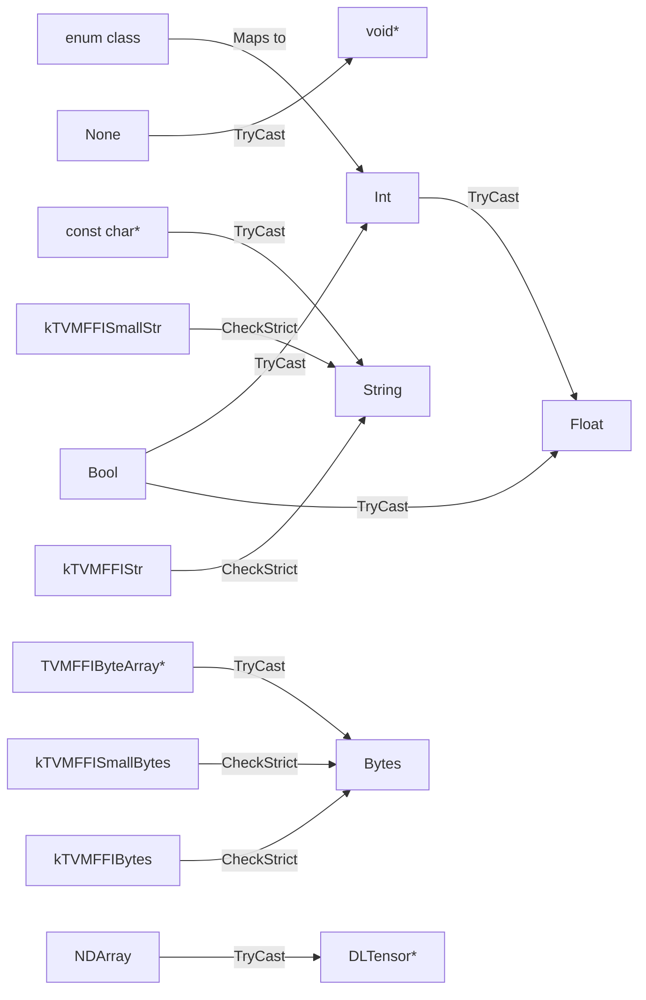

# TypeTraits Protocol Design

**TL;DR**:
- `TypeTraits<T>` is the compile-time protocol defining how C++ types are stored in and extracted from `Any`/`AnyView`.
- The protocol distinguishes strict checking (`CheckAnyStrict`) from conversion (`TryCastFromAnyView`), matching the `as` vs `cast`/`try_cast` API split.
- Built-in specializations cover integers, floats, bool, DLDataType, DLDevice, enum classes, ObjectRef subtypes, and raw object pointers (with `_type_mutable` gating).

## Problem Statement
### Background
- Every type that participates in the FFI system needs a way to serialize into the 16-byte `TVMFFIAny` and deserialize back out.
- The protocol must support both strict type matching (for container element verification) and lenient conversion (for function argument coercion).

### Solution
- A compile-time trait specialization `TypeTraits<T>` that each participating type provides.
- Base classes (`TypeTraitsBase`, `ObjectRefTypeTraitsBase`, `FallbackOnlyTraitsBase`, `ObjectRefWithFallbackTraitsBase`) reduce boilerplate.

### Goals
- Every type that can appear in an FFI function argument or container element has a `TypeTraits` specialization.
- Non-goals: runtime registration of type traits (everything is compile-time).

## Design

### Required Interface

A full `TypeTraits<T>` specialization must provide:

```cpp
template<>
struct TypeTraits<T> {
    static constexpr bool convert_enabled = true;   // type participates in FFI
    static constexpr bool storage_enabled = true;    // type can be stored in containers
    static constexpr int32_t field_static_type_index = ...;  // for reflection

    // Write T into a non-owning AnyView slot
    static void CopyToAnyView(const T& src, TVMFFIAny* result);

    // Write T into an owning Any slot (may transfer ownership)
    static void MoveToAny(T src, TVMFFIAny* result);

    // Strict check: does this Any hold exactly the result of MoveToAny<T>?
    static bool CheckAnyStrict(const TVMFFIAny* src);

    // Extract T after CheckAnyStrict returns true (non-owning copy from view)
    static T CopyFromAnyViewAfterCheck(const TVMFFIAny* src);

    // Extract T after CheckAnyStrict returns true (takes ownership from Any)
    static T MoveFromAnyAfterCheck(TVMFFIAny* src);

    // Lenient conversion: may coerce between compatible types
    static std::optional<T> TryCastFromAnyView(const TVMFFIAny* src);

    // Human-readable type name
    static std::string TypeStr();

    // Error message helper (called when TryCastFromAnyView fails)
    static std::string GetMismatchTypeInfo(const TVMFFIAny* source);

    // JSON type schema for reflection metadata (added in 28fe3cc)
    static std::string TypeSchema();
};
```

### CheckAnyStrict vs TryCastFromAnyView

These two methods serve fundamentally different purposes:

- **`CheckAnyStrict`** is strict: returns true only when the `Any` was produced by `MoveToAny<T>`. Used by `as<T>()` and by containers (`Array<T>`) for element type verification. Example: `CheckAnyStrict<float>` returns false for an int value.

- **`TryCastFromAnyView`** is lenient: returns a value if conversion is possible, even with coercion. Used by `cast<T>()` and `try_cast<T>()`. Example: `TryCastFromAnyView<float>` succeeds for both float and int values (int -> float coercion).

### Built-in Specializations

#### POD Types

| C++ Type | Type Index | CheckAnyStrict | TryCast Accepts |
|----------|-----------|----------------|-----------------|
| `nullptr_t` | kTVMFFINone | None | None only |
| `bool` | kTVMFFIBool | Bool | Bool, Int |
| `StrictBool` | kTVMFFIBool | Bool | Bool only |
| Integer types | kTVMFFIInt | Int | Int, Bool |
| Float types | kTVMFFIFloat | Float | Float, Int, Bool |
| `void*` | kTVMFFIOpaquePtr | OpaquePtr | OpaquePtr, None |
| `DLDevice` | kTVMFFIDevice | Device | Device only |
| `DLDataType` | kTVMFFIDataType | DataType | DataType only |
| `DLTensor*` | kTVMFFIDLTensorPtr | DLTensorPtr, NDArray | DLTensorPtr, NDArray |
| `TensorView` | kTVMFFIDLTensorPtr | DLTensorPtr only | DLTensorPtr, Tensor (via `TVMFFITensorGetDLTensorPtr`) |
| `const char*` | kTVMFFIRawStr | N/A (view-only) | RawStr only |

#### Enum Class Types (added in f7311e4, SFINAE fix in 5fba9e8)

A partial specialization guarded by the helper trait `is_integeral_enum_v<IntEnum>`, which uses a two-phase check: first `std::is_enum_v<T>`, then (only for enums) `std::is_integral_v<std::underlying_type_t<T>>`. This avoids evaluating `underlying_type_t` on non-enum types, which is undefined behavior and causes compile errors on GCC 8.x:

```cpp
// Two-phase helper (internal, Doxygen-suppressed)
template <typename T, bool = std::is_enum_v<T>>
constexpr bool is_integeral_enum_v = false;
template <typename T>
constexpr bool is_integeral_enum_v<T, true> = std::is_integral_v<std::underlying_type_t<T>>;

template <typename IntEnum>
struct TypeTraits<IntEnum, enable_if<is_integeral_enum_v<IntEnum>>> {
    static constexpr int32_t field_static_type_index = TypeIndex::kTVMFFIInt;
    // Stores/loads as v_int64 with type_index = kTVMFFIInt
    // TryCast accepts kTVMFFIInt and kTVMFFIBool
    // TypeStr() returns "int"
};
```

Convention: enum class types do not get distinct type indices; they map to `kTVMFFIInt` at the ABI level.

#### Object Reference Types

The default `TypeTraits<TObjRef>` (for `TObjRef : ObjectRef`) inherits from `ObjectRefTypeTraitsBase<TObjRef>`:

- `CopyToAnyView`: writes the object's `type_index` and `TVMFFIObject*` pointer
- `MoveToAny`: transfers ownership (no IncRef, nullifies source)
- `CheckAnyStrict`: checks `type_index >= kTVMFFIStaticObjectBegin` and `IsObjectInstance<ContainerType>`
- Nullable refs accept `kTVMFFINone` as valid

#### Object Pointers (`TObject*`) -- Mutable and Const

Specialization for raw object pointers. Supports both `const TObject*` and non-const `TObject*`:

```cpp
template <typename TObject>
struct TypeTraits<TObject*> {
    // Non-const pointer extraction requires TObject::_type_mutable == true
    static_assert(std::is_const_v<TObject> || TObject::_type_mutable,
                  "Only mutable classes support non-const pointer extraction");
    // CopyToAnyView: stores pointer without IncRef
    // MoveToAny: does IncRef (takes shared ownership)
};
```

The `_type_mutable` flag on the Object class controls whether non-const raw pointer extraction is allowed from `Any`/`AnyView`. Defaults to `false`. Types that need writable field access via reflection must opt in with `static constexpr bool _type_mutable = true;`.

#### TensorView (added in 1ec6236)

`TypeTraits<TensorView>` sets `storage_enabled = false` (view-only, cannot be stored in containers or `Any`). `field_static_type_index = kTVMFFIDLTensorPtr`. `CopyToAnyView` stores the internal `DLTensor*` as `kTVMFFIDLTensorPtr`. `TryCastFromAnyView` accepts both `kTVMFFIDLTensorPtr` (direct DLTensor pointers) and `kTVMFFITensor` (owned Tensor objects, extracts `DLTensor*` via `TVMFFITensorGetDLTensorPtr`). No `MoveToAny`/`MoveFromAny` since TensorView is non-owning.

#### TypedFunction<FType>

Delegates to `TypeTraits<Function>` for storage; `TypeStr()` returns the function signature string.

#### Optional<T>

Wraps `TypeTraits<T>` with nullable semantics. `CheckAnyStrict` accepts both None and whatever T accepts. `TryCastFromAnyView` returns `Optional<T>(nullopt)` for None inputs.

### Base Classes for Custom Traits

#### `TypeTraitsBase`

Provides `convert_enabled=true`, `storage_enabled=true`, `field_static_type_index = TypeIndex::kTVMFFIAny` (default), and a default `GetMismatchTypeInfo` that returns the runtime type key.

#### `ObjectRefTypeTraitsBase<TObjRef>`

Complete implementation for ObjectRef subclasses. Handles nullable vs non-nullable refs, IsInstance checks, and ownership transfer.

#### `FallbackOnlyTraitsBase<T, FallbackTypes...>`

For types that cannot be stored directly but can be converted from fallback types. Iterates through FallbackTypes in order, attempting `TryCastFromAnyView` for each. The derived class must define `ConvertFallbackValue(FallbackType) -> T` for each.

Example: `TypeTraits<std::string>` extends `FallbackOnlyTraitsBase<std::string, const char*, TVMFFIByteArray*, Bytes, String>`.

#### `ObjectRefWithFallbackTraitsBase<TObjRef, FallbackTypes...>`

Combines `ObjectRefTypeTraitsBase` with fallback conversion. First tries the normal object conversion, then falls back to FallbackTypes.

Note: `TypeTraits<String>` and `TypeTraits<Bytes>` previously used `ObjectRefWithFallbackTraitsBase` but now have fully custom specializations (since commit 49e2ed4) due to the small-string optimization.

#### Custom `TypeTraits<String>` and `TypeTraits<Bytes>`

Since commit 49e2ed4, `String` and `Bytes` are value types (not `ObjectRef` subclasses), so they have fully custom `TypeTraits`:

```cpp
template<> struct TypeTraits<String> {
    static constexpr int32_t field_static_type_index = kTVMFFIAny;  // runtime type varies
    static bool CheckAnyStrict(const TVMFFIAny* src);
        // accepts kTVMFFISmallStr or kTVMFFIStr
    static std::optional<String> TryCastFromAnyView(const TVMFFIAny* src);
        // accepts kTVMFFIRawStr, kTVMFFISmallStr, or kTVMFFIStr
    // CopyToAnyView, MoveToAny delegate to BytesBaseCell
};

template<> struct TypeTraits<Bytes> {
    static constexpr int32_t field_static_type_index = kTVMFFIAny;  // runtime type varies
    static bool CheckAnyStrict(const TVMFFIAny* src);
        // accepts kTVMFFISmallBytes or kTVMFFIBytes
    static std::optional<Bytes> TryCastFromAnyView(const TVMFFIAny* src);
        // accepts kTVMFFIByteArrayPtr, kTVMFFISmallBytes, or kTVMFFIBytes
};
```

`field_static_type_index = kTVMFFIAny` because the runtime type may be either a small (inline) or large (heap) representation, and the reflection system cannot predict which at registration time.

### Type Coercion Graph



### Contracts, Assumptions and Invariants
- **Strict-check consistency**: `CheckAnyStrict(x)` must return true for any `x` produced by `MoveToAny(v, x)` on the same type.
- **`zero_padding` invariant**: `CopyToAnyView` and `MoveToAny` for all non-small-string types must set `result->zero_padding = 0`. This ensures `AnyEqual`'s fast-path 16-byte comparison works correctly and `AnyHash` produces consistent results. Applies to 17+ TypeTraits specializations (all PODs, ObjectRef, raw pointers, Variant, etc.).
- **field_static_type_index default**: All types inherit `kTVMFFIAny` from `TypeTraitsBase` unless overridden. This default was centralized in the base class (commit 1a85688) instead of per-specialization.

#### STL Container Types (added in c3fc8f7f, header: `tvm/ffi/extra/stl.h`)

STL container specializations live in the `extra/` directory and provide automatic bidirectional conversion between C++ STL containers and FFI containers. All STL specializations set `storage_enabled = false` (cannot be stored in `Any`/containers directly; they are always copied through an FFI container intermediary).

The base infrastructure uses two internal tag types:
- `details::ListTemplate` -- base for array-like STL types (inherits `STLTypeTrait`)
- `details::MapTemplate` -- base for map-like STL types (inherits `STLTypeTrait`)

`details::STLTypeTrait` inherits from `TypeTraitsBase` with `storage_enabled = false`. It converts STL types by first copying into an FFI `Object` (Array/Map), then moving the `ObjectPtr` into `Any`. Extraction goes through `TryCastFromAnyView` which copies elements out of the FFI container, using a `STLTypeMismatch` exception to signal element-level conversion failures (caught internally, returned as `std::nullopt`).

| STL Type | FFI Mapping | `field_static_type_index` | Conversion Strategy |
|----------|-------------|---------------------------|---------------------|
| `std::vector<T>` | `Array` | `kTVMFFIArray` | Iterator-based copy/move via `CopyToArray`/`MoveToArray` |
| `std::array<T, N>` | `Array` (size-checked) | `kTVMFFIArray` | Fixed-size: `TryCast` checks `array.size_ == N` |
| `std::tuple<T...>` | `Array` (size-checked) | `kTVMFFIArray` | Element-wise via `CopyToTuple`/`ConstructTupleAux` with `index_sequence` |
| `std::pair<K,V>` | `Array` (as 2-tuple) | `kTVMFFIArray` | Maps to `std::tuple<K,V>` internally |
| `std::map<K,V>` | `Map` | `kTVMFFIMap` | Via `MapObj::CreateFromRange`; `CanReserve=false` |
| `std::unordered_map<K,V>` | `Map` | `kTVMFFIMap` | Via `MapObj::CreateFromRange`; `CanReserve=true` |
| `std::optional<T>` | None or T | (delegates to T) | Maps `nullopt` to `kTVMFFINone`; delegates to `TypeTraits<T>` otherwise |
| `std::variant<Args...>` | First matching alternative | (delegates) | `TryCast` iterates alternatives; `CheckAnyStrict` uses fold-expression |
| `std::function<Ret(Args...)>` | `Function` | `kTVMFFIFunction` | Wraps via `TypedFunction<Ret(Args...)>` proxy trait |

Note: `std::pair<K,V>` is treated as `std::tuple<K,V>` by the tuple specialization (C++ standard guarantees `std::tuple_size<std::pair<K,V>> == 2`).

Convention: Native FFI containers (`tvm::ffi::Array`, `tvm::ffi::Tuple`, `tvm::ffi::Map`) are preferred over STL equivalents. STL support exists for convenience when interfacing with existing C++ code that uses STL types.

### Extension Points
- New types can be added by specializing `TypeTraits<T>` or inheriting from one of the base classes.
- Enum classes are automatically covered by the `std::is_enum_v` partial specialization -- no explicit trait needed.
- STL container types can be used directly as packed function arguments/return types by including `tvm/ffi/extra/stl.h`.

### Usage Examples

#### Implementing TypeTraits for a custom enum
**Context**: Making a C++ enum class usable as an FFI function argument.
```cpp
// No specialization needed! The built-in enum TypeTraits handles it:
enum class MyKind : int32_t { kAdd = 0, kSub = 1 };

// Usage:
AnyView v = MyKind::kAdd;
auto k = v.cast<MyKind>();        // MyKind::kAdd
auto i = v.cast<int64_t>();       // 0 (enums are stored as kTVMFFIInt)
auto strict = v.as<MyKind>();     // has_value() == true
```

#### Mutable object pointer extraction
**Context**: Extracting a non-const pointer for reflection-based field writing.
```cpp
class MyObj : public Object {
    static constexpr bool _type_mutable = true;
    // ...
};

AnyView view = /* ... */;
MyObj* ptr = view.cast<MyObj*>();       // OK: _type_mutable == true
const MyObj* cptr = view.cast<const MyObj*>();  // Always OK
```

#### Using STL containers as FFI function arguments
**Context**: Defining a packed function that accepts and returns STL containers.
```cpp
#include <tvm/ffi/extra/stl.h>

TVM_FFI_STATIC_INIT_BLOCK() {
  namespace refl = tvm::ffi::reflection;
  refl::GlobalDef()
      .def("test.sum_vec", [](std::vector<int> v) -> int {
        int sum = 0;
        for (auto x : v) sum += x;
        return sum;
      })
      .def("test.pair_swap", [](std::pair<int, float> p) -> std::tuple<float, int> {
        return {p.second, p.first};
      });
}
// Python: test.sum_vec([1, 2, 3]) returns 6
// Python: test.pair_swap((1, 2.5)) returns (2.5, 1)
```

### Evolution Timeline
| Version | Commit | Change | Motivation |
|---------|--------|--------|------------|
| v1 | 7d34eb8 | Initial protocol: `CheckAnyStorage`, `CopyFromAnyStorageAfterCheck`, `MoveFromAnyStorageAfterCheck`, `TryConvertFromAnyView` | Establish type-erased conversion system |
| v2 | 37a2e7c | Rename to `CheckAnyStrict`, `CopyFromAnyViewAfterCheck`, `MoveFromAnyAfterCheck`, `TryCastFromAnyView` | Align names with `as`/`cast` semantic split |
| v3 | 1a85688 | Move `field_static_type_index = kTVMFFIAny` default to `TypeTraitsBase`; generalize `TObject*` to support non-const with `_type_mutable` guard | Simplify specializations; enable mutable field reflection |
| v4 | f7311e4 | Add enum class TypeTraits specialization | Auto-support enums without manual traits |
| v5 | 49e2ed4 | Custom `TypeTraits<String>`/`TypeTraits<Bytes>` (replace `ObjectRefWithFallbackTraitsBase`); `zero_padding = 0` enforced in all specializations | Small string optimization support |
| v5.1 | 5fba9e8 | Refactor enum SFINAE guard to two-phase `is_integeral_enum_v` helper | Fix GCC 8.x compile error from evaluating `underlying_type_t` on non-enum types |
| v6 | 1ec6236 | Add `TypeTraits<TensorView>` with `storage_enabled = false`, dual `TryCastFromAnyView` (DLTensorPtr + Tensor) | Non-owning tensor view for FFI kernel params |
| v7 | 28fe3cc | Add `TypeSchema()` method to every `TypeTraits` specialization, returning JSON type schema | Reflection metadata for schema generation |
| v8 | c3fc8f7f | Add STL container TypeTraits: `std::vector<T>`, `std::tuple<T...>`, `std::pair<K,V>`, `std::map<K,V>`, `std::unordered_map<K,V>`, `std::array<T,N>`, `std::optional<T>`, `std::variant<Args...>`, `std::function<Ret(Args...)>` in `extra/stl.h` | Enable direct use of STL types as FFI function args |

## Alternatives & Trade-offs
### Single method for both strict and lenient access
- Pros: Simpler protocol (fewer methods)
- Cons: Cannot optimize the strict path (containers call `as<T>()` on every element for type checking; paying conversion cost is wasteful)
### Runtime trait registration instead of compile-time specialization
- Pros: Could support types not known at compile time
- Cons: Adds indirection and vtable overhead to every type conversion; conflicts with the zero-cost abstraction goal

## Related Work
### Design Docs & ADRs
- `.knowledge/designs/any-system.md` -- The `as`/`cast`/`try_cast` API that consumes TypeTraits
- `.knowledge/ADRs/005-as-vs-cast-semantics.md` -- Decision to split strict from conversion access
- `.knowledge/designs/reflection.md` -- Uses `field_static_type_index` for reflection field metadata
- `.knowledge/designs/0011-small-string-optimization.md` -- SSO design, custom String/Bytes TypeTraits

### Evidence Matrix
- Protocol rename -> `2025-05-14-37a2e7c.md` + commit 37a2e7c + `CheckAnyStrict`, `CopyFromAnyViewAfterCheck`, `MoveFromAnyAfterCheck`, `TryCastFromAnyView`
- `_type_mutable` guard -> `2025-06-15-1a85688.md` + commit 1a85688 + `TypeTraits<TObject*>`
- Enum support -> `2025-06-27-f7311e4.md` + commit f7311e4 + `TypeTraits<IntEnum>`
- `field_static_type_index` centralization -> `2025-06-15-1a85688.md` + commit 1a85688 + `TypeTraitsBase`
- Base-class field ptr generalization -> `2025-06-27-f7311e4.md` + commit f7311e4 + `ObjectDef::def_ro`
- DLDataType padding fix -> `2025-06-27-a5a08b2.md` + commit a5a08b2
- Custom String/Bytes TypeTraits + zero_padding -> `2025-08-04-49e2ed4.md` + commit 49e2ed4
- TensorView TypeTraits -> `2025-10-01-1ec623678adea0ddba482d8d56d4ab2be440e694.md` + commit 1ec6236
- TypeSchema() method -> `2025-10-03-28fe3cc7fc23b725ddefbb3ca1e1899a7dfd530c.md` + commit 28fe3cc
- GCC 8.x enum SFINAE fix -> `2025-10-04-5fba9e8ff31940855b4abfa664c3369513814aa4.md` + commit 5fba9e8
- STL container TypeTraits (`extra/stl.h`) -> `2025-11-30-c3fc8f7f0e95a97beed342b6ddec4c3f6add0441.md` + commit c3fc8f7f + `TypeTraits<std::vector<T>>`, `TypeTraits<std::tuple<T...>>`, etc.
- Plus 2 supporting commits (88d5130d use-after-move fix, 5a82940e test fix)
