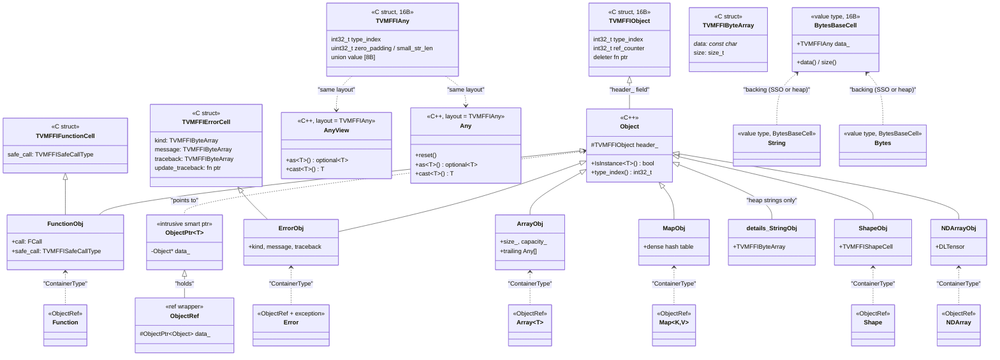
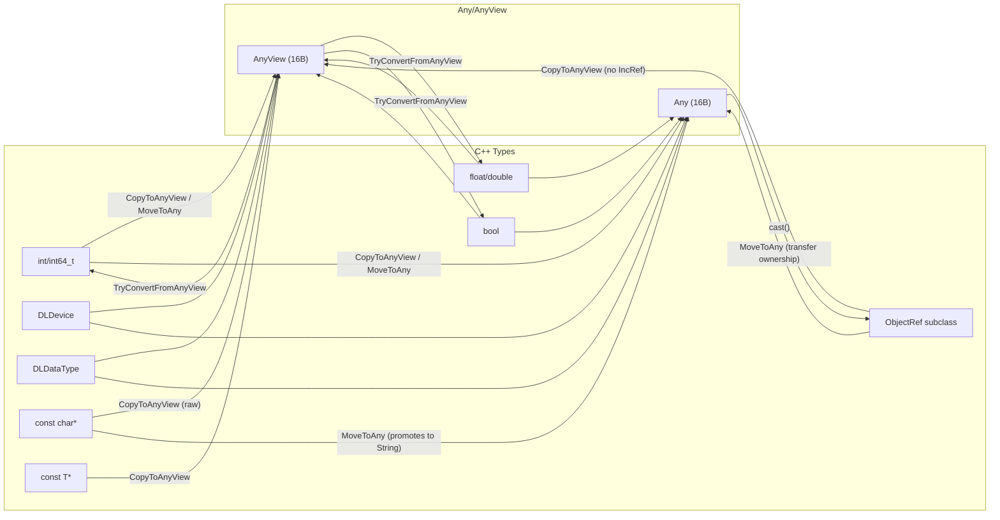

# Core Type Hierarchy and Dependency Graph

Source: commit `7d34eb8abfe987bf0031e4d4ff479895d867a966`
Related: [0001-c-abi](../designs/0001-c-abi.md), [0002-any-system](../designs/0002-any-system.md), [0003-object-system](../designs/0003-object-system.md)

## C Struct to C++ Class Mapping

## TypeTraits Conversion Arrows

