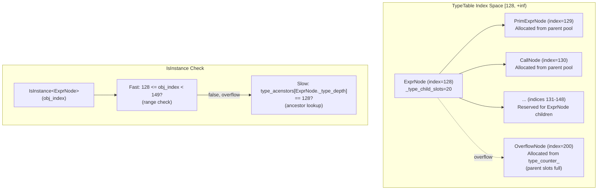

# Type Index Layout

Source: commits `7d34eb8`, `777cf8d` (reordering), `91d69f0` (opaque)
Related: [0001-c-abi](../designs/0001-c-abi.md), [ADR 0002](../ADRs/0002-type-index-partitioning.md), [ADR 0003](../ADRs/0003-slot-based-type-allocation.md), [ADR 0024](../ADRs/0024-static-type-index-ordering.md)

## Three-Range Partition

```mermaid
block-beta
    columns 1
    block:header["TVMFFITypeIndex Partition"]
        columns 3
        pod["POD Range\n[0, 64)"]
        static["Static Object Range\n[64, 128)"]
        dynamic["Dynamic Object Range\n[128, +inf)"]
    end

    block:pod_detail["POD Types (13 used / 64 available)"]
        columns 4
        a0["0: None"]
        a1["1: Int"]
        a2["2: Bool"]
        a3["3: Float"]
        a4["4: OpaquePtr"]
        a5["5: DataType"]
        a6["6: Device"]
        a7["7: DLTensorPtr"]
        a8["8: RawStr"]
        a9["9: ByteArrayPtr"]
        a10["10: ObjectRValueRef"]
        a11["11: SmallStr (SSO)"]
        a12["12: SmallBytes (SSO)"]
        a13["13-63: (reserved)"]
    end

    block:static_simple["Simple C ABI Types (cell layout fully described in c_api.h)"]
        columns 4
        b0["64: Object"]
        b1["65: String"]
        b2["66: Bytes"]
        b3["67: Error"]
        b4["68: Function"]
        b5["69: Shape"]
        b6["70: NDArray"]
        b7[""]
    end

    block:static_complex["Complex C++ Types (may require C++ runtime)"]
        columns 4
        b8["71: Array"]
        b9["72: Map"]
        b10["73: Module"]
        b11["74: OpaquePyObject"]
    end

    block:static_avail["Available: 75-127 (53 slots)"]
        columns 1
        b12[""]
    end

    block:dynamic_detail["Dynamic Types (runtime-allocated)"]
        columns 1
        c0["128+: User-defined types\n(allocated by TypeTable via slot reservation)"]
    end
```

## Slot-Based Dynamic Allocation


