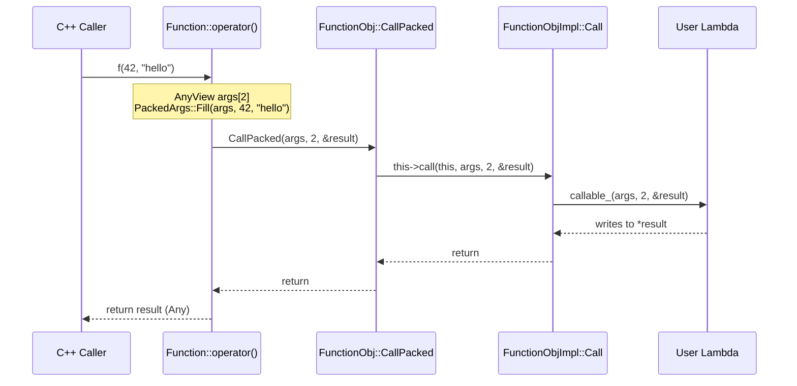
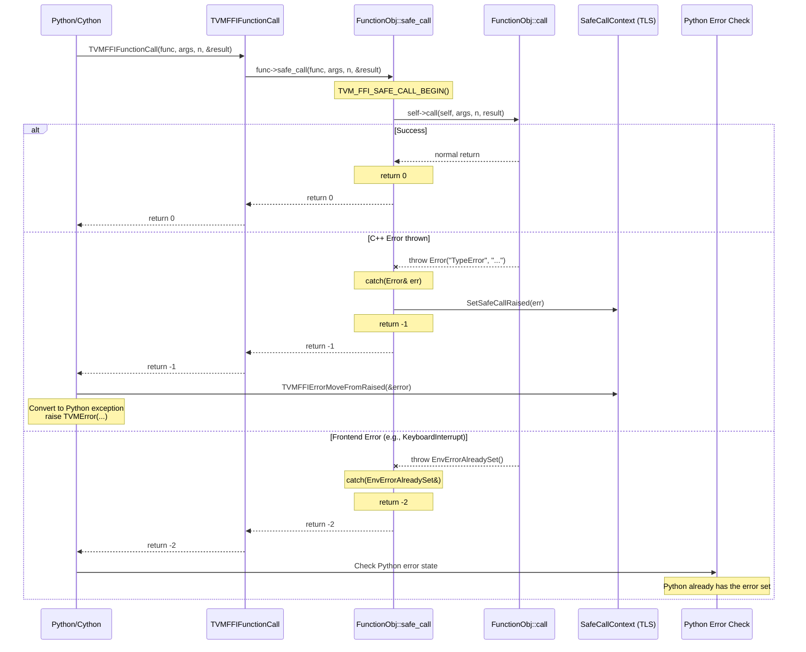
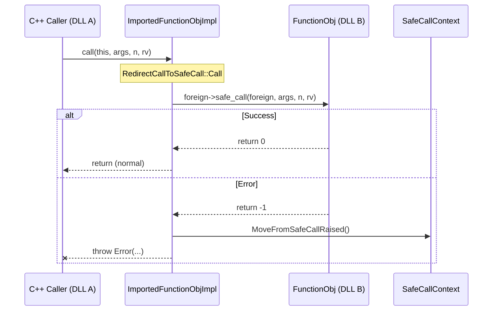

# Function Call Flow (C++ -> C ABI -> C++)

Source: commit `7d34eb8abfe987bf0031e4d4ff479895d867a966`
Related: [0004-function-system](../designs/0004-function-system.md), [0007-error-handling](../designs/0007-error-handling.md), [ADR 0005](../ADRs/0005-safe-call-abi-boundary.md)

## Same-DLL C++ Call (Fast Path)

## Cross-DLL Call via safe_call (Error Path)

## ImportedFunctionObjImpl: Cross-DLL Redirect

