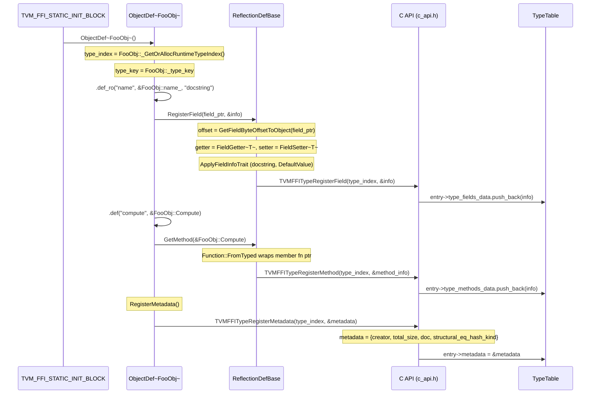
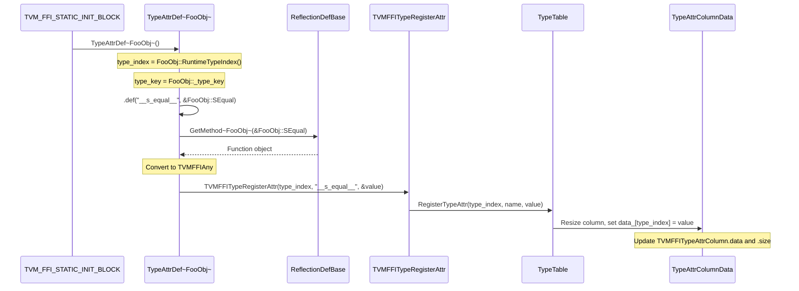
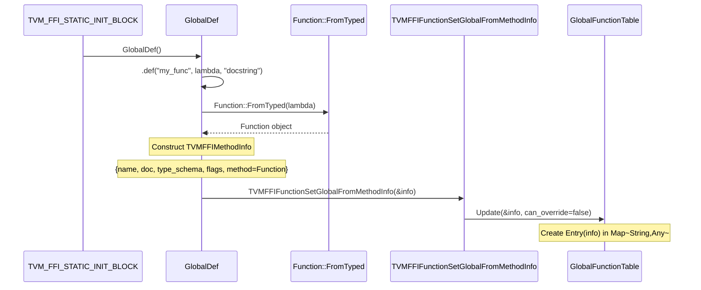
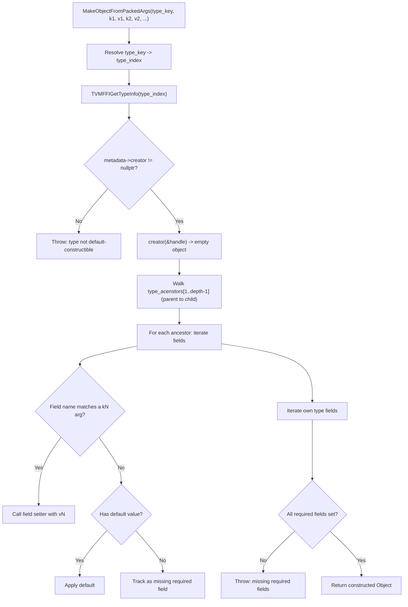

# Reflection Registration Flow

Source: commits `11a4a02`, `1a85688`, `a419ed1`, `b333288`, `e95b43b`, `162d600`, `9445fe7`
Related: [0006-reflection](../designs/0006-reflection.md), [0004-function-system](../designs/0004-function-system.md), [0010-type-attr-columns](../designs/0010-type-attr-columns.md)

## ObjectDef Registration (Type-Level Fields, Methods, Metadata)

## TypeAttrDef Registration (Per-Type Extensible Attributes)

## GlobalDef Registration (Global Functions with Metadata)

## MakeObjectFromPackedArgs (Reflection-Based Construction)

