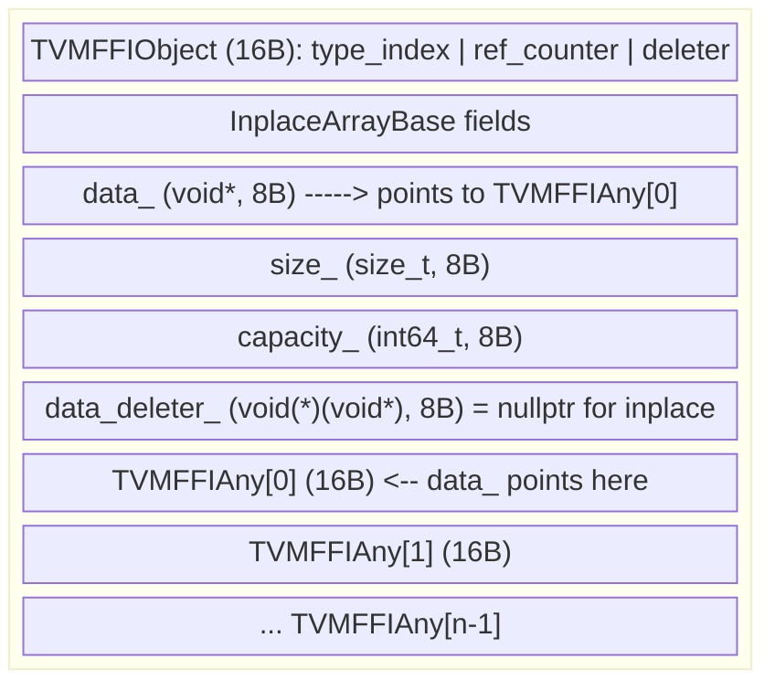
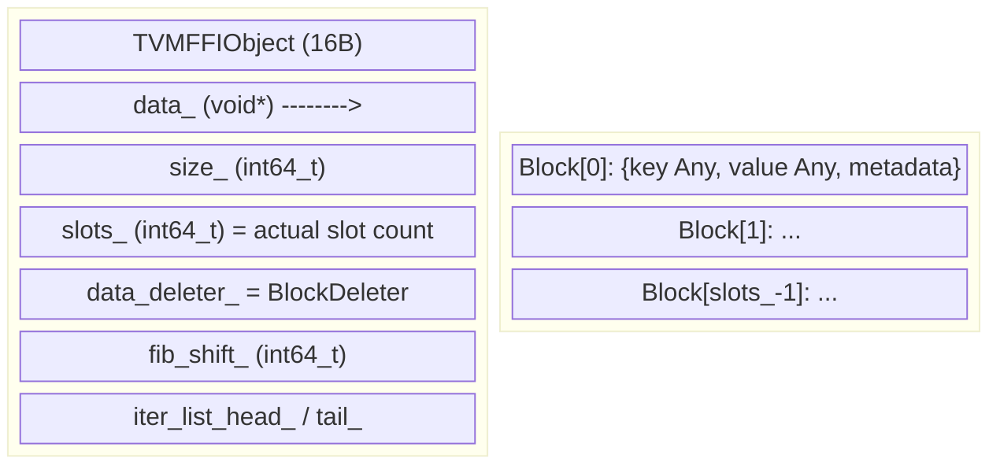
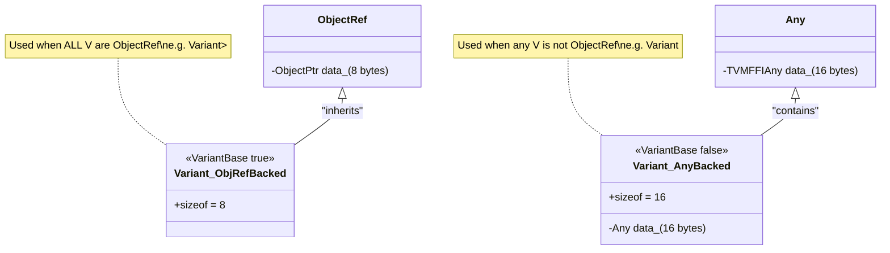

# Container ABI Layout

Source: commit `7e0a4b35df078675af32624b9cd02d1b8da1353e`
Related: [0005-containers](../designs/0005-containers.md), [ADR 0009](../ADRs/0009-container-data-indirection.md)

## ArrayObj Memory Layout (After data_ Indirection)

## DenseMapObj Memory Layout

## Variant Dual Storage

