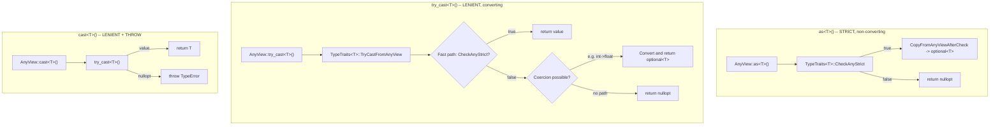
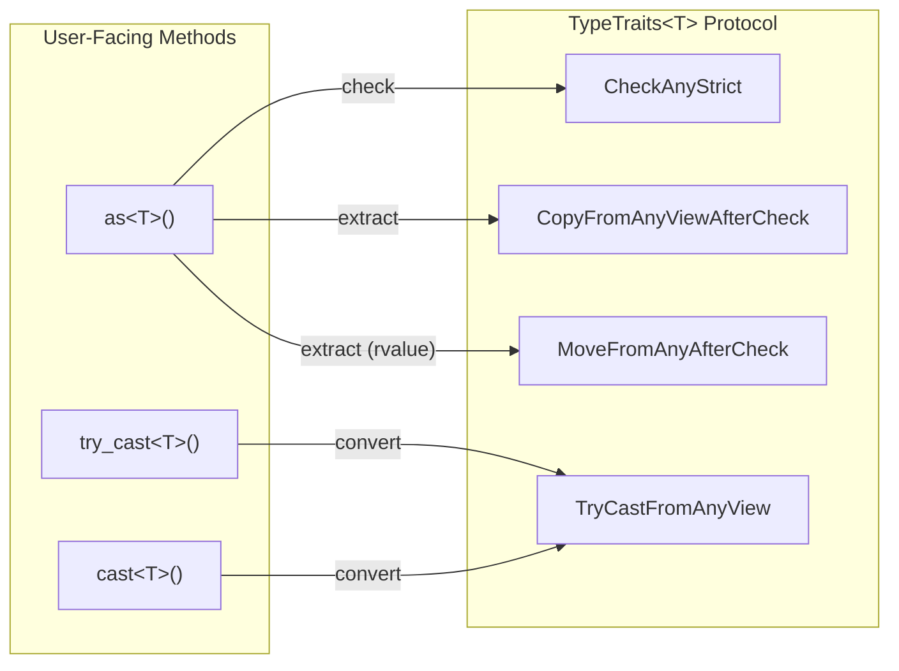
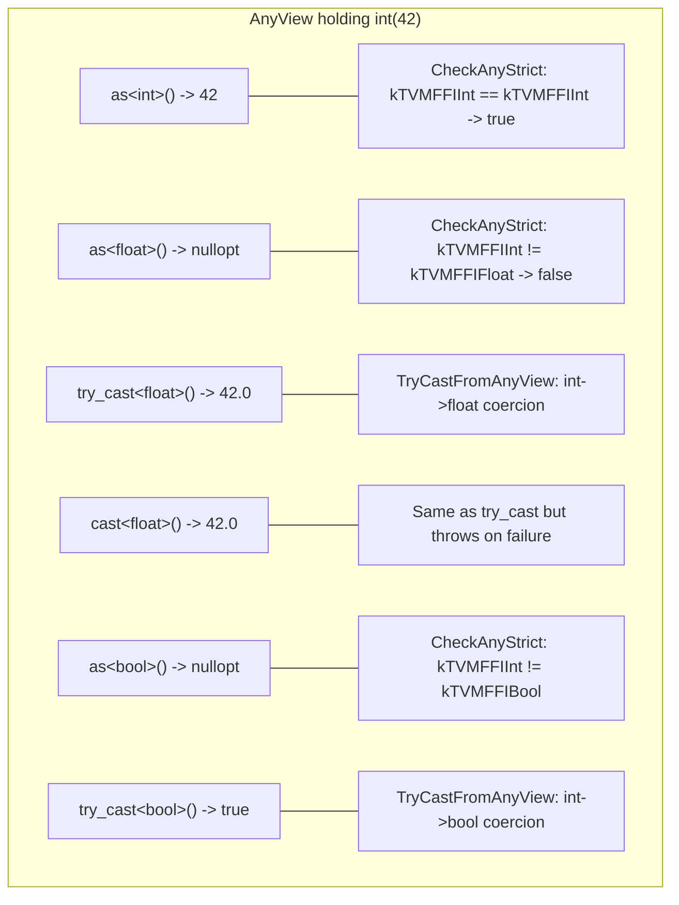

# Any Access Semantics: as() vs try_cast() vs cast()

Source: commit `37a2e7c521435cbe2bd772480f0389c18bd9ce2c`
Related: [0002-any-system](../designs/0002-any-system.md), [ADR 0008](../ADRs/0008-as-strict-cast-lenient.md)

## Decision Flow for the Three Access Methods

## TypeTraits Method Mapping

## Behavioral Examples

