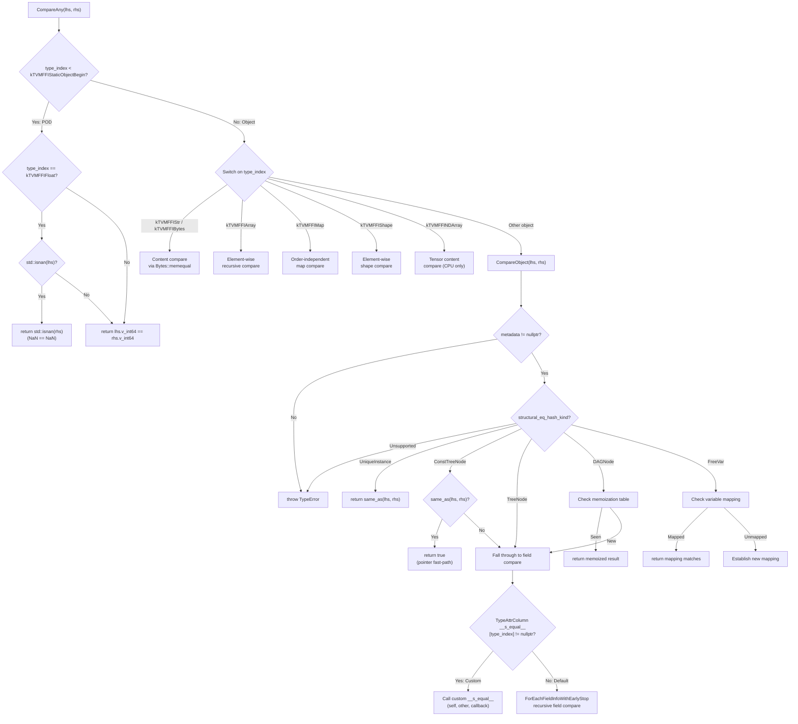
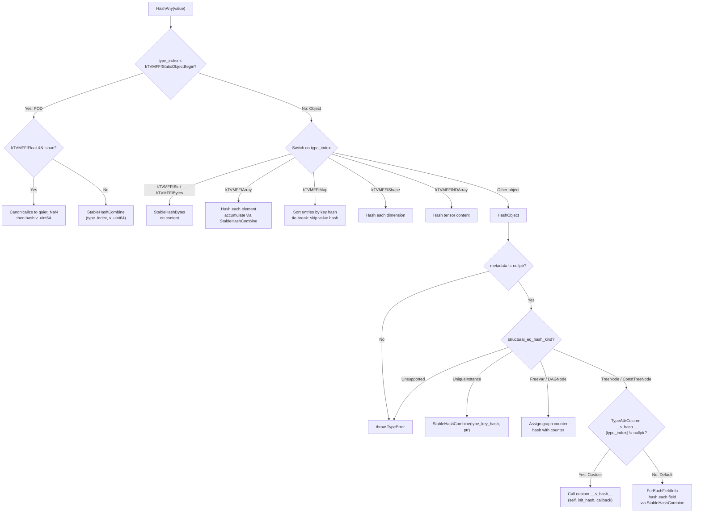
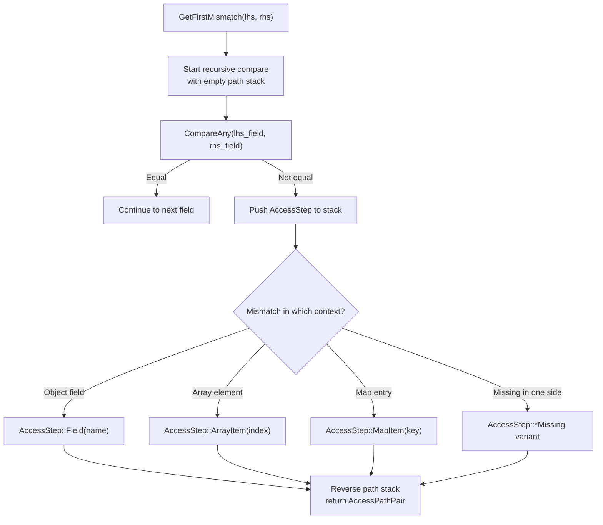

# Structural Equal/Hash Dispatch

Source: commits `9445fe7`, `2ec11f5`, `59a837e`, `3fc0391`
Related: [0009-structural-equal-hash](../designs/0009-structural-equal-hash.md), [0010-type-attr-columns](../designs/0010-type-attr-columns.md)

## StructuralEqual Dispatch Flow

## StructuralHash Dispatch Flow

## AccessPath Mismatch Construction

