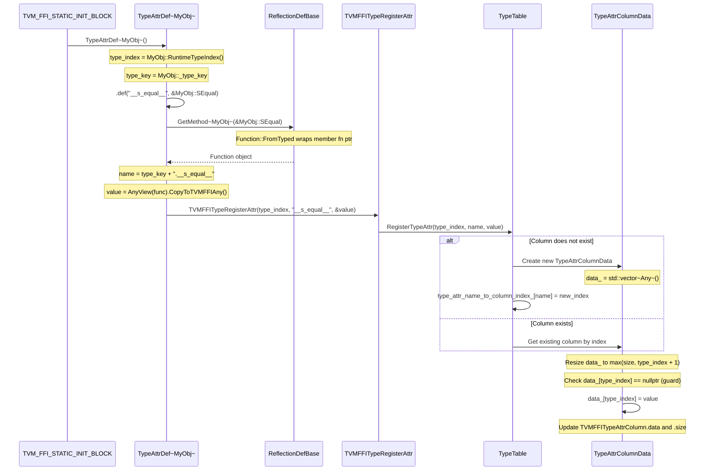
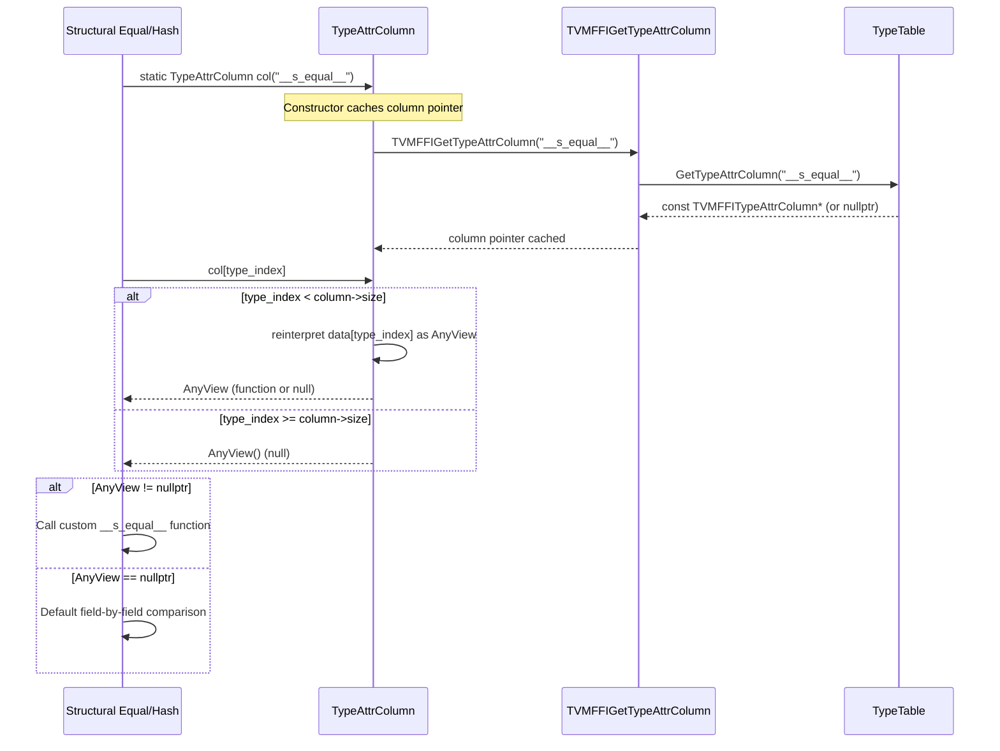
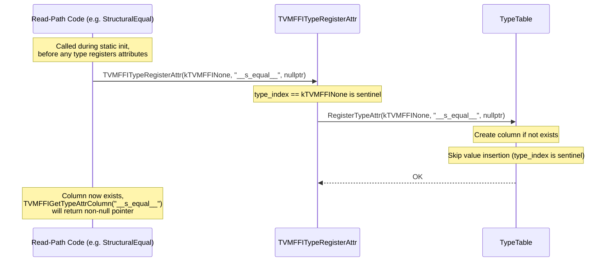

# TypeAttr Registration and Lookup Flow

Source: commits `162d600`, `2ec11f5`, `59a837e`
Related: [0010-type-attr-columns](../designs/0010-type-attr-columns.md), [0006-reflection](../designs/0006-reflection.md)

## Registration Path

## Lookup Path

## EnsureTypeAttrColumn (Forward Declaration)

