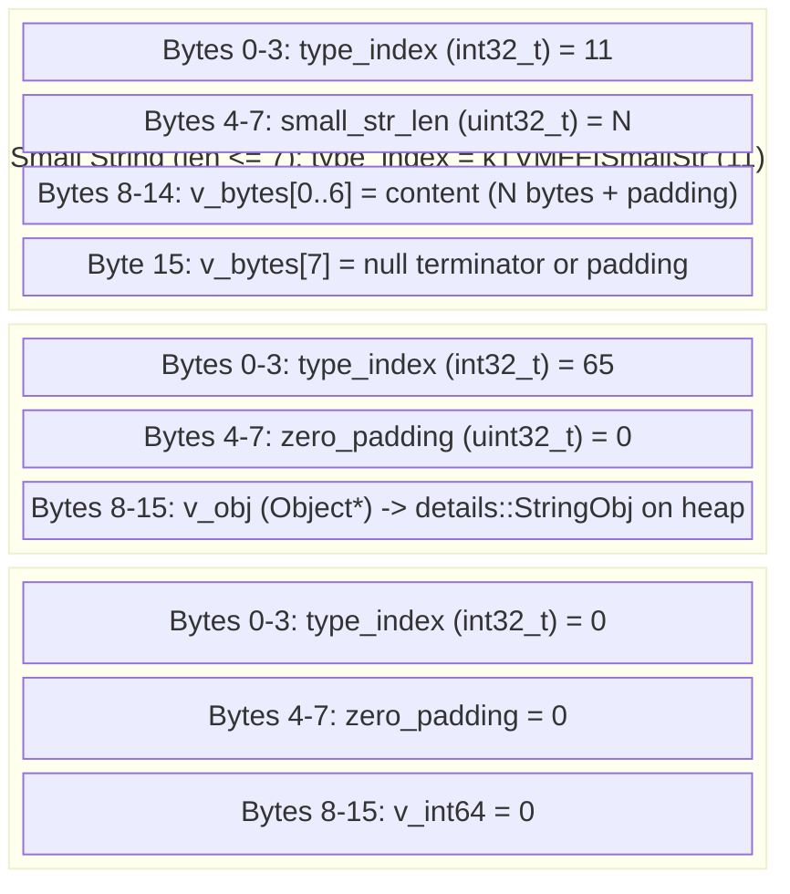
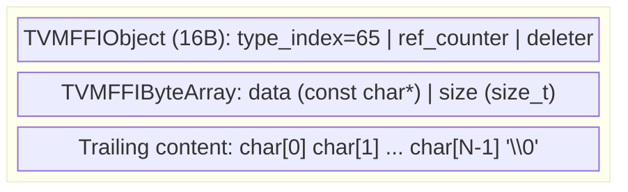
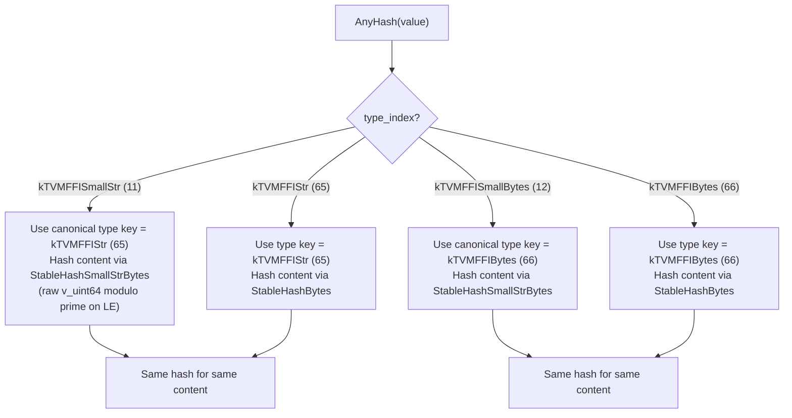
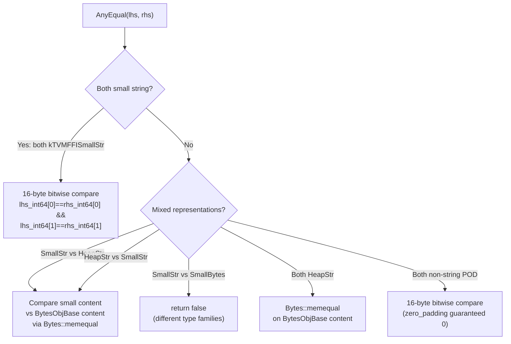

# String Dual Storage Layout (Small String Optimization)

Source: commits `0342d85`, `f9d2bff`
Related: [0005-containers](../designs/0005-containers.md), [0002-any-system](../designs/0002-any-system.md), [ADR 0013](../ADRs/0013-small-string-optimization.md)

## BytesBaseCell Dual Representation

## Heap StringObj Layout (when len >= 8)

## AnyHash Cross-Representation Consistency

## AnyEqual Cross-Representation Combinations

