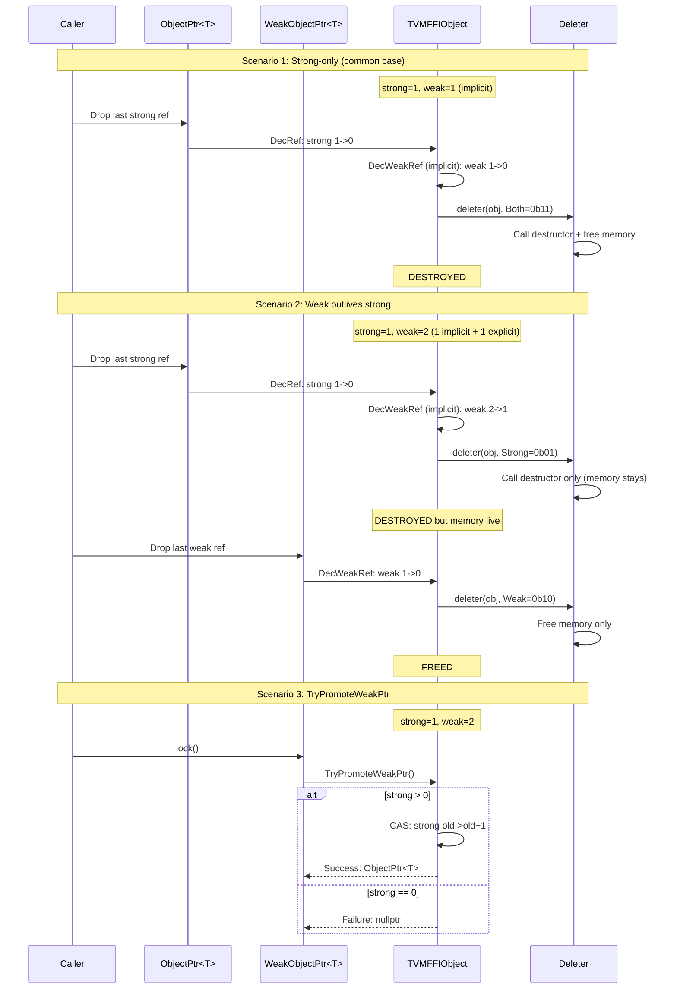
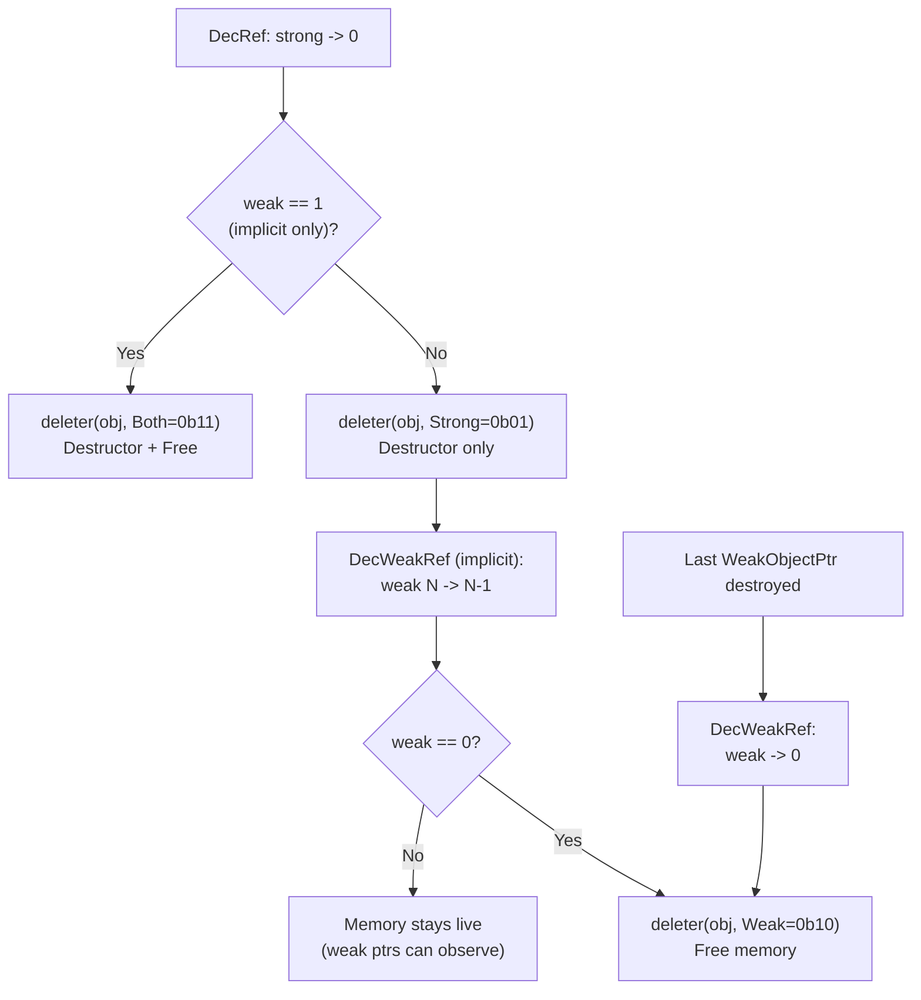

# Weak Reference Counting Destruction Protocol

Source: commit `ca9c3d10bb9640bffb972302f7064e49e592a526`
Related: [0003-object-system](../designs/0003-object-system.md), [ADR 0023](../ADRs/0023-weak-rc-abi-design.md)

## Two-Phase Destruction: Three Scenarios



## TVMFFIObject Header Layout (24 bytes)

```mermaid
block-beta
    columns 1
    block:header["TVMFFIObject (24 bytes)"]
        columns 3
        ti["type_index\n(int32, 4B)\noffset 0"]
        wrc["weak_ref_count\n(uint32, 4B)\noffset 4"]
        src["strong_ref_count\n(uint64, 8B)\noffset 8"]
    end
    block:deleter[""]
        columns 1
        del["deleter(TVMFFIObject*, int flags)\nor __ensure_align (int64)\n(8B) offset 16"]
    end
    block:cell["Cell data starts at offset 24"]
        columns 1
        cd["Specialized cell: FunctionCell, ErrorCell, ShapeCell, etc."]
    end
```

## Deleter Flag Dispatch


