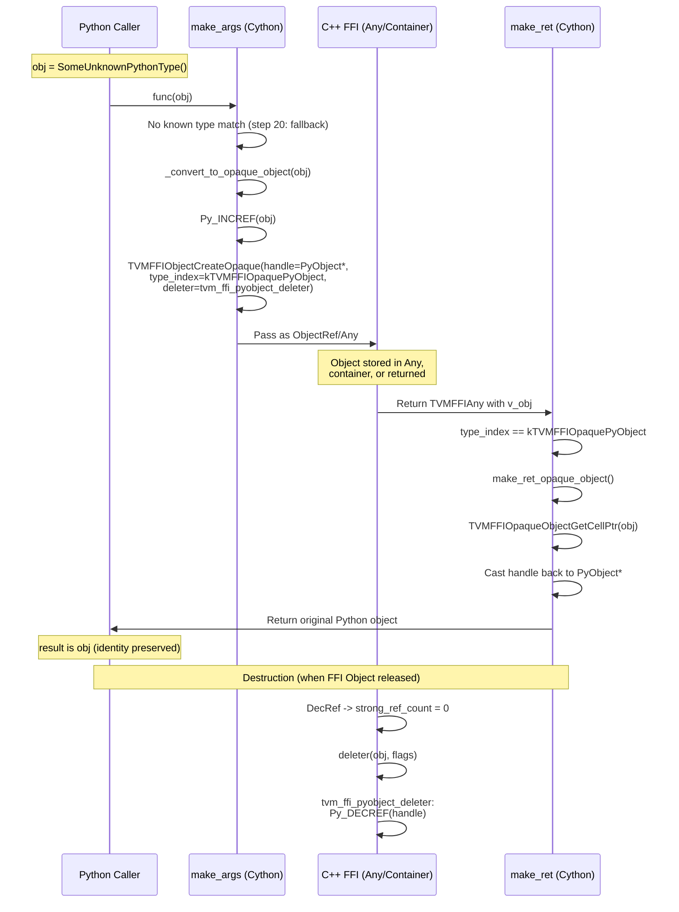
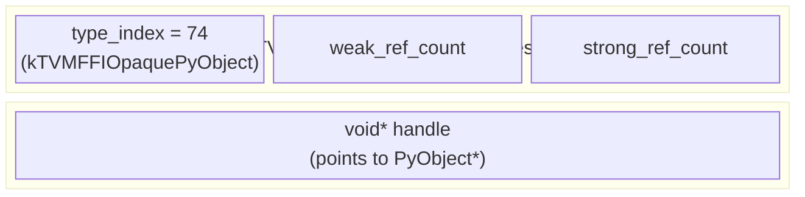
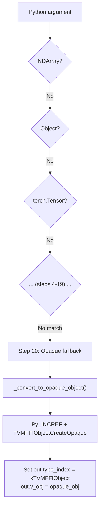

# Opaque PyObject Lifecycle

Source: commit `91d69f0658eef18fd9c99d4ac195ad5319db3787`
Related: [0014-python-bindings](../designs/0014-python-bindings.md), [ADR 0026](../ADRs/0026-opaque-pyobject-fallback.md)

## Round-Trip Lifecycle

## Object Structure

## Integration with make_args Priority Order

