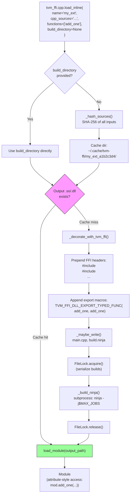
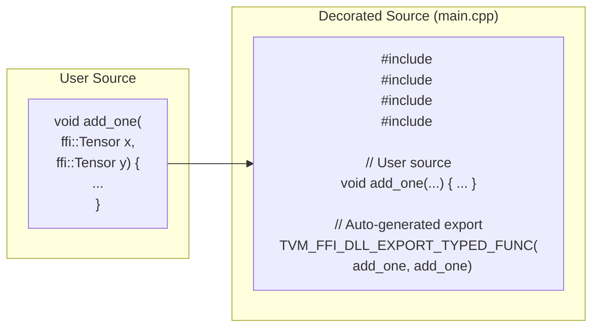
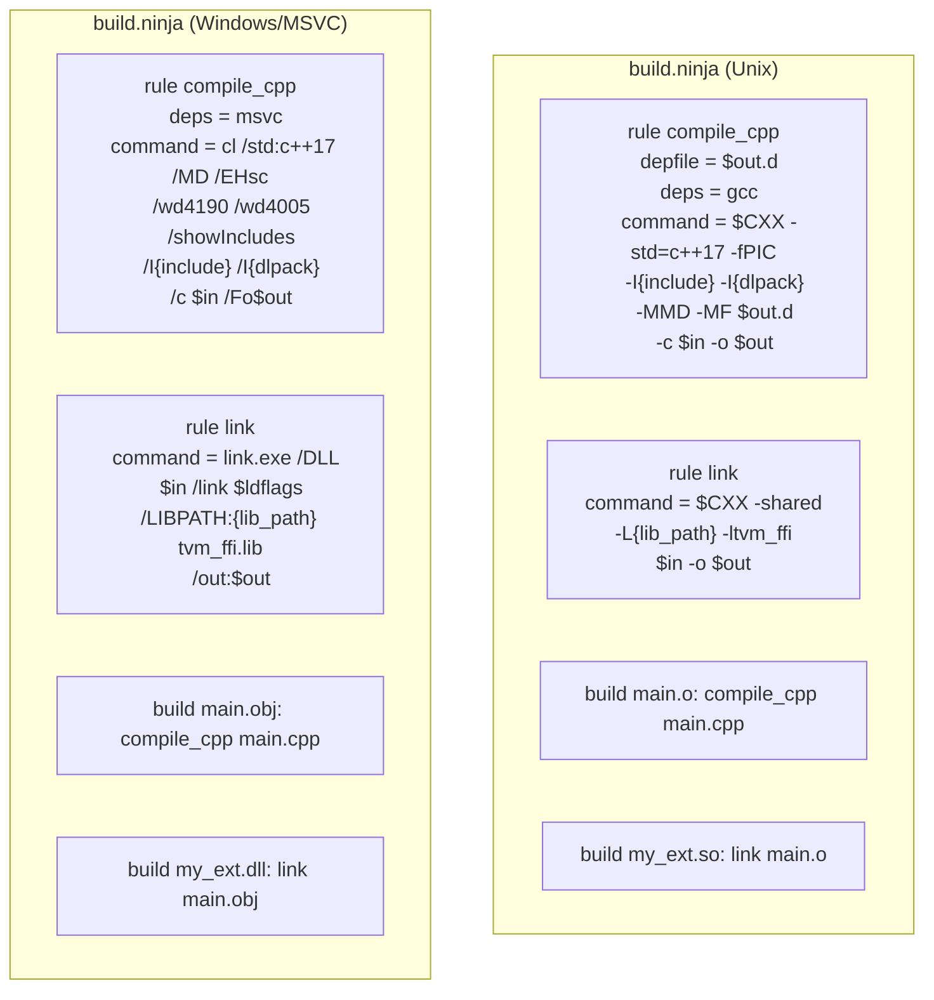

# Inline Module Compilation Flow

Source: commit `83805ec949227620d05e61358a4ecb4f0c931979`
Updated by: `825aeb9` (API rename), `2df07e5` (Windows), `4ffbc88` (macOS)
Related: [0017-inline-module-compilation](../designs/0017-inline-module-compilation.md), [0013-module-system](../designs/0013-module-system.md), [0008-module-export-system](../designs/0008-module-export-system.md)

## End-to-End Pipeline



## Source Decoration Detail



## Ninja Build Structure (Platform-Aware)



## Cache Directory Layout

```
~/.cache/tvm-ffi/
    my_ext_a1b2c3d4e5f6g7h8/
        main.cpp          # Decorated source
        cuda.cu           # CUDA source (if any)
        build.ninja       # Ninja build file
        my_ext.so         # Compiled output (Linux)
        my_ext.dylib      # Compiled output (macOS)
        my_ext.dll        # Compiled output (Windows)
        .lock             # FileLock file
```
