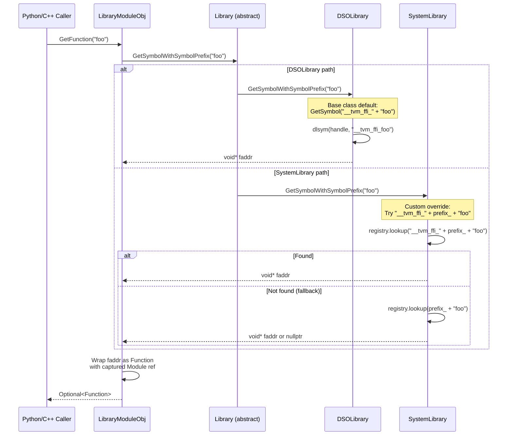
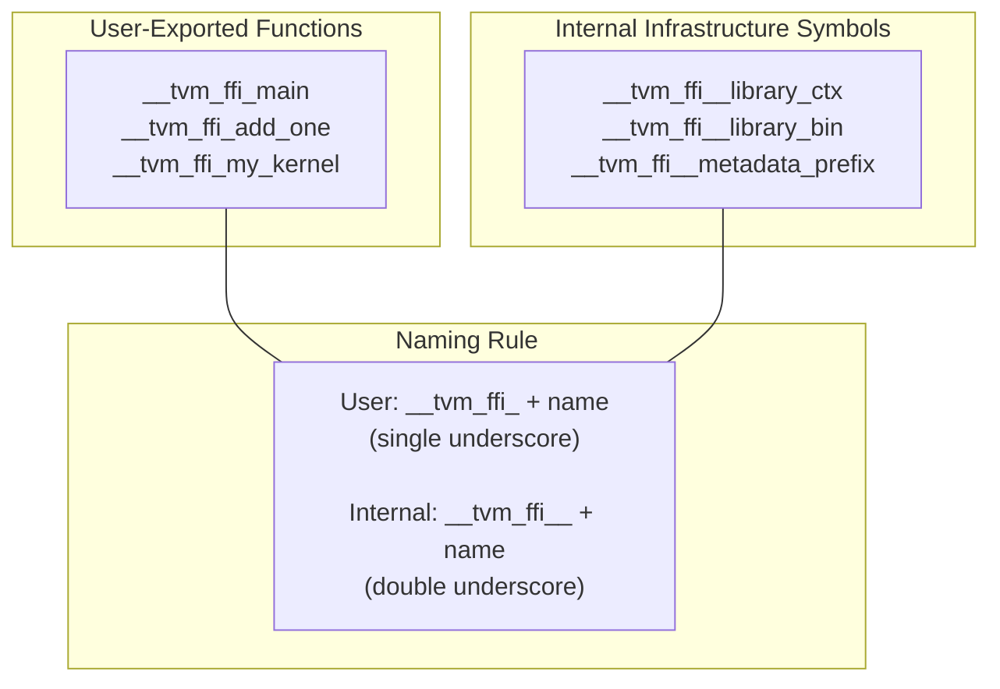
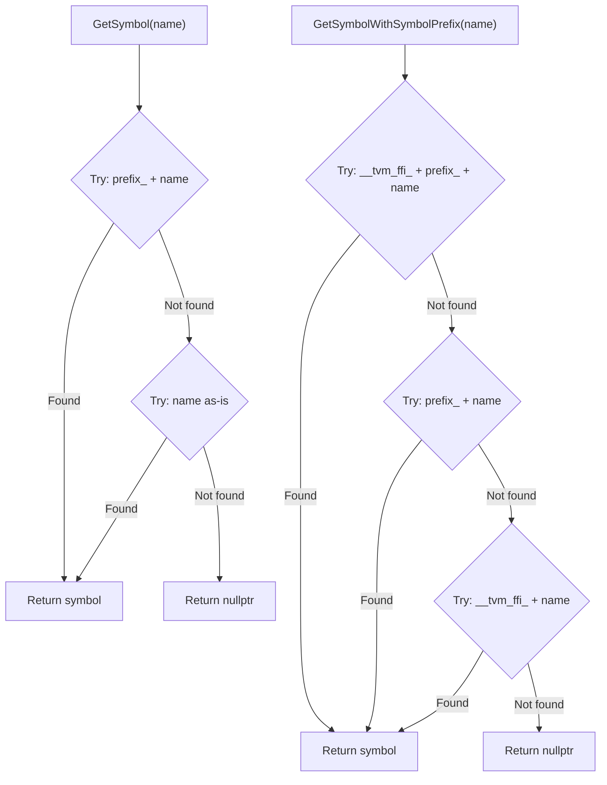

# Two-Tier Symbol Resolution in Module System

Source: commit `40e8a519f5270dfb18436b2f26c2d691cf24c9c1` (symbol prefix), `315f4bb00eac8b4d26cdcd6839fb1a077bab6976` (SystemLibrary fix)
Related: [0013-module-system](../designs/0013-module-system.md), [0008-module-export-system](../designs/0008-module-export-system.md), [ADR 0027](../ADRs/0027-ffi-symbol-prefix.md)

## LibraryModuleObj Function Discovery

## Symbol Naming Convention

## SystemLibrary Prefix-Tolerant Lookup

