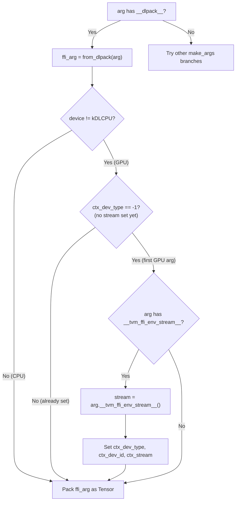
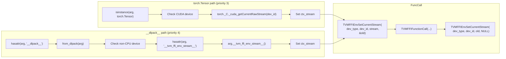

# __tvm_ffi_env_stream__ Protocol in make_args

Source: commit `db987299f74aadcb4d8003cc6009cb67a75662c8`
Related: [0014-python-bindings](../designs/0014-python-bindings.md), [0011-extra-api-tier](../designs/0011-extra-api-tier.md), [ADR 0030](../ADRs/0030-generic-stream-exchange-protocol.md)

## Decision Tree in make_args (DLPack branch)

## Parallel: torch.Tensor vs Generic Protocol

