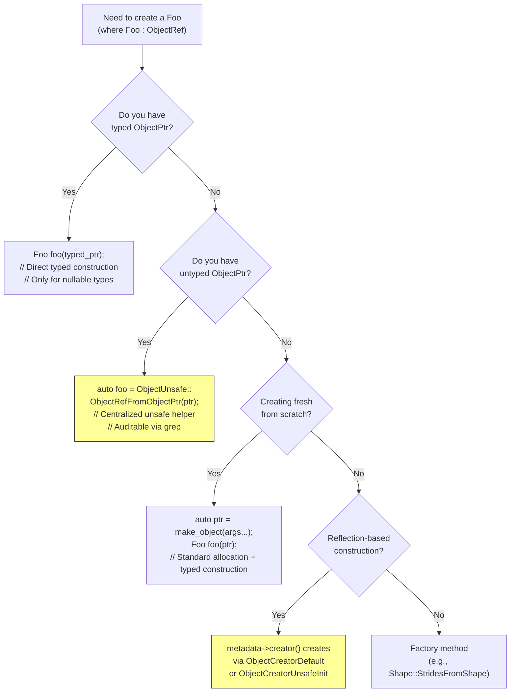
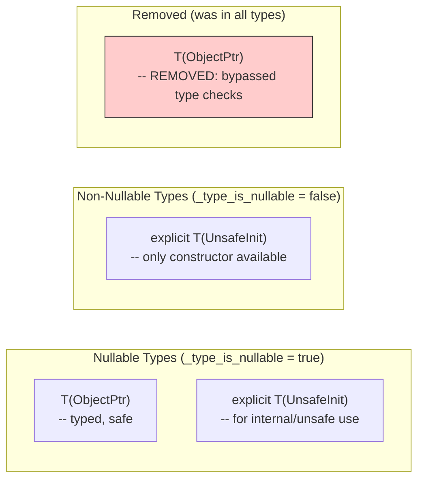
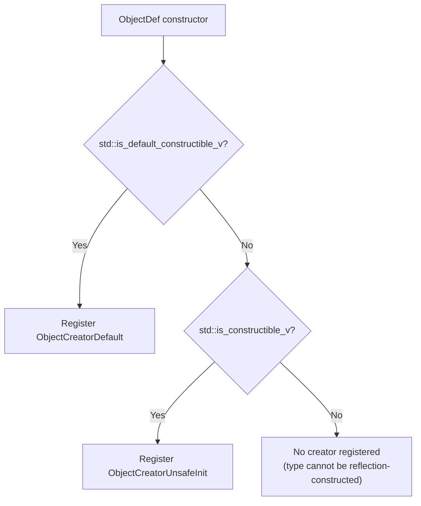

# ObjectRef Construction Paths (Post-UnsafeInit)

Source: commit `472e10c4086e91fb788ffe1f0eee10df4bcf5db2`
Related: [0003-object-system](../designs/0003-object-system.md), [ADR 0028](../ADRs/0028-unsafeinit-tag-replaces-objectptr-object-ctor.md)

## How to Construct an ObjectRef Subclass

## Constructor Matrix After UnsafeInit

## Reflection Creator Resolution

