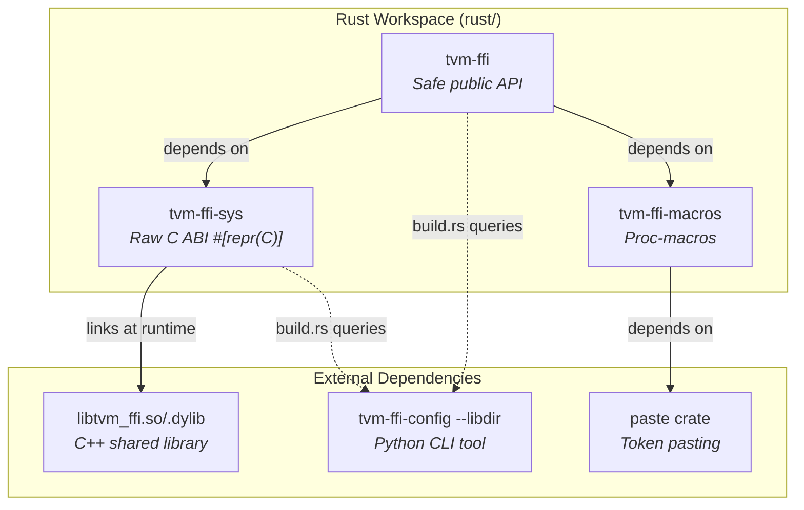
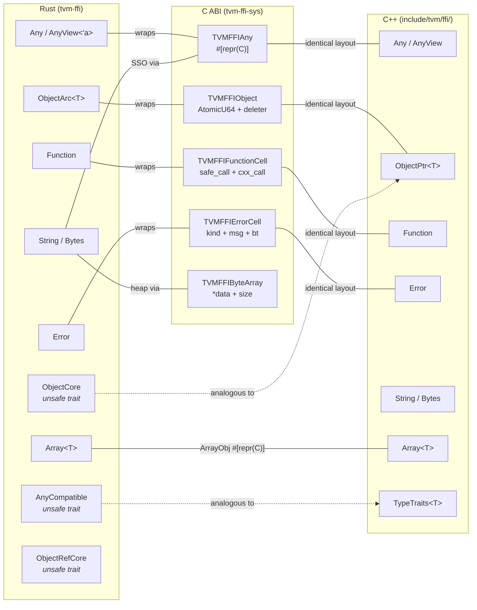
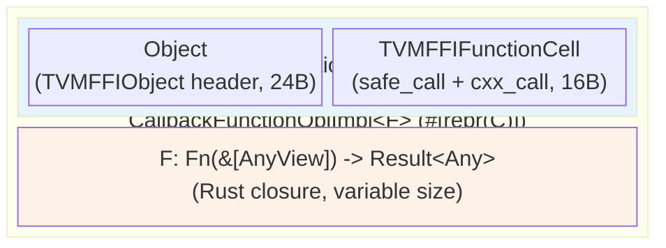
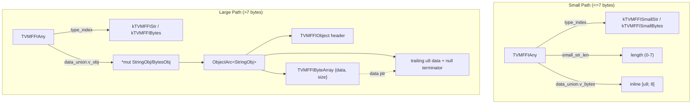

# Rust Crate Architecture and Type Mapping

Source: commit `09477ce10de566f8cf511cce7dfe56e77759f100`
Related: [0022-rust-bindings](../designs/0022-rust-bindings.md), [ADR 0043](../ADRs/0043-native-rust-ref-counting.md), [ADR 0044](../ADRs/0044-manual-c-api-transcription-in-rust.md)

## Three-Crate Workspace Dependency Graph



## Rust-to-C++ Type Mapping



## ObjectArc Lifecycle: Native Ref-Counting

```mermaid
sequenceDiagram
    participant User as Rust Code
    participant Arc as ObjectArc&lt;T&gt;
    participant Header as TVMFFIObject.combined_ref_count
    participant Del as Deleter (extern "C")

    Note over Header: Initial: strong=1, weak=1<br/>(COMBINED_REF_COUNT_BOTH_ONE)

    User->>Arc: .clone()
    Arc->>Header: fetch_add(1, Relaxed)
    Note over Header: strong=2, weak=1

    User->>Arc: drop first clone
    Arc->>Header: fetch_sub(STRONG_ONE, Relaxed)
    Note over Header: strong=1, weak=1

    User->>Arc: drop last clone
    Arc->>Header: fetch_sub(STRONG_ONE, Relaxed)
    Note over Header: old was BOTH_ONE
    Arc->>Arc: fence(Acquire)
    Arc->>Del: deleter(ptr, Both=0b11)
    Del->>Del: drop_in_place(obj) + dealloc(ptr)
    Note over Header: FREED
```

## CallbackFunctionObjImpl Memory Layout



The `safe_call` pointer in `TVMFFIFunctionCell` points to a monomorphized `invoke_callback` function that casts the handle back to `CallbackFunctionObjImpl<F>` to call the closure. The `ObjectArc` is created as `ObjectArc<CallbackFunctionObjImpl<F>>` (so the deleter knows the full type for drop), then transmuted to `ObjectArc<FunctionObj>` via `into_raw`/`from_raw` pointer casting.

## String/Bytes Dual Storage


