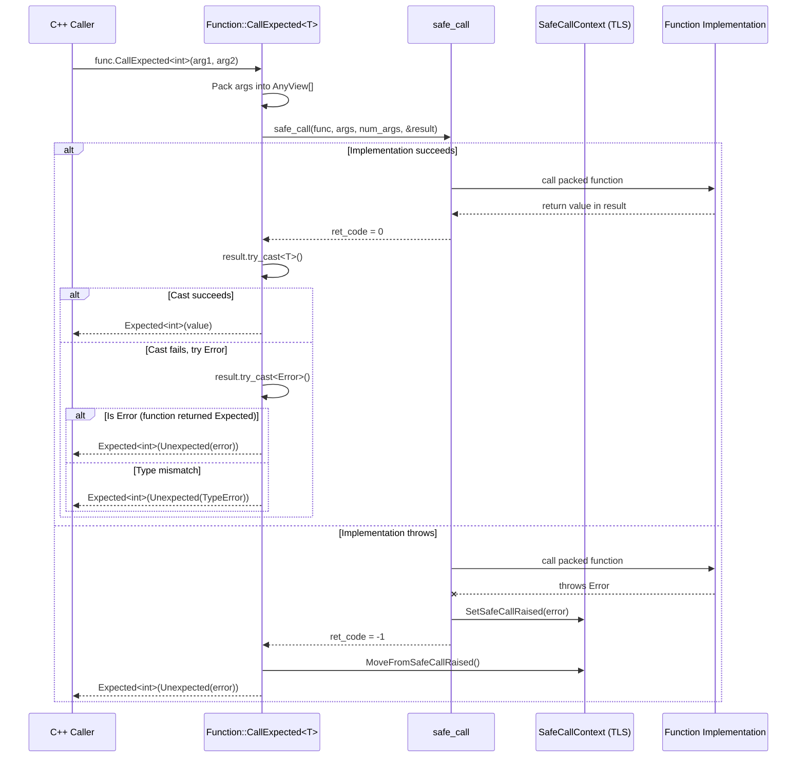
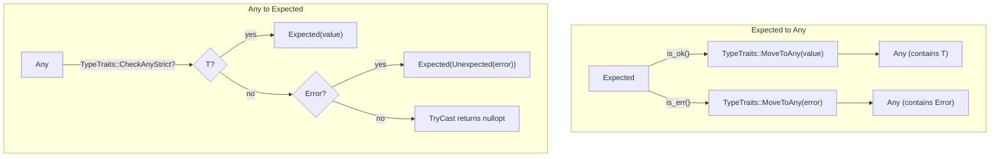
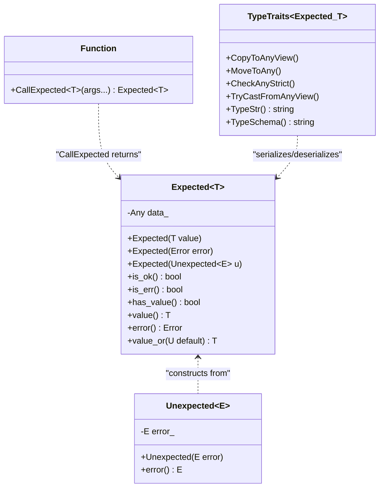

# Expected<T> Call Flow and Type System Integration

Source: commit `0a9d4b681cb017e9103efa6cc20d687c065a26fe`
Related: [0007-error-handling](../designs/0007-error-handling.md), [ADR 0056](../ADRs/0056-expected-type-for-exception-free-errors.md)

## CallExpected<T> Flow

## Expected<T> TypeTraits Serialization

## Expected<T> Class Hierarchy

