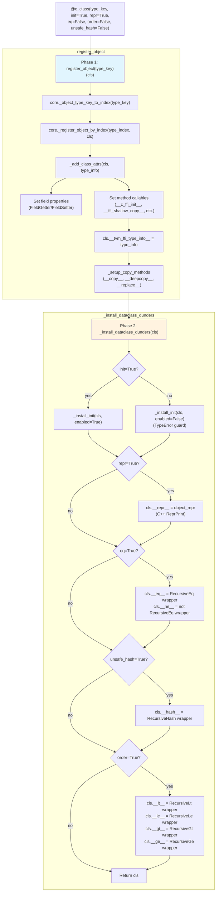
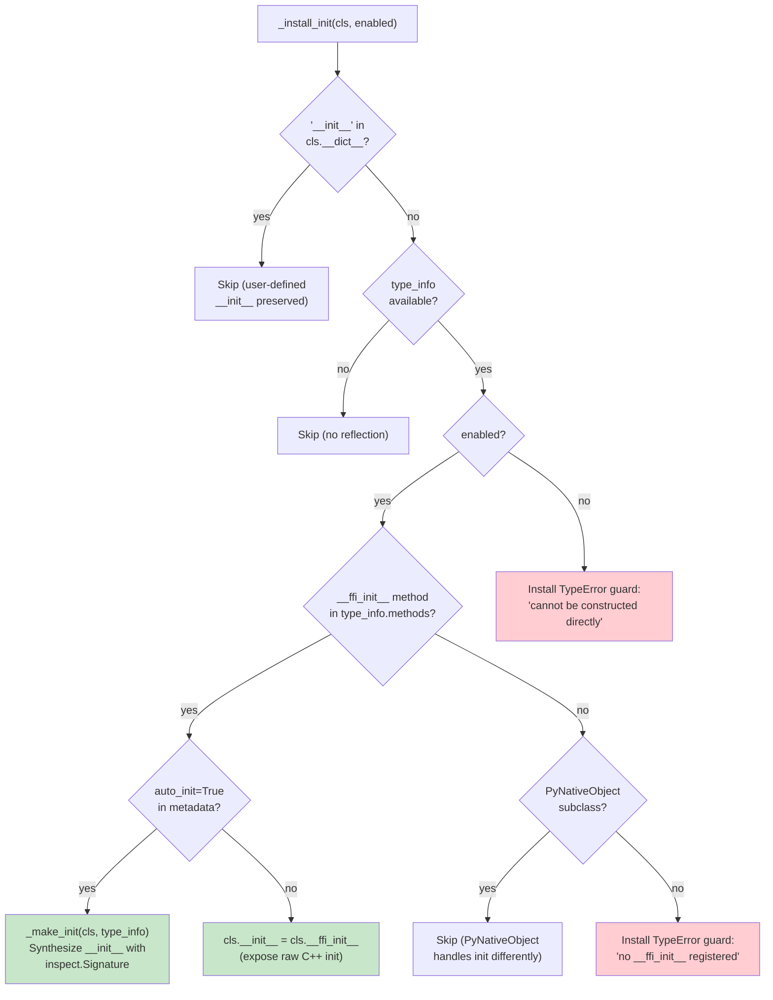
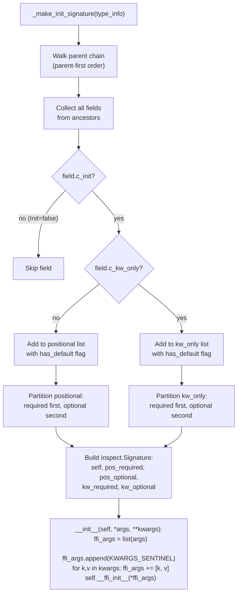
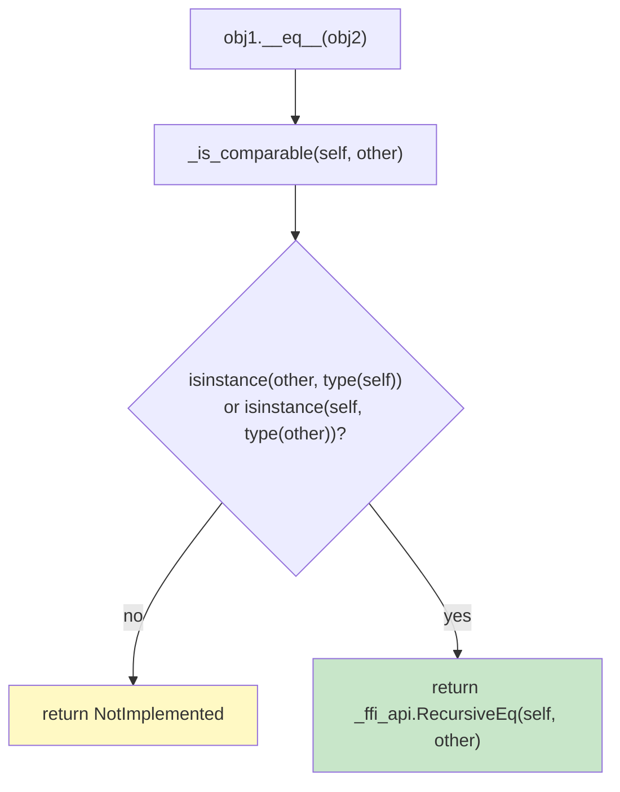

# @c_class Decorator and Init Wiring Flow

Source: commits `e5f3af7` (#488, c_class reimplementation), `b1abaea` (#486, __ffi_init__ wiring)
Related: [0014-python-bindings](../designs/0014-python-bindings.md), [0027-dataclass-operations](../designs/0027-dataclass-operations.md), [ADR 0069](../ADRs/0069-c-class-as-register-object-plus-dunders.md)

## @c_class Decorator Two-Phase Flow

## __ffi_init__ to Python __init__ Wiring

## _make_init Signature Synthesis

## Comparison Dunder Guard Logic

