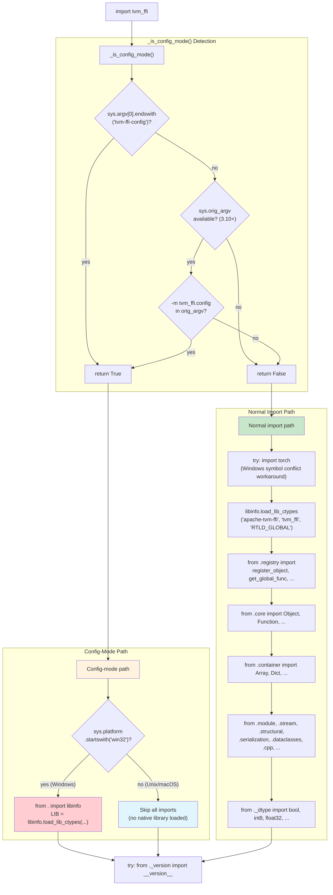

# Config-Mode Import Bypass Flow

Source: commits `5c0deb9` (#489, skip imports in config mode), `bad3896` (#490, Windows config loading fix)
Related: [0014-python-bindings](../designs/0014-python-bindings.md), [0016-packaging-and-build](../designs/0016-packaging-and-build.md)

## Package Initialization with Config-Mode Detection

## Rationale

The `tvm-ffi-config` CLI (`python -m tvm_ffi.config`) only needs path discovery functions from `libinfo.py` (`find_lib_path`, `find_include_path`, etc.). Loading the full C++ shared library, Cython extension, and registering all object types is unnecessary overhead. On CI systems or cross-compilation environments, the native library may not even be available for the host platform.

The Windows exception exists because DLL search path resolution on Windows requires the native library to be loaded via `ctypes.CDLL` before any Cython extension (`.pyd` file) can be imported, even indirectly. Some test configurations trigger Cython imports even during config queries, so the library must be loaded preemptively.
