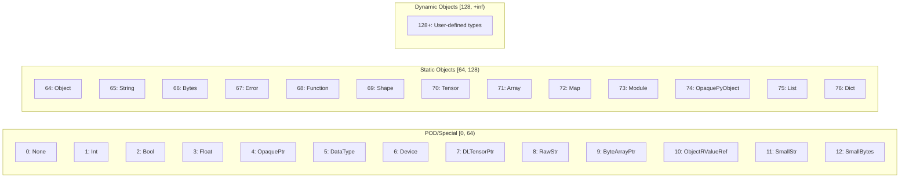
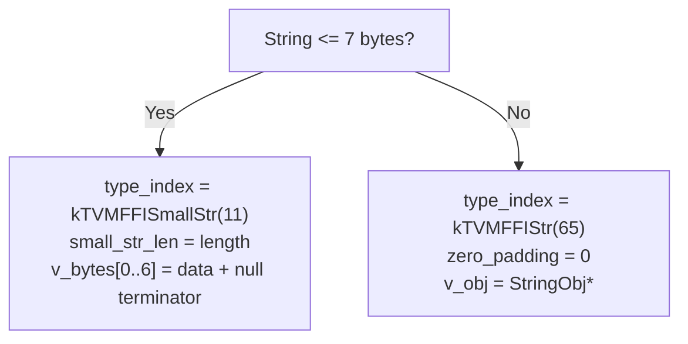

# TVMFFIAny 16-Byte Memory Layout

## Structure Layout

```mermaid
block-beta
  columns 4
  block:header["Bytes 0-3: type_index (int32_t)"]
    columns 1
    ti["type_index"]
  end
  block:pad["Bytes 4-7: union"]
    columns 1
    zp["zero_padding / small_str_len (uint32_t)"]
  end
  block:value["Bytes 8-15: union (8 bytes)"]
    columns 1
    val["v_int64 | v_float64 | v_ptr | v_c_str | v_obj | v_dtype | v_device | v_bytes[8] | v_uint64"]
  end
```

## Type Index Ranges

## Small String Optimization

## Evidence

- TVMFFIAny struct: `include/tvm/ffi/c_api.h` lines 280-333 @ `7d34eb8`
- TVMFFITypeIndex enum: `include/tvm/ffi/c_api.h` lines 84-192 @ `7d34eb8`
- Small string optimization: `include/tvm/ffi/any.h` AnyView constructors @ `7d34eb8`
