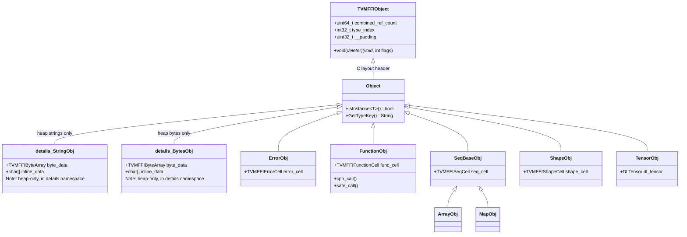
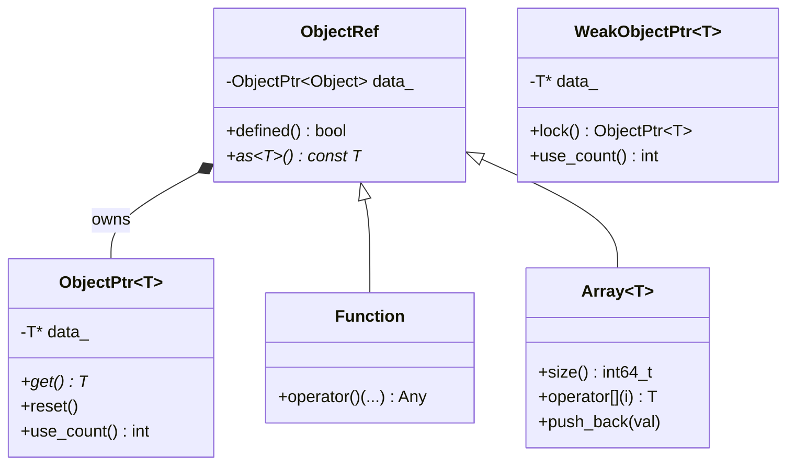
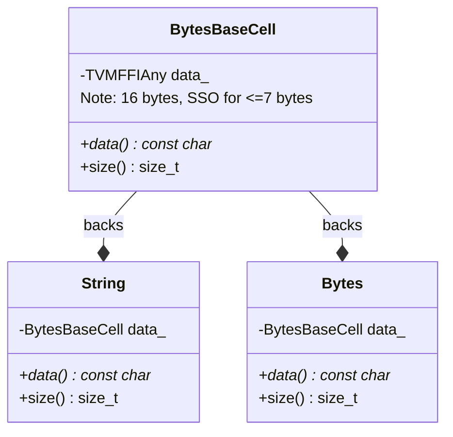
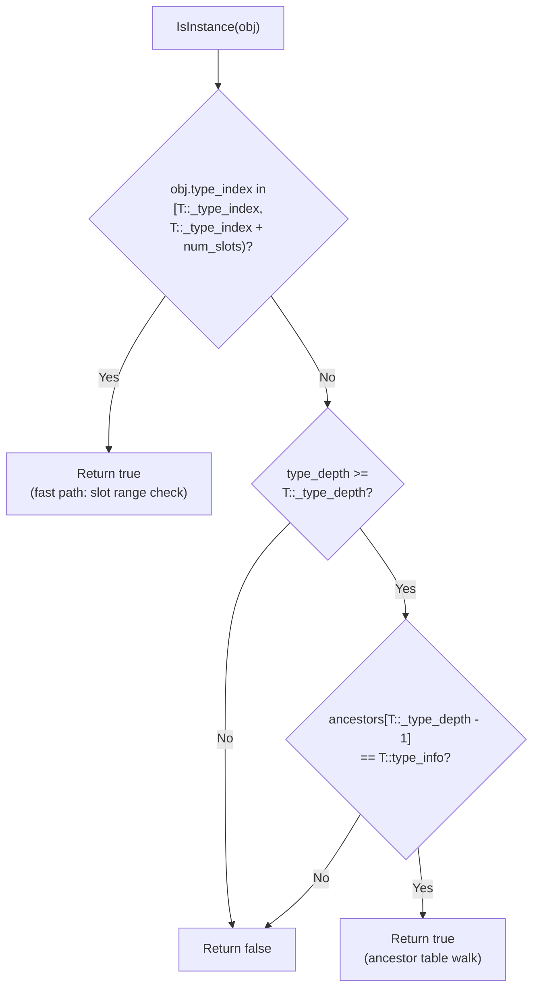

# Object Type Hierarchy and IsInstance Check Flow

## Builtin Object Hierarchy

## Ref Wrapper Pattern

## Value Types (Not ObjectRef)

## IsInstance Check Flow

## TVMFFIObject Header Layout (24 bytes)

```mermaid
block-beta
  columns 4
  block:combined["Bytes 0-7: combined_ref_count (uint64_t)"]
    columns 1
    s["Strong bits [0:31] + Weak bits [32:63]"]
  end
  block:tidx["Bytes 8-11: type_index (int32_t)"]
    columns 1
    t["Object type tag"]
  end
  block:pad["Bytes 12-15: __padding (uint32_t)"]
    columns 1
    w["Zero-initialized"]
  end
  block:del["Bytes 16-23: deleter (void*)(void*, int flags)"]
    columns 1
    d["Called with TVMFFIObjectDeleterFlagBitMask"]
  end
```

## Evidence

- Object class definition: `include/tvm/ffi/object.h` @ `7d34eb8`
- TVMFFIObject struct: `include/tvm/ffi/c_api.h` lines 227-278 @ `7d34eb8`
- TVMFFIObject header split refcounts (strong/weak): `include/tvm/ffi/c_api.h` @ `ca9c3d1`
- TVMFFIObject header reorder (refcounts first): `include/tvm/ffi/c_api.h` @ `13436f0`
- TVMFFIObject combined u64 refcount: `include/tvm/ffi/c_api.h`, `include/tvm/ffi/object.h` @ `43d13e8`
- WeakObjectPtr template: `include/tvm/ffi/object.h` @ `ca9c3d1`
- TypeTable and IsInstance: `src/ffi/object.cc` @ `7d34eb8`
- IsInstance fast path (slot-range check): `TVM_FFI_DECLARE_OBJECT_INFO` macro in `include/tvm/ffi/object.h` @ `7d34eb8`
- String/Bytes rewritten as value types (BytesBaseCell): `include/tvm/ffi/string.h` @ `49e2ed4`
- StringObj/BytesObj moved to `namespace details`: `include/tvm/ffi/string.h` @ `f9d2bff`
