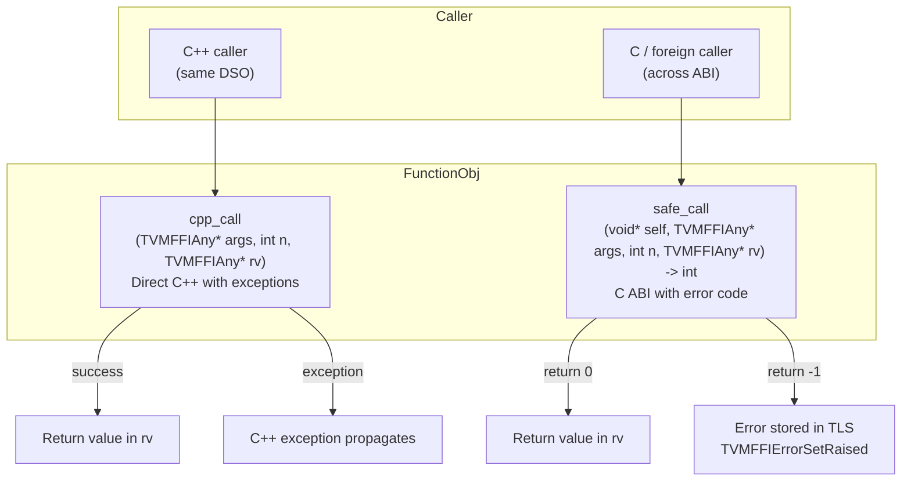
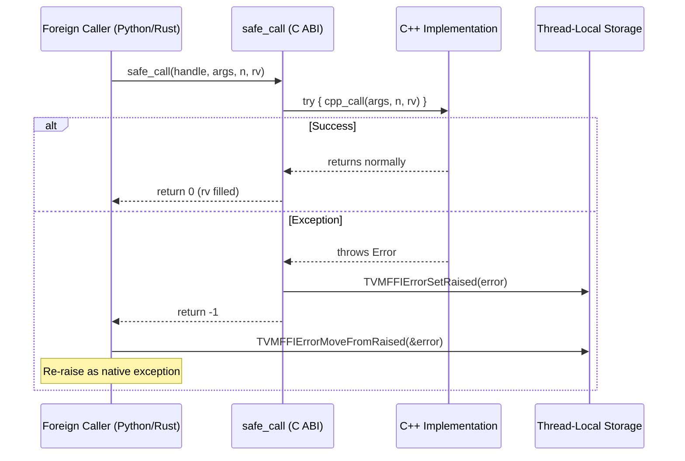
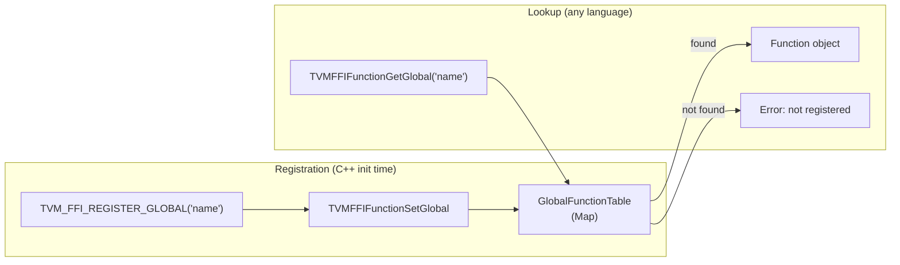
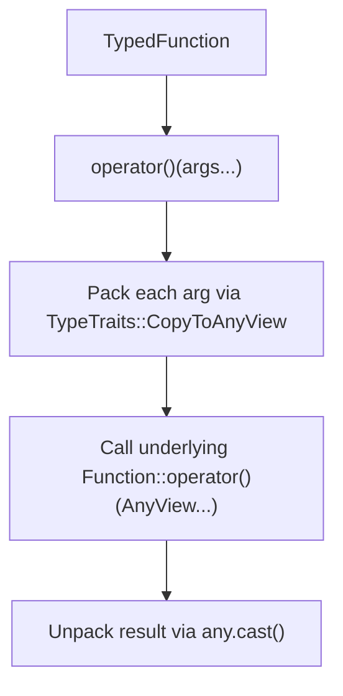

# Function Dual-Dispatch and Safe Call Flow

## Dual Dispatch Architecture

## Safe Call Error Propagation

## Global Function Registry

## TypedFunction Wrapper

## Evidence

- FunctionObj dual dispatch: `include/tvm/ffi/function.h` cpp_call/safe_call fields @ `7d34eb8`
- TVM_FFI_SAFE_CALL_BEGIN/END macros: `include/tvm/ffi/function.h` @ `7d34eb8`
- GlobalFunctionTable: `src/ffi/function.cc` @ `7d34eb8`
- TVMFFISafeCallType: `include/tvm/ffi/c_api.h` lines 458-480 @ `7d34eb8`
- TVMFFIErrorSetRaised/MoveFromRaised: `include/tvm/ffi/c_api.h` @ `7d34eb8`
