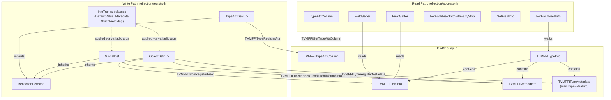
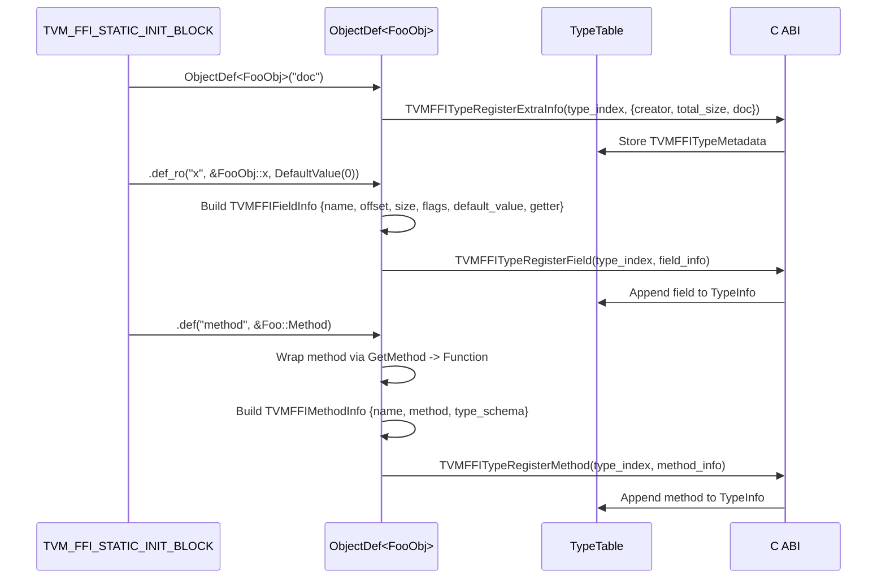
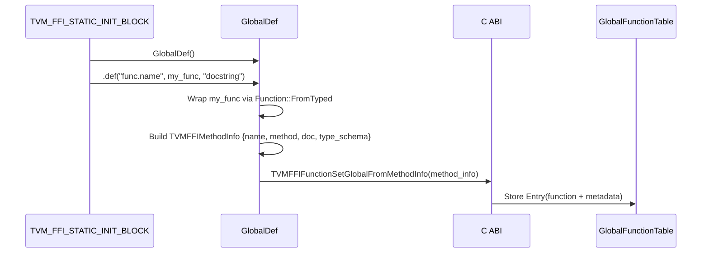
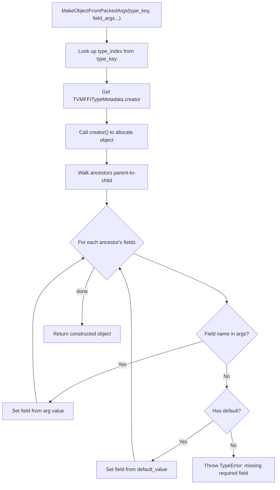
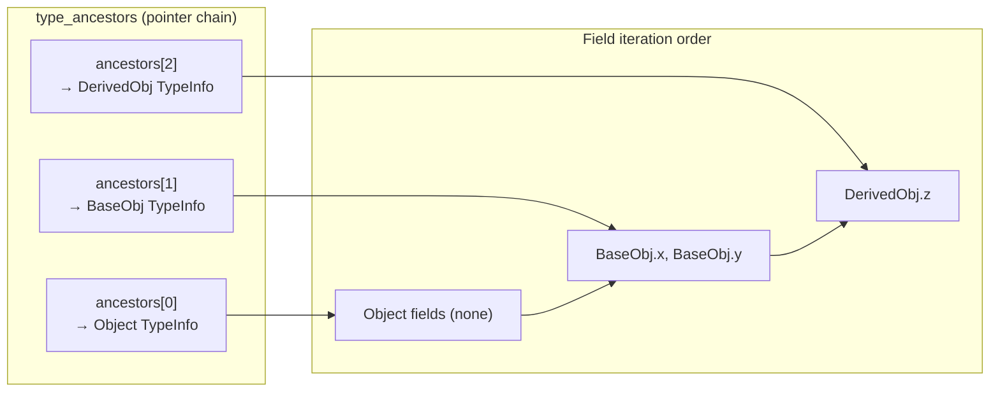

# Reflection System Architecture

## Header Organization (Write Path vs Read Path)

## ObjectDef Registration Flow

## GlobalDef Registration Flow

## MakeObjectFromPackedArgs Flow

## ForEachFieldInfo Ancestor Traversal

## Evidence

- ObjectDef template: `include/tvm/ffi/reflection/registry.h` @ `1a8568`, `a419ed`
- GlobalDef class: `include/tvm/ffi/reflection/registry.h` @ `b33328`
- TVMFFIFieldInfo/MethodInfo/TypeExtraInfo structs: `include/tvm/ffi/c_api.h` @ `a419ed`
- Header split (registry.h + accessor.h): @ `e95b43`
- ForEachFieldInfo: `include/tvm/ffi/reflection/accessor.h` @ `837800`
- MakeObjectFromPackedArgs: `src/ffi/object.cc` @ `e90948`
- Ancestor pointer chain: `include/tvm/ffi/c_api.h` @ `837800`
- TypeAttrDef<T>: `include/tvm/ffi/reflection/registry.h` @ `162d600`
- TypeAttrColumn accessor: `include/tvm/ffi/reflection/accessor.h` @ `162d600`
- TVMFFITypeMetadata (renamed from TypeExtraInfo): `include/tvm/ffi/c_api.h` @ `162d600`
- AttachFieldFlag (SEqHash field annotations): `include/tvm/ffi/reflection/registry.h` @ `9445fe7`
