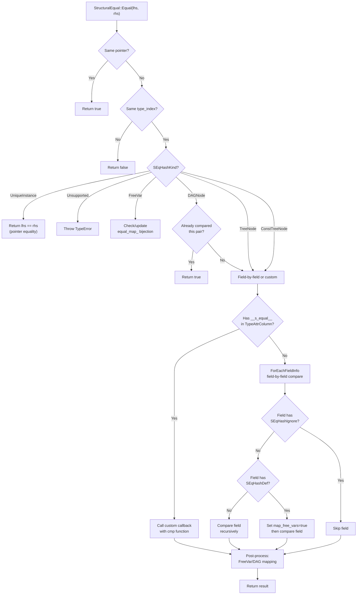
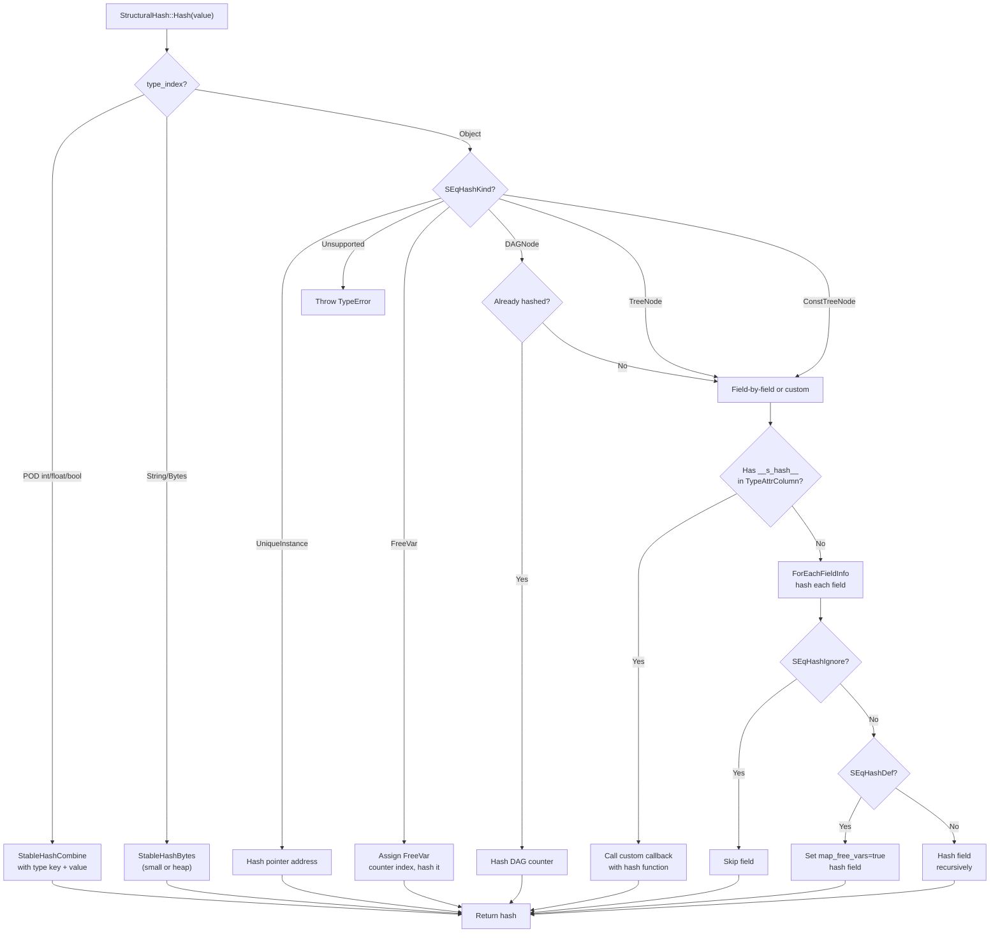
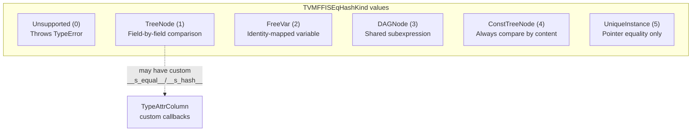

# Structural Equal and Hash Dispatch Flow

## Structural Equal Dispatch

## Structural Hash Dispatch

## AccessPath Mismatch Tracking

```mermaid
flowchart LR
  subgraph "Parent-pointing tree"
    Root["Root<br/>depth=0"]
    A1["Attr('body')<br/>depth=1"]
    A2["ArrayItem(0)<br/>depth=2"]
    A3["Attr('value')<br/>depth=3"]
    A3 -->|parent| A2
    A2 -->|parent| A1
    A1 -->|parent| Root
  end

  subgraph "Flattened path"
    P[".body[0].value"]
  end

  A3 -->|ToSteps| P
```

## SEqHashKind Taxonomy

## Evidence

- StructuralEqual dispatch: `src/ffi/extra/structural_equal.cc` @ `9445fe7`, `59a837e`
- StructuralHash dispatch: `src/ffi/extra/structural_hash.cc` @ `9445fe7`, `59a837e`
- AccessPath/AccessStep: `include/tvm/ffi/reflection/access_path.h` @ `9445fe7`, `3fc0391`
- AccessPathObj parent-pointing tree redesign: `include/tvm/ffi/reflection/access_path.h` @ `f4ede98`
- TVMFFISEqHashKind enum: `include/tvm/ffi/c_api.h` @ `9445fe7`, `59a837e`
- TypeAttrColumn custom dispatch: `src/ffi/extra/structural_equal.cc` @ `2ec11f5`, `59a837e`
- Field flags (SEqHashIgnore, SEqHashDef): `include/tvm/ffi/reflection/registry.h` @ `9445fe7`
