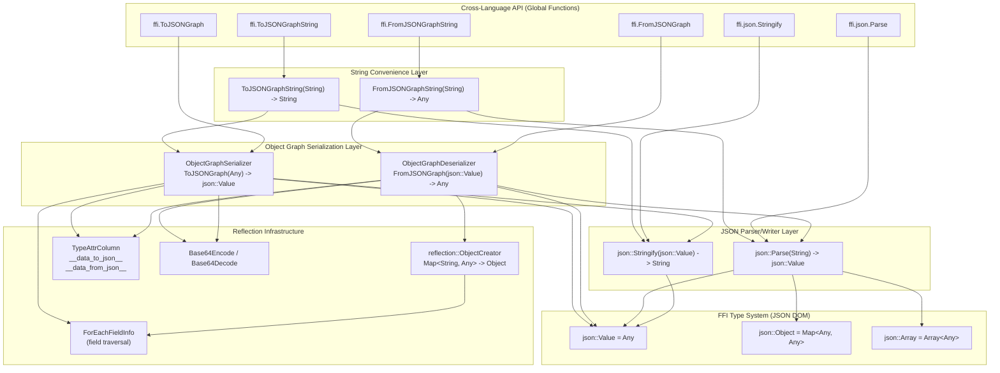
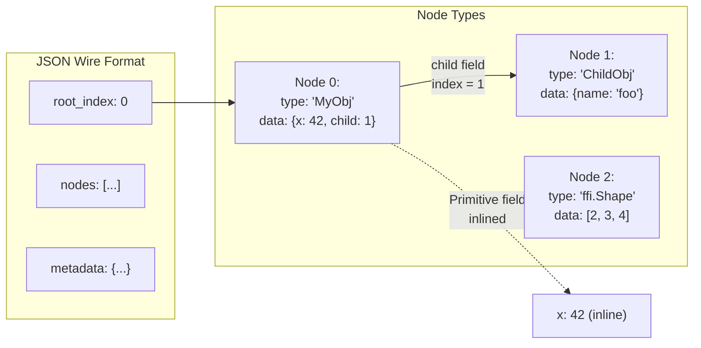
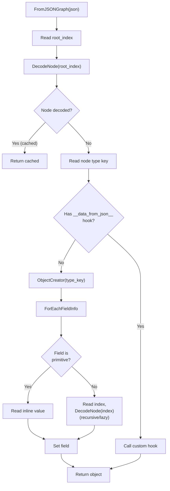

# JSON Ecosystem Architecture

## Layer Diagram



## JSON Parser Flow

```mermaid
flowchart TD
  A["json::Parse(str)"] --> B["JSONParserContext<br/>(character scanning)"]
  B --> C["JSONParser::ParseValue()"]
  C --> D{"First char?"}
  D -->|"{"| E["ParseObject() -> Map&lt;Any,Any&gt;"]
  D -->|"["| F["ParseArray() -> Array&lt;Any&gt;"]
  D -->|'"'| G["ParseString() -> String"]
  D -->|"digit/-"| H["ParseNumber() -> int64/double"]
  D -->|"t/f"| I["ParseBool() -> bool"]
  D -->|"n"| J["ParseNull() -> nullptr"]
  D -->|"I/N"| K["ParseInfNaN() -> Inf/NaN"]

  E --> L["Temp stack accumulate"]
  F --> L
  L --> M["Batch construct<br/>with exact size"]

  H --> N{"strtoimax OK?"}
  N -->|"Yes"| O["Return int64_t"]
  N -->|"No"| P["strtod fallback<br/>Return double"]
```

## Object Graph Serialization Format



## Object Graph Deserialization Flow



## Evidence

- JSON parser/writer: `src/ffi/extra/json_parser.cc`, `src/ffi/extra/json_writer.cc` @ `de541e3`
- JSON type aliases: `include/tvm/ffi/extra/json.h` @ `de541e3`
- Object graph serialization: `src/ffi/extra/serialization.cc`, `include/tvm/ffi/extra/serialization.h` @ `8eaefe0`
- ObjectCreator: `include/tvm/ffi/reflection/creator.h` @ `7cb9273`
- String convenience wrappers: `src/ffi/extra/serialization.cc` @ `55edee0`
- FastMath-safe helpers: `src/ffi/extra/json_parser.cc`, `src/ffi/extra/json_writer.cc` @ `1a271f0`
- TypeAttrColumn hooks: `src/ffi/extra/serialization.cc` @ `8eaefe0`
- Base64: `include/tvm/ffi/extra/base64.h` @ `8eaefe0`
