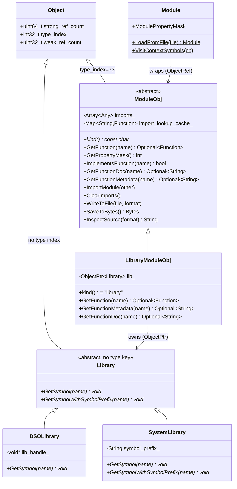
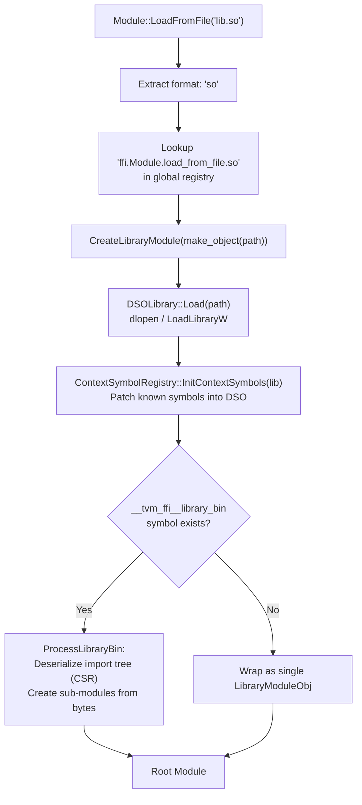
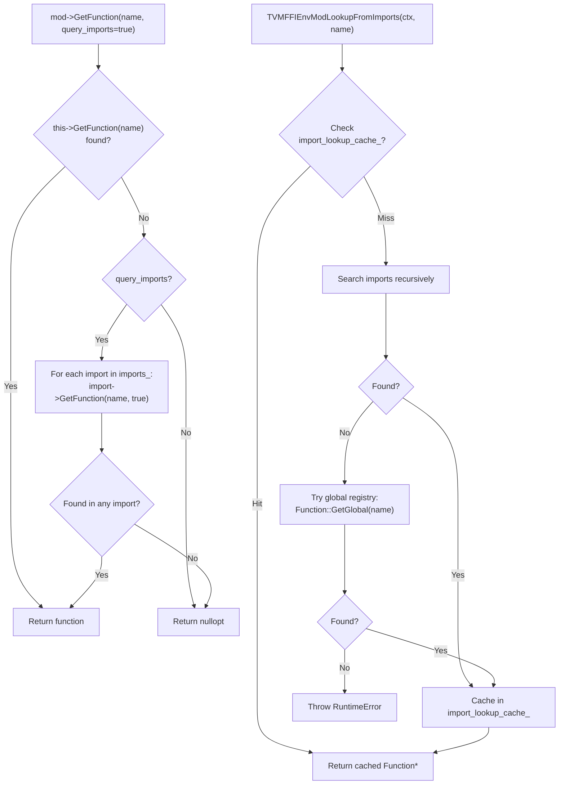
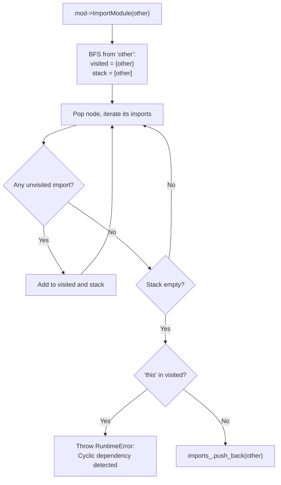
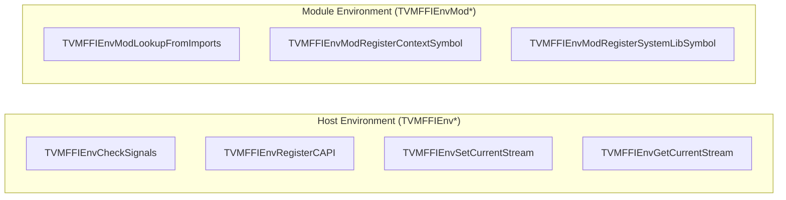
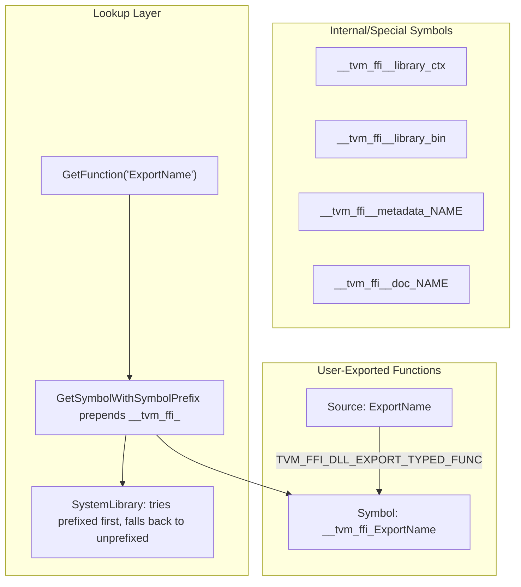
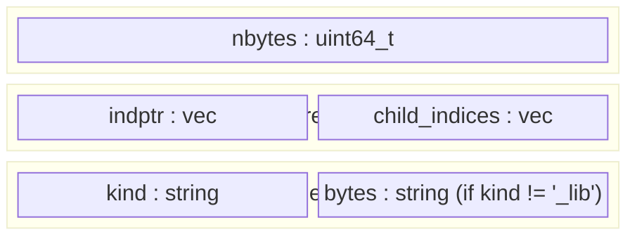

# Module System Architecture

## Class Hierarchy

## Module Loading Flow (DSO)

## Function Lookup Flow

## Import Cycle Detection

## C API Symbol Taxonomy

## Symbol Prefix Convention

## Binary Import-Tree Layout

## Evidence

- `symbol::tvm_ffi_symbol_prefix` constant: `include/tvm/ffi/extra/module.h` @ `40e8a51`
- `Library::GetSymbolWithSymbolPrefix`: `src/ffi/extra/module_internal.h` @ `40e8a51`
- SystemLibrary prefix-tolerant lookup: `src/ffi/extra/library_module_system_lib.cc` @ `8068d1d`
- Stream API renames (`TVMFFIEnvSetCurrentStream`): `include/tvm/ffi/extra/c_env_api.h` @ `a08fa6e`
- `ModuleObj` class: `include/tvm/ffi/extra/module.h` @ `538bef4`
- `Library` abstract class: `src/ffi/extra/module_internal.h` @ `538bef4`
- `DSOLibrary`: `src/ffi/extra/library_module_dynamic_lib.cc` @ `538bef4`
- `SystemLibrary`: `src/ffi/extra/library_module_system_lib.cc` @ `538bef4`
- `LibraryModuleObj`: `src/ffi/extra/library_module.cc` @ `538bef4`
- `ProcessLibraryBin`: `src/ffi/extra/library_module.cc` lines 109-163 @ `538bef4`
- C API renames (`TVMFFIEnvMod*`): `include/tvm/ffi/extra/c_env_api.h` @ `023ea44`
- `EnvCAPIRegistry` moved to `src/ffi/extra/env_c_api.cc` @ `023ea44`
