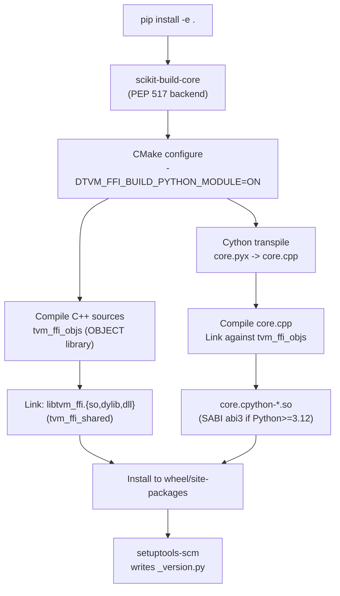
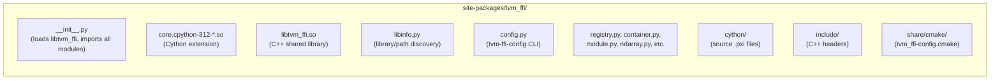
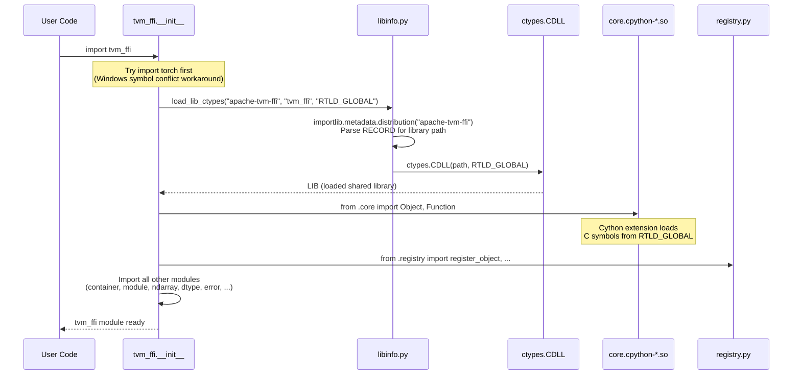
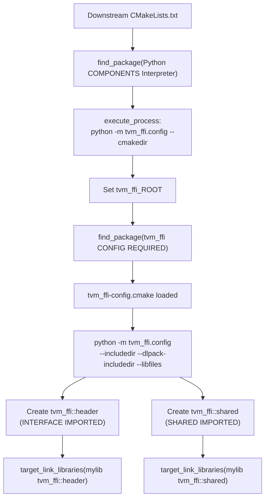
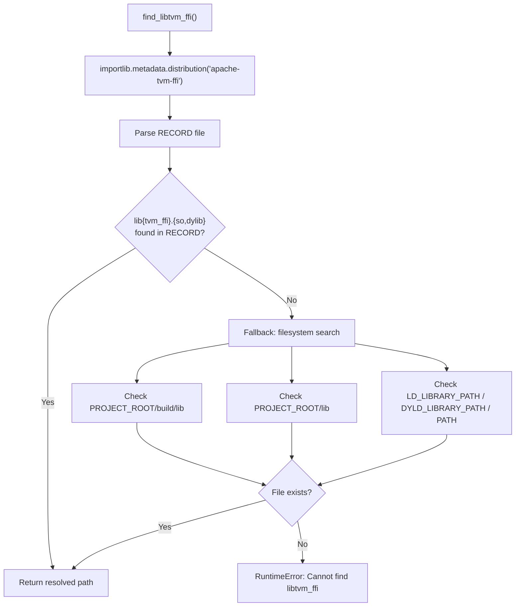
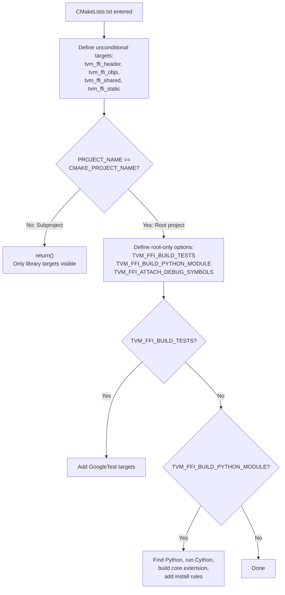

# Python Package Architecture

## Package Build Pipeline

## Package Layout (installed)

## Import and Initialization Sequence

## Downstream C++ Integration Flow

## Library Discovery Strategy (libinfo.py)

## Dual CMake Mode

## Evidence

- `pyproject.toml` (scikit-build-core config): `pyproject.toml` @ `2d41a51`
- `__init__.py` (initialization): `python/tvm_ffi/__init__.py` @ `2d41a51`
- `libinfo.py` (library discovery): `python/tvm_ffi/libinfo.py` @ `2d41a51`
- `config.py` (CLI): `python/tvm_ffi/config.py` @ `2d41a51`
- `tvm_ffi-config.cmake`: `cmake/tvm_ffi-config.cmake` @ `2d41a51`
- `CMakeLists.txt` (dual mode): `CMakeLists.txt` @ `2d41a51`
- `Library.cmake` (tvm_ffi_ prefix): `cmake/Utils/Library.cmake` @ `2d41a51`
