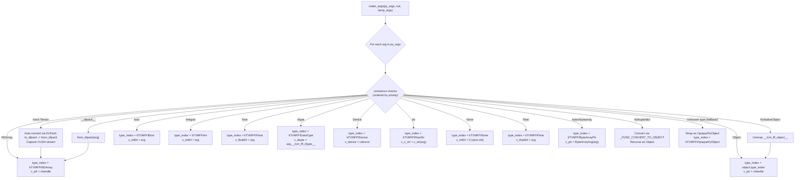
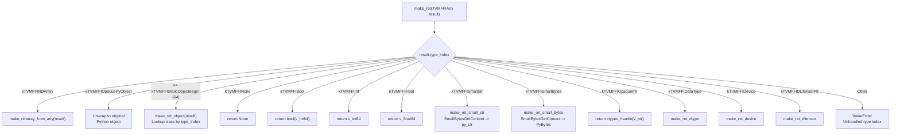
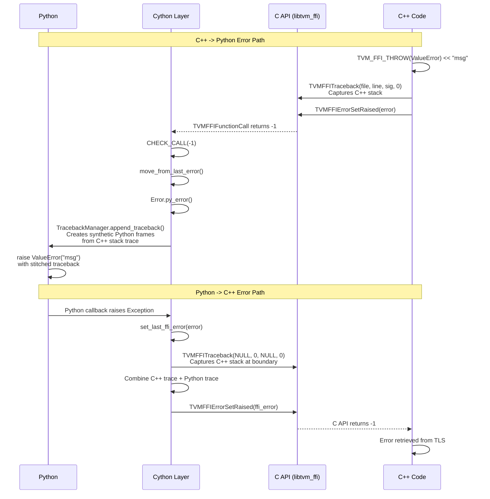
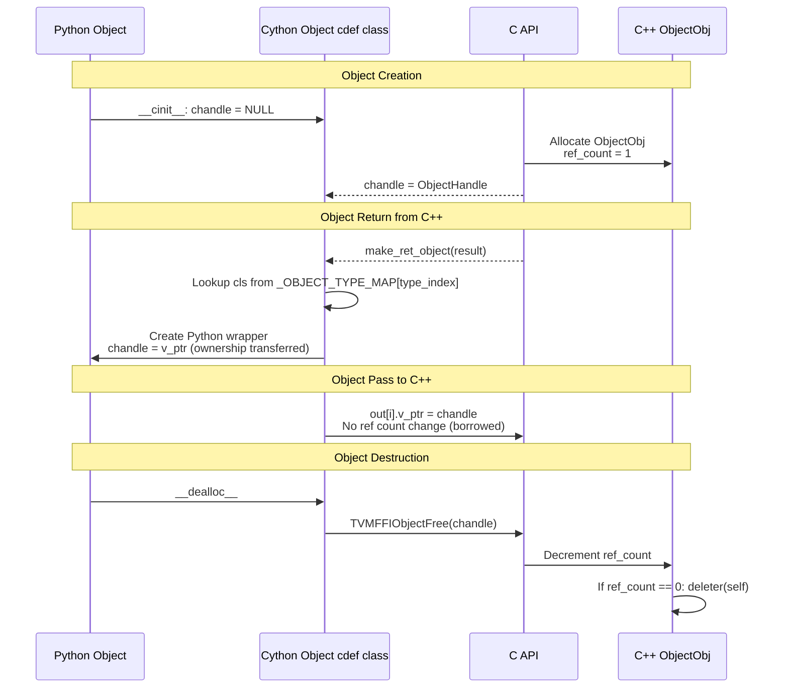
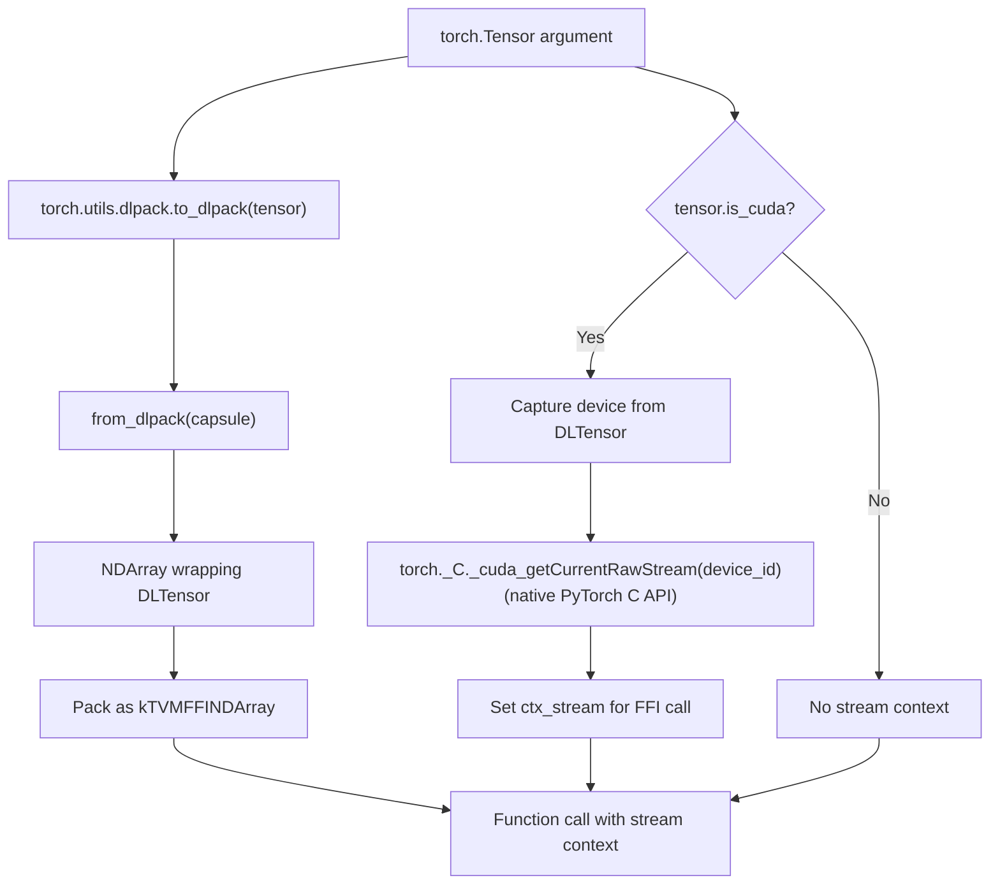

# Cython Binding Type Marshaling Flow

## Python-to-C Argument Marshaling (make_args)

## C-to-Python Return Value Unmarshaling (make_ret)

## Bidirectional Error Propagation

## Object Lifecycle (Ref Counting)

## torch Tensor Auto-Conversion Detail

## Evidence

- `make_args()`: `python/tvm_ffi/cython/function.pxi` @ `2d41a51`
- `make_ret()`: `python/tvm_ffi/cython/function.pxi` @ `2d41a51`
- `CHECK_CALL()`: `python/tvm_ffi/cython/error.pxi` @ `2d41a51`
- `set_last_ffi_error()`: `python/tvm_ffi/cython/error.pxi` @ `2d41a51`
- `TracebackManager`: `python/tvm_ffi/error.py` @ `2d41a51`
- `Object.__dealloc__`: `python/tvm_ffi/cython/object.pxi` @ `2d41a51`
- torch auto-conversion: `python/tvm_ffi/cython/function.pxi` `make_args` torch branch @ `2d41a51`
- None arg zero-init (v_int64 = 0): `python/tvm_ffi/cython/function.pxi` @ `3702e50`
- torch stream via native API (`torch._C._cuda_getCurrentRawStream`): `python/tvm_ffi/cython/function.pxi` @ `1b07159`
- OpaquePyObject wrapping/unwrapping: `python/tvm_ffi/cython/function.pxi`, `python/tvm_ffi/cython/object.pxi` @ `91d69f0`
