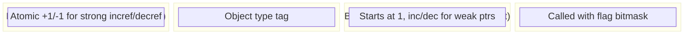
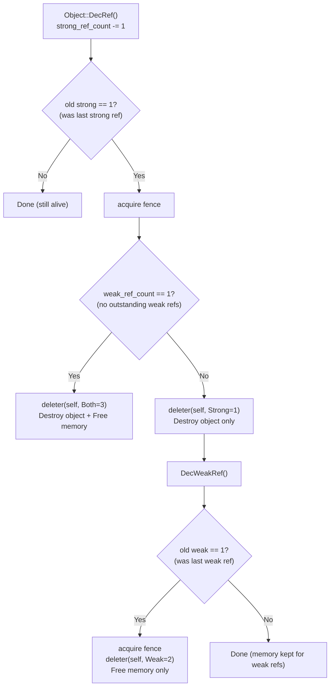
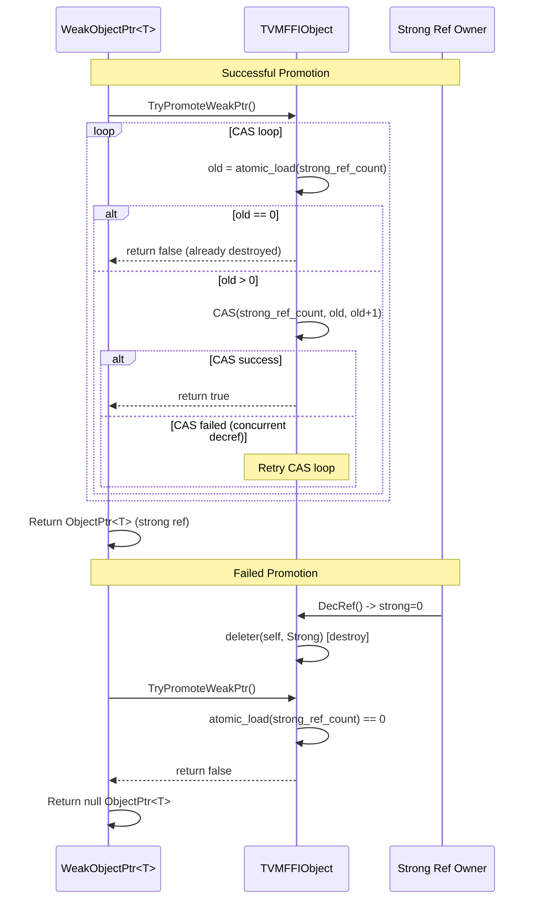
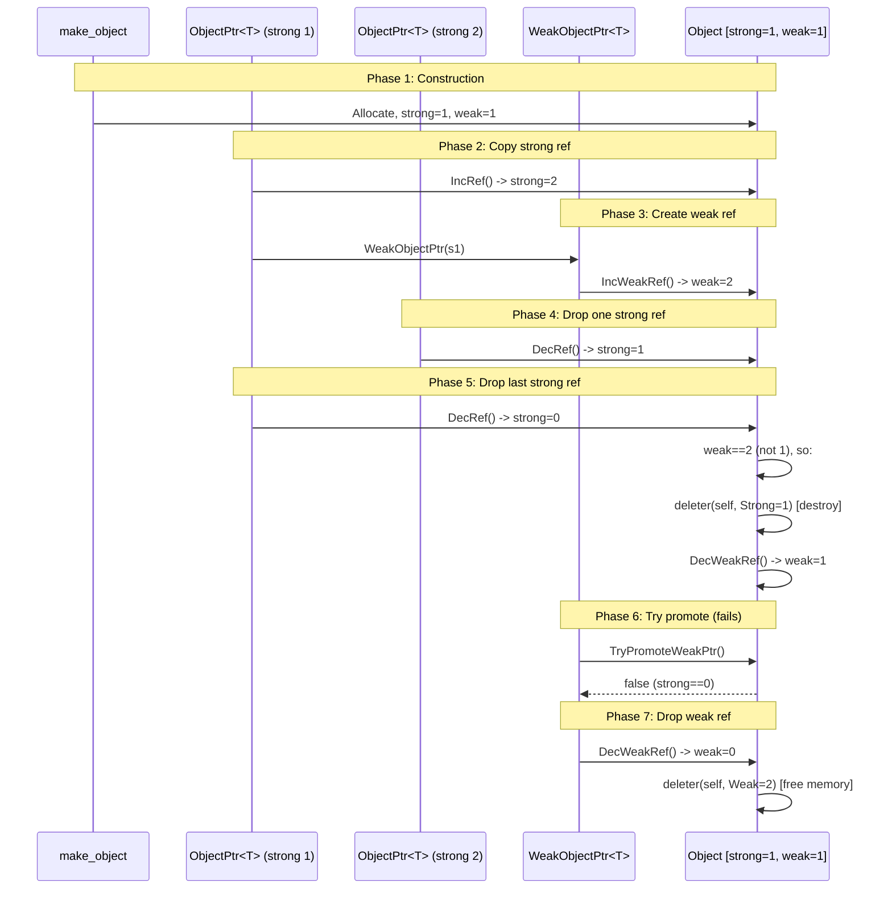
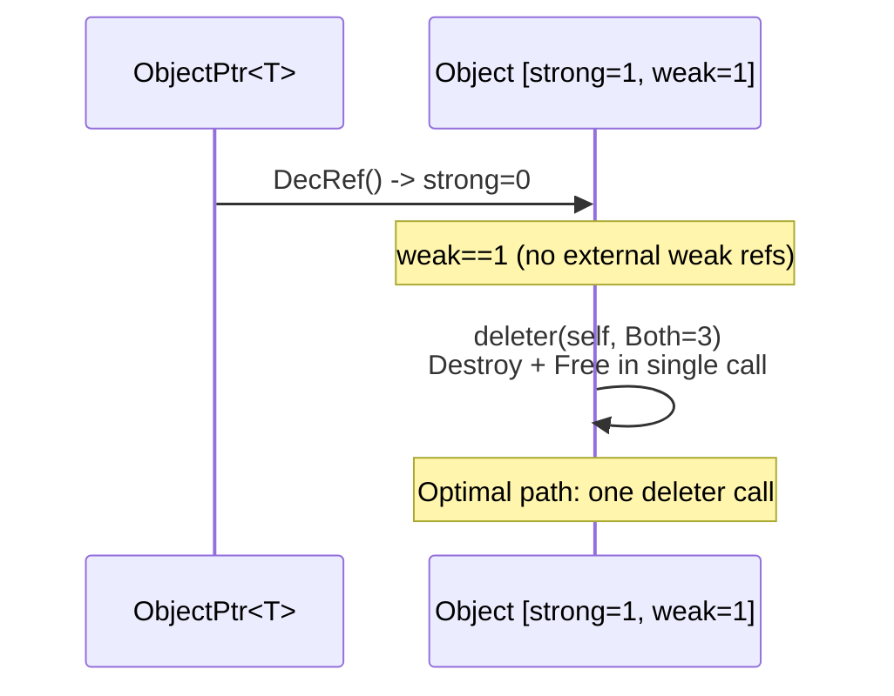

# Weak Reference Lifecycle and Promotion Flow

## Object Header Layout (Post Weak-RC)

## Deleter Flag Protocol

## WeakObjectPtr Promotion (lock)

## Full Lifecycle: Strong + Weak References

## Common Case: No Weak References

## Evidence

- TVMFFIObject header with split refcounts: `include/tvm/ffi/c_api.h` @ `ca9c3d1`
- WeakObjectPtr template: `include/tvm/ffi/object.h` @ `ca9c3d1`
- TryPromoteWeakPtr CAS loop: `include/tvm/ffi/object.h` @ `ca9c3d1`
- TVMFFIObjectDeleterFlagBitMask: `include/tvm/ffi/c_api.h` @ `ca9c3d1`
- SimpleObjAllocator deleter with flags: `include/tvm/ffi/memory.h` @ `ca9c3d1`
- DecRef common-case optimization: `include/tvm/ffi/object.h` @ `ca9c3d1`
