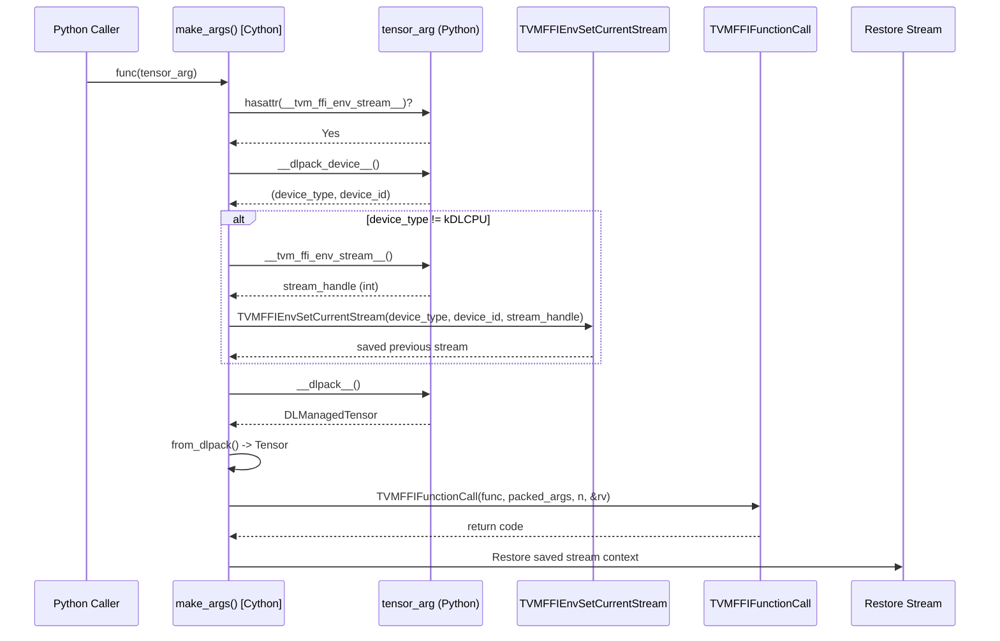
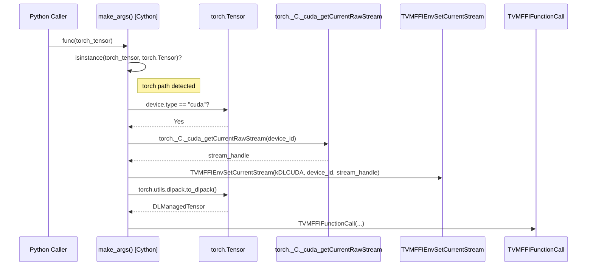
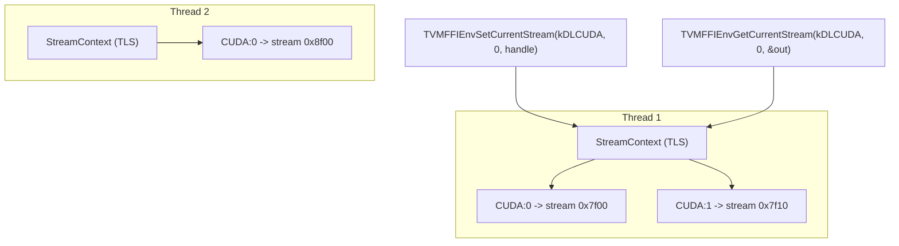
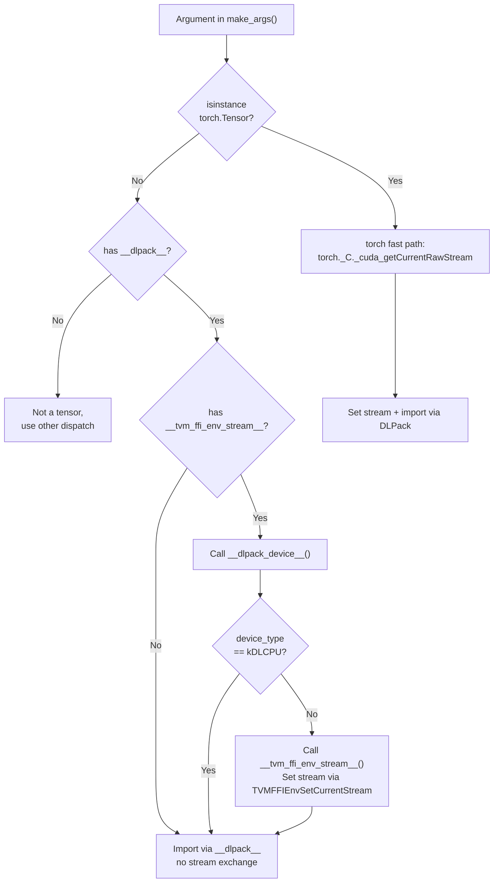

# Stream Exchange Flow

## Sequence Diagram: Generic Protocol Path

## Sequence Diagram: torch-Specific Fast Path

## Stream Context Thread-Local Storage

## Protocol Decision Tree

## Evidence

- `__tvm_ffi_env_stream__` protocol dispatch in `make_args()`: `python/tvm_ffi/cython/function.pxi` @ `a08fa6e`
- `TVMFFIEnvSetCurrentStream` / `TVMFFIEnvGetCurrentStream`: `include/tvm/ffi/extra/c_env_api.h` @ `a08fa6e`
- `DLTensorTestWrapper`: `python/tvm_ffi/cython/tensor.pxi` @ `a08fa6e`
- torch fast path: `python/tvm_ffi/cython/function.pxi` @ `a08fa6e`
- `StreamContext` thread-local: `src/ffi/extra/stream_context.cc` @ `a08fa6e`
