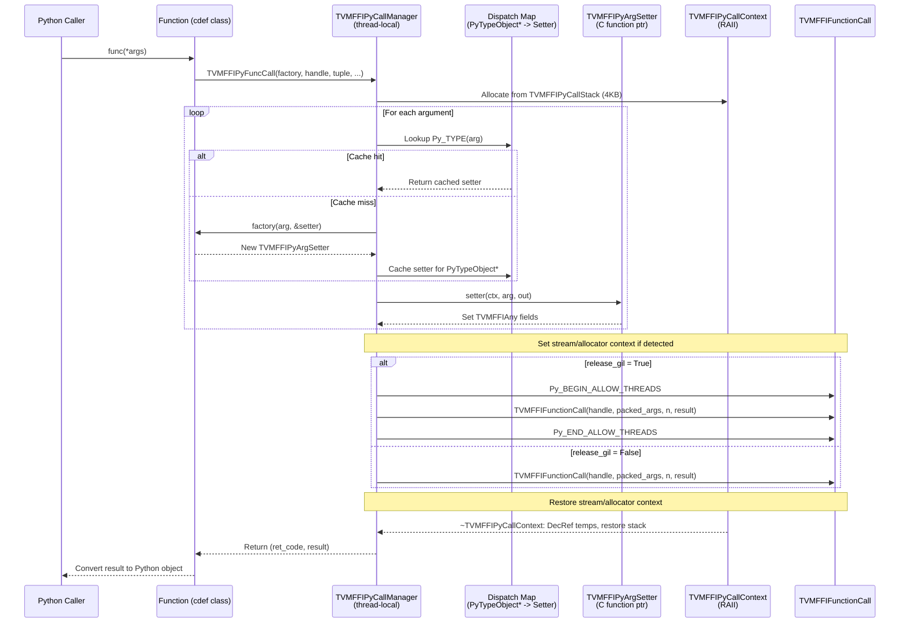
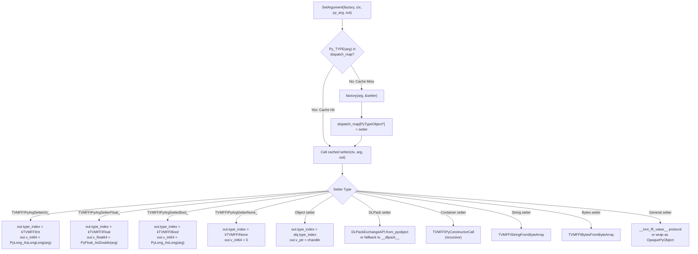
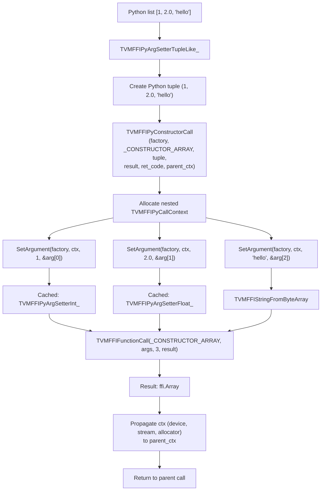
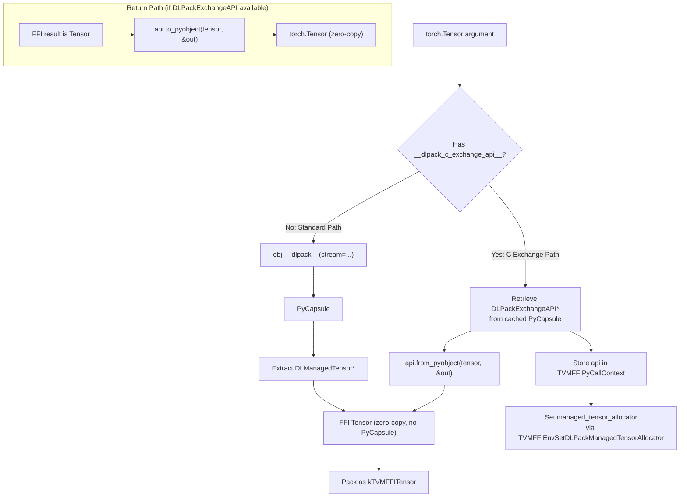
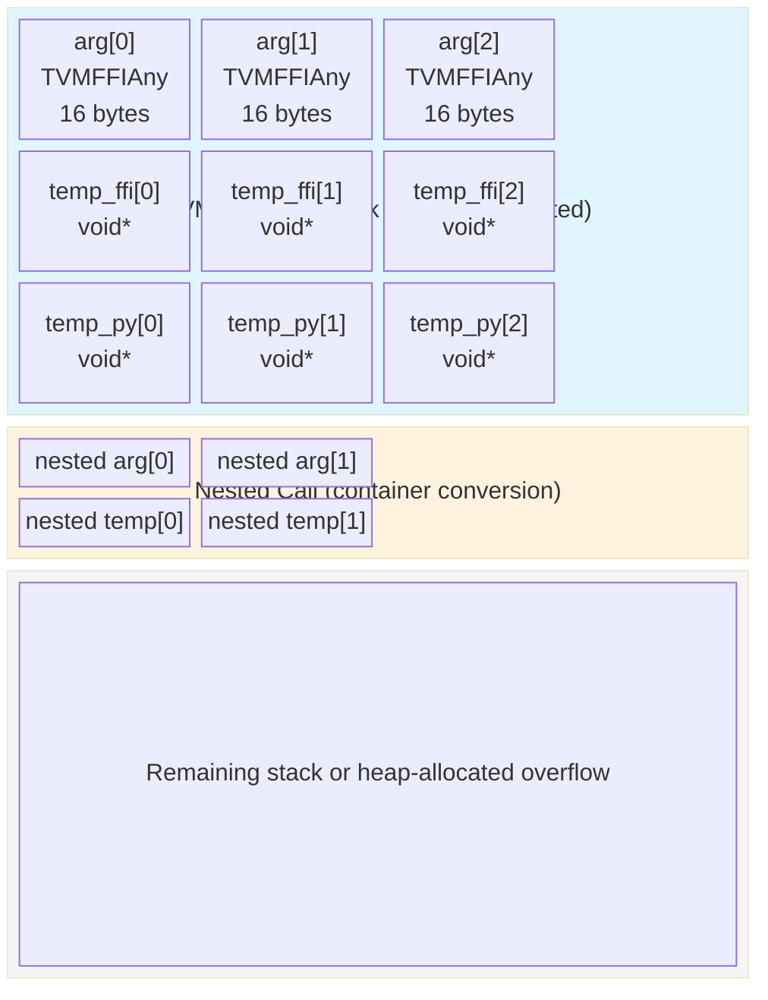

# Python FFI Call Optimization Flow

## Optimized Call Path (TVMFFIPyFuncCall)

## Argument Setter Dispatch (Cached Per-Type)

## Nested Container Conversion (TVMFFIPyConstructorCall)

## DLPack C-Level Exchange Flow

## Call Stack Memory Layout

## Evidence

- `TVMFFIPyCallManager` class: `python/tvm_ffi/cython/tvm_ffi_python_helpers.h` @ `38d2cdaa`
- `TVMFFIPyFuncCall` entry: `python/tvm_ffi/cython/tvm_ffi_python_helpers.h` @ `38d2cdaa`
- `TVMFFIPyArgSetter` dispatch: `python/tvm_ffi/cython/tvm_ffi_python_helpers.h` @ `38d2cdaa`
- Predefined POD setters: `python/tvm_ffi/cython/tvm_ffi_python_helpers.h` @ `38d2cdaa`
- `DLPackExchangeAPI` integration: `python/tvm_ffi/cython/function.pxi` @ `f81ab9c2`
- `TVMFFIPyConstructorCall`: `python/tvm_ffi/cython/tvm_ffi_python_helpers.h` @ `043d9f64`
- Container setters: `python/tvm_ffi/cython/function.pxi` @ `043d9f64`
- `TVMFFIStringFromByteArray` / `TVMFFIBytesFromByteArray`: `include/tvm/ffi/c_api.h` @ `043d9f64`
