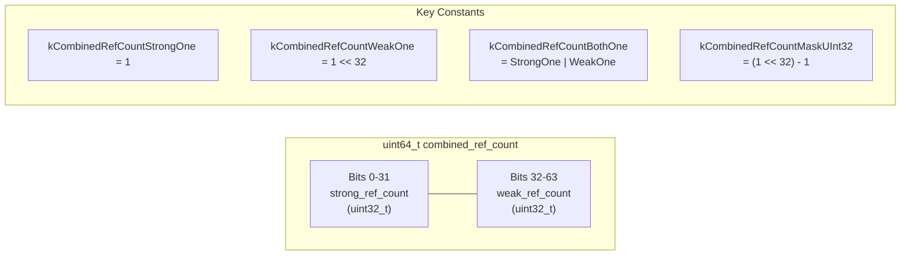
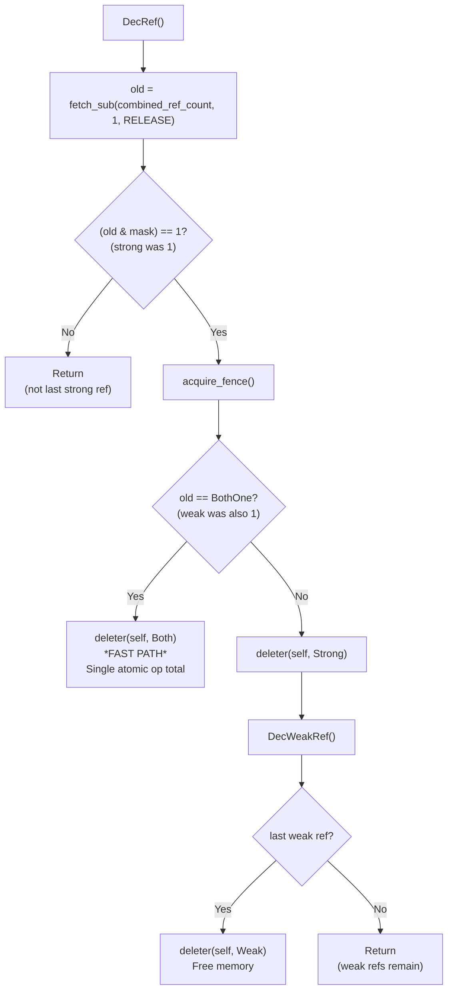
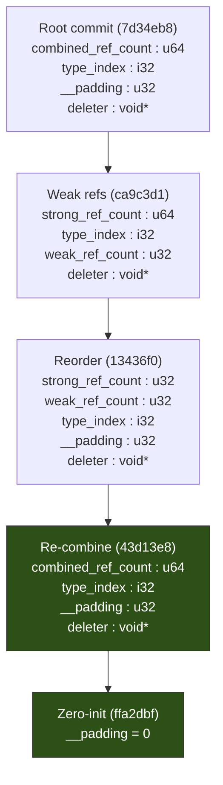

# TVMFFIObject Header Layout: Combined Reference Count

## Current Layout (24 bytes)

```mermaid
block-beta
  columns 4
  block:combined["Bytes 0-7: combined_ref_count (uint64_t)"]
    columns 2
    strong["Bits 0-31: strong count"]
    weak["Bits 32-63: weak count"]
  end
  block:tidx["Bytes 8-11: type_index (int32_t)"]
    columns 1
    t["Object type tag"]
  end
  block:pad["Bytes 12-15: __padding (uint32_t)"]
    columns 1
    p["Zero-initialized"]
  end
  block:del["Bytes 16-23: deleter (void*)(void*, int flags)"]
    columns 1
    d["TVMFFIObjectDeleterFlagBitMask"]
  end
```

## Combined Refcount Bit Layout

## DecRef Fast Path

## Header Layout Evolution

## Evidence

- Header reorder (refcounts first): `include/tvm/ffi/c_api.h` @ `13436f0`
- Combined u64 refcount: `include/tvm/ffi/c_api.h`, `include/tvm/ffi/object.h` @ `43d13e8`
- Zero-init padding: `include/tvm/ffi/memory.h` @ `ffa2dbf`
- Constants (kCombinedRefCount*): `include/tvm/ffi/object.h` @ `43d13e8`
