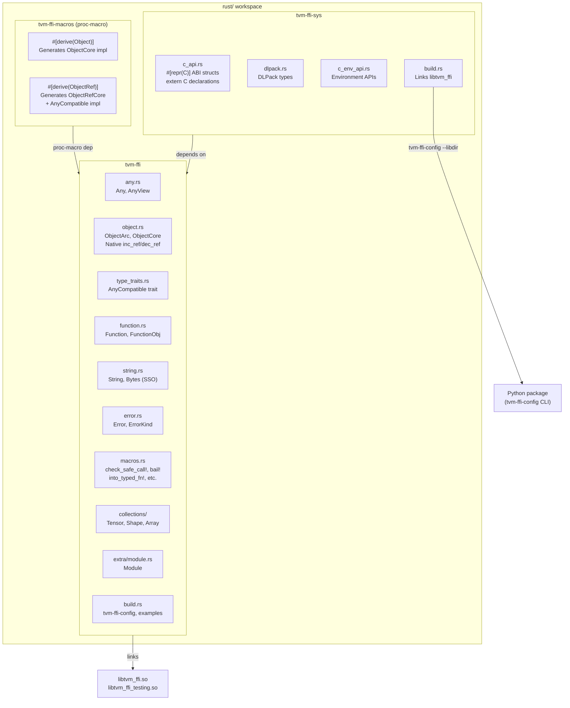
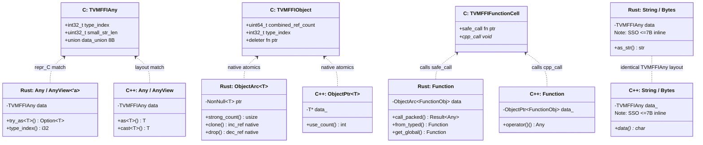
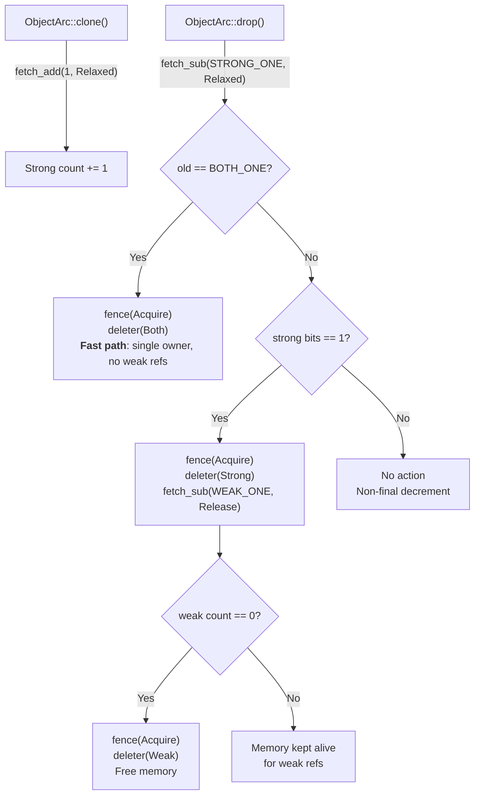
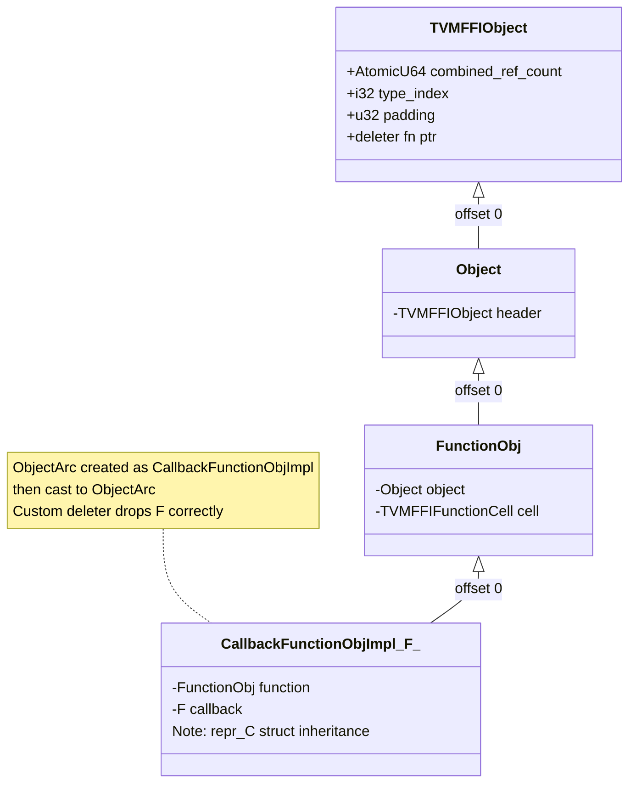
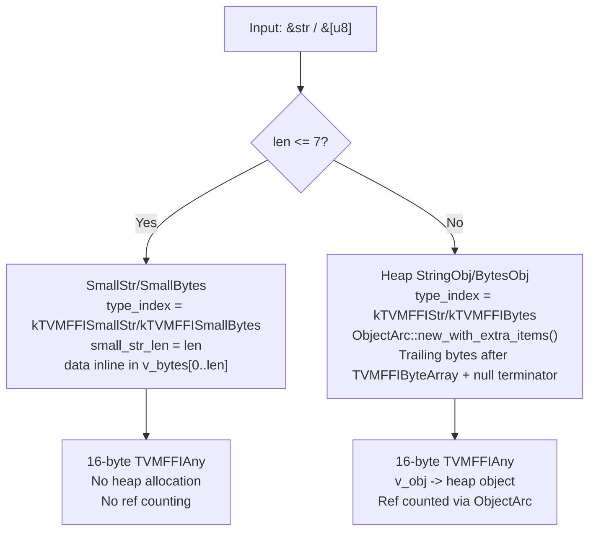

# Rust Crate Workspace Architecture and Type Mapping

## Three-Crate Workspace

## Type Mapping: Rust to C++ to C ABI

## Ref-Counting Flow in Rust

## CallbackFunctionObjImpl Struct Inheritance

## String/Bytes Dual Representation

## Evidence

- Three-crate workspace: `rust/Cargo.toml` @ `09477ce`
- `tvm-ffi-sys` ABI structs: `rust/tvm-ffi-sys/src/c_api.rs` @ `09477ce`
- `tvm-ffi-sys/build.rs` with `tvm-ffi-config`: `rust/tvm-ffi-sys/build.rs` @ `09477ce`
- `#[derive(Object)]` / `#[derive(ObjectRef)]`: `rust/tvm-ffi-macros/src/object_macros.rs` @ `09477ce`
- Native ref-counting: `rust/tvm-ffi/src/object.rs` `unsafe_` module @ `09477ce`
- `CallbackFunctionObjImpl<F>`: `rust/tvm-ffi/src/function.rs` @ `09477ce`
- String/Bytes dual representation: `rust/tvm-ffi/src/string.rs` @ `09477ce`
- `ObjectArc::new` and `new_with_extra_items`: `rust/tvm-ffi/src/object.rs` @ `09477ce`
