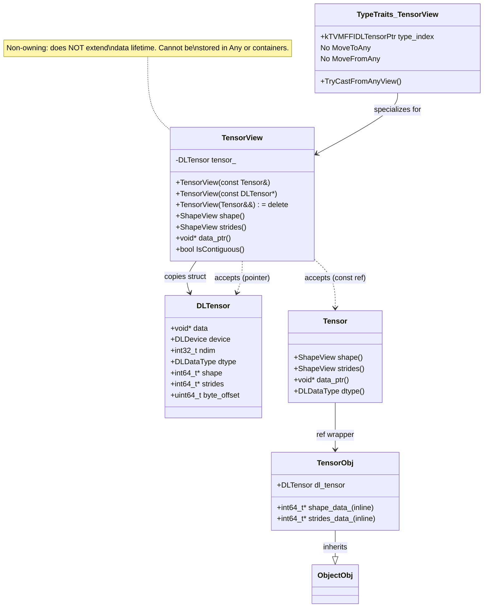
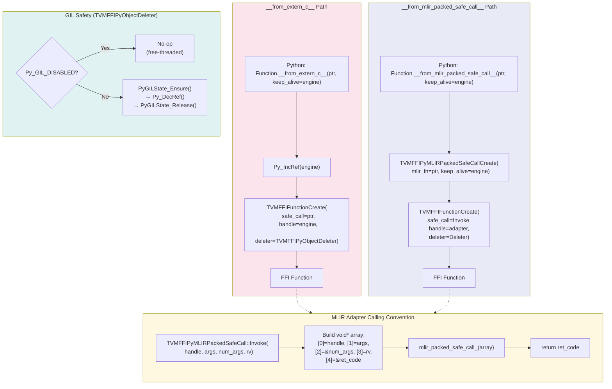

# TensorView Type Hierarchy and TypeSchema Metadata Flow

## TensorView in the Type System



## TypeSchema Metadata Generation Flow

```mermaid
flowchart TD
    A["C++ Type T\n(e.g., Array&lt;String&gt;)"] --> B["TypeSchema&lt;T&gt;::v()"]
    B --> C["JSON string\n{\"type\":\"ffi.Array\",\"args\":[{\"type\":\"ffi.String\"}]}"]

    D["ObjectDef&lt;T&gt;::def_ro(name, &T::field)"] --> E["TypeSchema&lt;FieldType&gt;::v()"]
    E --> F["Metadata(\"type_schema\", json)"]
    F --> G["TVMFFIFieldInfo.metadata"]

    H["GlobalDef::def(name, func)"] --> I["TypeSchema&lt;FuncType&gt;::v()"]
    I --> J["Metadata(\"type_schema\", json)"]
    J --> K["TVMFFIMethodInfo.metadata"]

    G --> L["Python: TypeField.metadata[\"type_schema\"]"]
    K --> M["Python: get_global_func_metadata(name)"]

    L --> N["TypeSchema.from_json_str(json)"]
    M --> N
    N --> O["TypeSchema(origin='list', args=(TypeSchema('str'),))"]
    O --> P["repr() → 'list[str]'"]
    O --> Q["repr(ty_map=...) → 'Sequence[str]'"]

    style A fill:#e1f5fe
    style C fill:#fff3e0
    style O fill:#e8f5e9
```

## External Function Construction Paths


