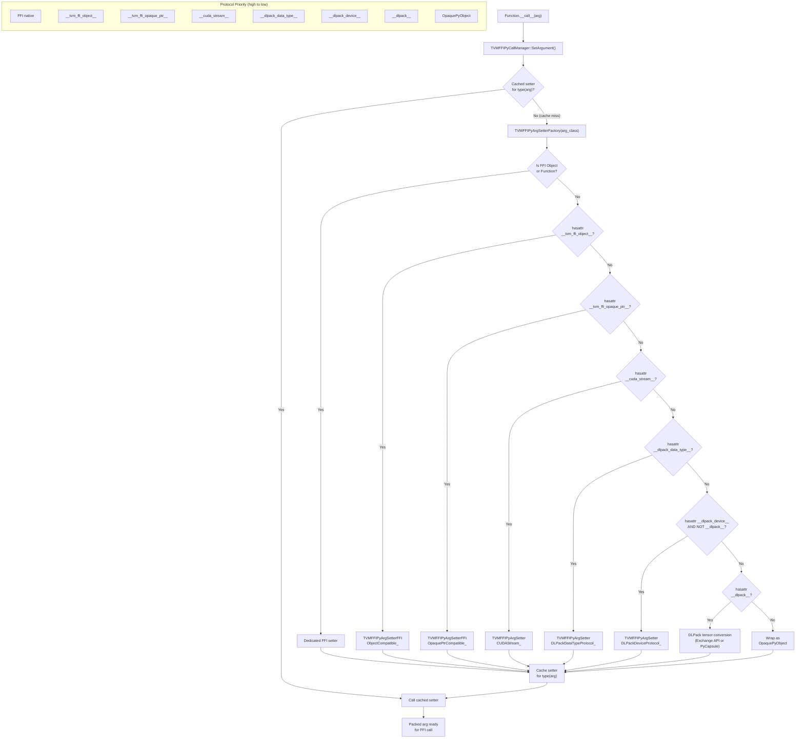

# Python FFI Protocol Dispatch Flow

This diagram shows how the Cython `TVMFFIPyArgSetterFactory` dispatches argument
conversion based on duck-typing protocols. Protocol checks happen once per Python
type and are cached for subsequent calls.

## Protocol Return Types

```mermaid
classDiagram
    class TVMFFIPyArgSetterFactory {
        +dispatch(arg_class) TVMFFIPyArgSetter
    }

    class __tvm_ffi_object__ {
        <<protocol>>
        +__tvm_ffi_object__() Object
    }
    note for __tvm_ffi_object__ "Returns cached FFI Object\nSetter extracts handle\nType index: kTVMFFIObject+"

    class __tvm_ffi_opaque_ptr__ {
        <<protocol>>
        +__tvm_ffi_opaque_ptr__() int
    }
    note for __tvm_ffi_opaque_ptr__ "Returns raw pointer as int\nType index: kTVMFFIOpaquePtr"

    class __cuda_stream__ {
        <<protocol>>
        +__cuda_stream__() int
    }
    note for __cuda_stream__ "Returns CUDA stream handle\nType index: kTVMFFIOpaquePtr\nAligns with NVIDIA protocol"

    class __dlpack_data_type__ {
        <<protocol>>
        +__dlpack_data_type__() tuple
    }
    note for __dlpack_data_type__ "Returns (type_code, bits, lanes)\nConverts to DLDataType\nDLPack dtype exchange"

    class __dlpack_device__ {
        <<protocol>>
        +__dlpack_device__() tuple
    }
    note for __dlpack_device__ "Returns (device_type, device_id)\nConverts to TVMFFIDevice\nOnly when __dlpack__ absent"

    class __dlpack__ {
        <<protocol>>
        +__dlpack__() PyCapsule
        +__dlpack_device__() tuple
    }
    note for __dlpack__ "Standard DLPack tensor exchange\nFallback if no C exchange API"

    TVMFFIPyArgSetterFactory --> __tvm_ffi_object__
    TVMFFIPyArgSetterFactory --> __tvm_ffi_opaque_ptr__
    TVMFFIPyArgSetterFactory --> __cuda_stream__
    TVMFFIPyArgSetterFactory --> __dlpack_data_type__
    TVMFFIPyArgSetterFactory --> __dlpack_device__
    TVMFFIPyArgSetterFactory --> __dlpack__
```

